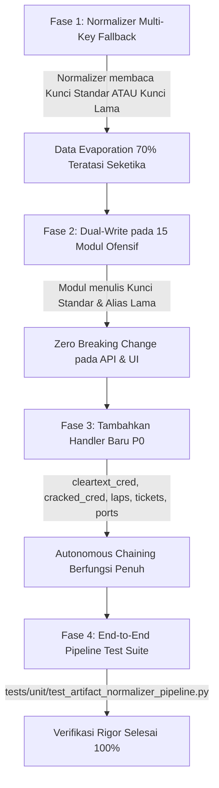

# ARES Standard Key Convention: Telemetry, Artifact Normalizer & Module Contract

> **Dokumen Status**: Spesifikasi Standar Kontrak Data (Architecture Decision Record)  
> **Tanggal Penetapan**: 26 September 2026  
> **Target Implementasi**: `ares/normalize/artifacts.py` & seluruh modul di `ares/modules/`  
> **Tujuan**: Menghilangkan 70% data mismatch antara output modul (`raw`) dan `ArtifactNormalizer`, menjamin integritas aliran data telemetry ofensif ke `ArtifactStore`, dan memvalidasi rantai eksekusi otomatis (*attack chaining*).

---

## 1. Tabel Standar Kunci Normalizer (Section 1)

Tabel berikut menetapkan **satu nama kunci standar tunggal** untuk setiap tipe data telemetry di ARES. Penetapan ini mencakup tipe data yang saat ini sudah berstatus MATCH (dipertahankan) dan tipe data yang berstatus MISMATCH (ditargetkan untuk penyelarasan).

| No | Tipe Data Telemetry | Kunci Standar (`raw`) | Alasan Pemilihan Standar | Modul yang Wajib Menulis Kunci Ini | Handler Normalizer yang Wajib Membaca Kunci Ini | Status Kontrak Saat Ini |
|:---:|---|---|---|---|---|:---:|
| 1 | **NTLM Hashes** | `hashes` | Sudah digunakan oleh `windows.lsass_dump` dan berstatus MATCH. Menjadi jangkar konvensi untuk seluruh artefak hash crackable. | `ad.dcsync`, `windows.lsa_secrets`, `windows.lsass_dump` | `_normalize_ntlm_hashes` (`artifacts.py:549`) | ❌ MISMATCH pada 2 modul |
| 2 | **Kerberos TGS Hashes** | `hashes` | Selaras penuh dengan standar `hashes`. Normalizer membedakan tipe hash berdasarkan capability (`ad.kerberoast` $\rightarrow$ mode 13100). | `ad.kerberoast` | `_normalize_kerberos_hashes` (`artifacts.py:507`) | ❌ MISMATCH |
| 3 | **AS-REP Hashes** | `hashes` | Selaras penuh dengan standar `hashes`. Normalizer membedakan tipe hash berdasarkan capability (`ad.asreproast` $\rightarrow$ mode 18200). | `ad.asreproast` | `_normalize_asrep_hashes` (`artifacts.py:529`) | ❌ MISMATCH |
| 4 | **User Accounts** | `users` | Konvensi plural noun standar Python/REST API (`users`, `computers`, `hashes`). Normalizer sudah mengimplementasikan `raw.get("users")`. | `ad.enum_users` | `_normalize_users` (`artifacts.py:473`) | ❌ MISMATCH |
| 5 | **Computer / Host Accounts** | `computers` | Konvensi plural noun standar. Normalizer sudah membaca `raw.get("computers")`. | `ad.enum_computers` | `_normalize_computers` (`artifacts.py:491`) | ❌ MISMATCH |
| 6 | **SPN Accounts** | `spns` | Konvensi plural noun standar. Normalizer sudah membaca `raw.get("spns")`. | `ad.enum_spn` | `_normalize_spns` (`artifacts.py:566`) | ❌ MISMATCH |
| 7 | **ACL Misconfigurations** | `misconfigs` | Sudah diterapkan secara seragam oleh `ad.enum_acl` dan normalizer berstatus MATCH penuh. Pertahankan untuk menghindari breaking change. | `ad.enum_acl` | `_normalize_permissions` (`artifacts.py:584`) | ✅ MATCH |
| 8 | **Cloud S3 Buckets** | `public_buckets` (dalam `s3`) | Sesuai dengan struktur nested dictionary `raw["s3"]["public_buckets"]` di `cloud.aws` yang sudah MATCH. | `cloud.aws` | `_normalize_cloud` (`artifacts.py:600`) | ✅ MATCH |
| 9 | **Target Host / Privesc Host** | `target` | Universal parameter identifier di seluruh ARES (`ExecutionContext.target`, `BaseModule`, `Finding.host`). Mayoritas modul (6 dari 9) sudah menulis `raw["target"]`. | `linux.ld_preload`, `linux.nfs_escape`, `linux.service_hijack`, `linux.kernel_suggester`, `linux.privesc`, `windows.applocker_bypass`, `windows.scheduled_tasks_enum`, `windows.token_impersonation`, `windows.uac_bypass` | `_normalize_host_vuln` (`artifacts.py:615`) | ❌ MISMATCH pada 6 modul |

---

## 2. Kasus Khusus & Analisis Konflik Semantik (Section 2)

### 2.1. Konflik Kunci: `target` vs `host`
- **Permasalahan**: Pada penangan `privesc_vectors`, normalizer membaca `raw.get("host", "")`.
  - 3 modul Linux (`ld_preload`, `nfs_escape`, `service_hijack`) menulis `raw["host"]` $\rightarrow$ status ✅ MATCH.
  - 6 modul lain (2 Linux, 4 Windows: `kernel_suggester`, `privesc`, `applocker_bypass`, `scheduled_tasks_enum`, `token_impersonation`, `uac_bypass`) menulis `raw["target"]` $\rightarrow$ status ❌ MISMATCH.
- **Analisis Trade-Off**:
  - Jika `host` dijadikan standar: 6 modul harus diubah, padahal seluruh arsitektur ARES (`ExecutionContext`, parameter models, CLI, engine dispatcher) menggunakan `target` sebagai nama variabel kanonikal.
  - Jika `target` dijadikan standar: Hanya 3 modul yang perlu diubah di sisi modul, dan normalizer diperbarui untuk memprioritaskan `target` sebelum fallback ke `host`.
- **Rekomendasi Keputusan**: **Standar kanonikal adalah `target`**.  
  Normalizer `_normalize_host_vuln` diperbarui menjadi:
  ```python
  target = raw.get("target") or raw.get("host", "")
  ```
  Modul yang saat ini hanya menulis `host` akan dimutakhirkan untuk menulis `target` (dengan `host` dipertahankan sebagai alias).

---

### 2.2. Konflik Generik vs Spesifik: `hashes` vs `ntlm_hashes` / `kerberos_hashes` / `asrep_hashes`
- **Permasalahan**: Pengembang modul cenderung memberi nama key spesifik teknik (`kerberos_hashes`, `asrep_hashes`, `ntlm_hashes`), sedangkan normalizer mengharapkan key generik `hashes`.
- **Analisis Trade-Off**:
  - Key spesifik teknik memudahkan keterbacaan manusia saat membaca JSON mentah, tetapi memaksa normalizer memiliki logika parser berbeda untuk setiap format dict.
  - Key generik `hashes` memungkinkan satu fungsi pipeline konsumsi (misal cracker runner) memproses seluruh hash tanpa bergantung pada nama teknik asal.
  - Modul `windows.lsass_dump` membuktikan solusi elegan: ia menuliskan **kedua key sekaligus** (`raw["hashes"]` dan `raw["ntlm_hashes"]`), sehingga lolos verifikasi normalizer tanpa merusak backward compatibility.
- **Rekomendasi Keputusan**: **Standar kanonikal adalah `hashes`**, dengan **Dual-Write Policy**.  
  Setiap modul penghasil hash wajib menuliskan key `hashes` (list of strings atau list of dicts), serta mempertahankan key spesifik teknik sebagai alias backward compatibility:
  ```python
  raw["hashes"] = hashes
  raw["ntlm_hashes"] = hashes  # alias backward-compat
  ```

---

### 2.3. Tabrakan Semantik: `aws_findings` pada `cloud.aws` vs `cloud.aws_privesc`
- **Permasalahan**: Kedua modul mendeklarasikan capability `aws_findings`.
  - `cloud.aws` mengekstrak S3 public buckets (`raw["s3"]["public_buckets"]`) $\rightarrow$ dicerna oleh `_normalize_cloud` menjadi `CloudResourceArtifact`.
  - `cloud.aws_privesc` mengekstrak jalur eskalasi hak akses IAM (`raw["privesc_paths"]`) $\rightarrow$ dikirim ke `_normalize_cloud` yang mengharapkan `raw["s3"]`, menghasilkan **0 artifact (kegagalan 100%)**.
- **Analisis Trade-Off**:
  - Menggabungkan IAM privilege escalation ke dalam normalizer S3 bucket adalah *type confusion*. IAM role escalation path seharusnya menjadi `PermissionArtifact` atau subtype `CloudResourceArtifact(resource_type="iam_role")`.
- **Rekomendasi Keputusan**: **Pemisahan Semantik Capability**.
  - `cloud.aws` tetap memegang `aws_findings` (fokus pada asset cloud & S3 storage).
  - `cloud.aws_privesc` memisahkan diri ke capability kanonikal `aws_privesc_paths` atau `cloud_permissions`, dan normalizer menambahkan handler `_normalize_cloud_permissions`.

---

### 2.4. Konvensi Penamaan: Plural Noun (`users`) vs List Suffix (`user_list`)
- **Permasalahan**: Modul AD enumerasi mendeklarasikan `OUTPUTS = ["user_list", "computer_list", "spn_list"]` dan menulis `raw["user_list"]`, sedangkan normalizer membaca `raw.get("users")`.
- **Analisis Trade-Off**:
  - `user_list` mencerminkan nama capability deklaratif.
  - `users` mencerminkan objek data koleksi (standar industri JSON / OpenAPI schema).
- **Rekomendasi Keputusan**: **Standar kanonikal adalah Plural Noun (`users`, `computers`, `spns`)**.  
  Modul mengadopsi Dual-Write (`raw["users"] = users; raw["user_list"] = users`), dan normalizer mendukung fallback pembacaan `raw.get("users") or raw.get("user_list", [])`.

---

## 3. Prioritas Penambahan Handler Baru (UNHANDLED OUTPUTS) (Section 3)

Dari 86 capability yang saat ini belum ditangani oleh `ArtifactNormalizer`, ditetapkan prioritas implementasi berdasarkan **urgensi rantai serangan otomatis (*autonomous attack chaining*)** dan **pencegahan penguapan kredensial (*credential evaporation*)**:

```
┌─────────────────────────────────────────────────────────────────────────────┐
│                       PRIORITAS IMPLEMENTASI HANDLER                       │
├─────────────────────────────────────────────────────────────────────────────┤
│  [P0] HARUS ADA (Critical)    ──► Kredensial, Hash Cracking, Port Discovery │
│  [P1] SEBAIKNYA ADA (High)   ──► Domain Hierarchy, Sesi Lateral, DNS Recon │
│  [P2] BISA DITUNDA (Medium)  ──► Telemetry Rules, Raw Logs, Exfil Paths    │
└─────────────────────────────────────────────────────────────────────────────┘
```

### 3.1. Kategori [P0] HARUS ADA — Critical for Downstream & Autonomous Chaining
Tanpa handler ini, kredensial tingkat tinggi yang berhasil diekstraksi menguap dari runtime state dan tidak dapat digunakan oleh modul downstream:

| Capability Output | Modul Penghasil Kunci | Kunci Standar yang Ditulis | Tipe Artifact Target | Alasan Urgensi P0 |
|---|---|---|---|---|
| `cleartext_credentials` | `ad.sccm`, `windows.dpapi`, `linux.samba_secrets` | `credentials` | `CredentialArtifact(cred_type="cleartext")` | Password plaintext hasil ekstraksi NAA/DPAPI/Samba harus masuk ke `ArtifactStore` agar dapat langsung dicoba oleh `credential.reuse` dan lateral movement. |
| `cracked_credentials` | `credential.crack` | `cracked_credentials` | `CredentialArtifact(cracked=True)` | Jantung autonomous chaining: setelah hash di-crack oleh hashcat, hasilnya wajib terserap kembali ke store sebagai kredensial valid untuk eskalasi hak akses. |
| `laps_passwords` | `ad.laps_enum` | `laps_passwords` | `CredentialArtifact(cred_type="cleartext", privilege="local_admin")` | Password administrator lokal seluruh armada workstation/server domain. Penguapan data ini memutus jalur lateral movement domain. |
| `kerberos_ticket` / `kerberos_tickets` | `lateral.ntlm_relay`, `credential.golden_ticket`, `credential.ticket_converter` | `tickets` | `CredentialArtifact(cred_type="kerberos_ticket")` | Tiket TGS/TGT forged (.ccache / .kirbi) diperlukan untuk Pass-the-Ticket dan eksekusi command via Kerberos authentication. |
| `open_ports` & `service_map` | `network.port_scan`, `network.service_detect` | `open_ports`, `service_map` | `HostArtifact(open_ports=...)` | Graph jaringan tidak mengetahui port dan servis terbuka pada target jika scan reconnaissance diabaikan oleh normalizer. |

---

### 3.2. Kategori [P1] SEBAIKNYA ADA — High Value for State Graph & Pathfinding
Handler ini memperkaya visualisasi attack graph dan pemetaan topologi Active Directory / Cloud:

| Capability Output | Modul Penghasil | Kunci Standar | Tipe Artifact Target | Manfaat Arsitektural |
|---|---|---|---|---|
| `domain_controllers` / `domain_info` | `recon.fingerprint`, `ad.dependencies` | `domain_controllers` | `DomainArtifact` | Mengidentifikasi target Tier-0 (Domain Controllers) untuk prioritas serangan DCSync. |
| `lateral_session` / `powershell_session` | `lateral.psexec`, `lateral.wmiexec`, `lateral.winrm`, `lateral.ssh_pivot` | `session_host` | Update `HostArtifact(is_compromised=True)` | Memperbarui status kompromi host pada state graph campaign secara real-time. |
| `relay_candidates` / `smb_signing_config` | `lateral.smb_relay` | `relay_candidates` | Update `HostArtifact(smb_signing_required=False)` | Memetakan host-host yang rentan terhadap NTLM relay attack ke attack graph. |
| `dns_records` / `subdomains` | `network.dns_enum` | `dns_records` | `HostArtifact` | Menambahkan host-host baru hasil resolusi DNS ke daftar target campaign. |
| `privesc_paths` (Cloud IAM) | `cloud.aws_privesc` | `privesc_paths` | `PermissionArtifact` | Memetakan jalur eskalasi role IAM cloud. |

---

### 3.3. Kategori [P2] BISA DITUNDA — Informational, Raw Logs & Artifact Metadata
Data pada kategori ini sudah memiliki jalur persistensi tersendiri (misal tabel database `loot`, `evidence`, atau return raw output modul) sehingga tidak mendesak untuk diubah menjadi `NormalizedArtifact`:

- `command_output` (stdout mentah eksekusi perintah shell; sudah tersimpan di `ModuleResult.raw`).
- `evidence_chain` & `evidence_integrity` (SHA-256 Merkle records; ditangani langsung oleh SDK provenance layer).
- `loot` (KQL query & Sigma detection rules; sudah dipersistensikan langsung ke tabel `loot` di Postgres/SQLite).
- `sensitive_file_paths` / `collection_inventory` (inventaris path file hasil staged collection).
- `socks5_proxy` / `pivot_tunnel` (state socket tunnel dikelola langsung oleh `PivotManager`).

---

## 4. Estimasi Scope Perubahan (Section 4)

Berikut adalah perkiraan kuantitatif perubahan codebase saat fase eksekusi standardisasi kontrak dijalankan:

### 4.1. Rincian File yang Terdampak
1. **File Normalizer Core**:
   - `ares/normalize/artifacts.py` (1 file, penambahan logika dual-read fallback pada 9 handler yang ada + 5 handler baru kategori P0).
2. **File Modul Ofensif yang Perlu Dual-Write**:
   - `ares/modules/ad/kerberoast.py` (`hashes`)
   - `ares/modules/ad/asreproast.py` (`hashes`)
   - `ares/modules/ad/dcsync.py` (`hashes`)
   - `ares/modules/ad/enum_users.py` (`users`)
   - `ares/modules/ad/enum_computers.py` (`computers`)
   - `ares/modules/ad/enum_spn.py` (`spns`)
   - `ares/modules/windows/lsa_secrets.py` (`hashes`)
   - `ares/modules/linux/kernel_suggester.py` (`target`)
   - `ares/modules/linux/privesc.py` (`target`)
   - `ares/modules/windows/applocker_bypass.py` (`target`)
   - `ares/modules/windows/scheduled_tasks_enum.py` (`target`)
   - `ares/modules/windows/token_impersonation.py` (`target`)
   - `ares/modules/windows/uac_bypass.py` (`target`)
   - `ares/modules/cloud/aws_privesc.py` (`privesc_paths`)
   - `ares/modules/exfil/staged_collection.py` (`sensitive_file_paths`)
   - *Total Modul*: **15 file modul**.
3. **File Test Suite**:
   - `tests/unit/test_staged_modules.py`
   - `tests/unit/test_state_graph_fingerprint_service.py`
   - `tests/simulation/test_scenarios.py`
   - `tests/unit/test_executor_pivot_lateral.py`
   - *File Test Baru yang Wajib Dibuat*: `tests/unit/test_artifact_normalizer_pipeline.py` (End-to-End Normalizer Pipeline Test).
   - *Total File Test*: **5 file**.

**Total Keseluruhan**: **21 file**.

---

### 4.2. Analisis Risiko Breaking Change ke Konsumen Eksternal
- **Risiko Potensial**:
  Jika key lama langsung dihapus (misal mengganti `raw["kerberos_hashes"]` secara destruktif dengan `raw["hashes"]`), API client eksternal, dashboard UI, script integrasi, atau execution chain legacy yang membaca `result.raw_output["kerberos_hashes"]` akan mengalami `KeyError`.
- **Mitigasi Zero-Breaking-Change (Wajib)**:
  Terapkan **Dual-Write Policy** pada modul:
  ```python
  raw["hashes"] = hashes                      # Kunci Standar Kanonikal Baru
  raw["kerberos_hashes"] = raw["hashes"]       # Alias Backward Compatibility
  ```
  Dengan kebijakan ini:
  - 100% downstream baru dan `ArtifactNormalizer` membaca `raw["hashes"]`.
  - 100% consumer lama tetap dapat membaca `raw["kerberos_hashes"]`.
  - **Zero Breaking Change** terhadap REST API `/campaigns/{id}/results` maupun SDK consumers.

---

## 5. Urutan Eksekusi Fix yang Disarankan (Section 5)

Dua strategi migrasi dianalisis untuk menentukan urutan eksekusi yang paling aman:

### Perbandingan Opsi Eksekusi:

| Parameter Evaluasi | Opsi A: Normalizer Dual-Read Fallback First (Direkomendasikan) | Opsi B: Big-Bang Simultaneous Change |
|---|---|---|
| **Alur Langkah** | 1. Update `artifacts.py` membaca `standar or legacy`.<br>2. Update modul menulis `standar` (dual-write).<br>3. Tambah test pipeline integrasi.<br>4. Tandai legacy key sebagai deprecated. | 1. Update seluruh 15 modul sekaligus.<br>2. Update normalizer.<br>3. Update semua test sekaligus. |
| **Ketahanan terhadap Regresi** | **Sangat Tinggi**. Pada langkah 1, normalizer langsung berhasil memproses modul lama tanpa menunggu modul di-update. | **Rendah**. Jika 1 modul terlewat, data modul tersebut tetap hilang tanpa peringatan. |
| **Downtime / Test Breakage** | **Zero Test Breakage**. Seluruh test yang ada tetap lulus di setiap commit. | Test berpotensi gagal massal sampai seluruh file selesai diedit secara sempurna. |
| **Kepatuhan Rule 3 (Root-Cause)** | **Sempurna**. Memperbaiki normalizer di tingkat root terlebih dahulu sebagai guardrail defensif. | Rentan menimbulkan patch kosmetik lokal yang tidak seragam. |

---

### Roadmap Eksekusi Bertahap (Rekomendasi Resmi: OPSI A)



1. **Fase 1 (Normalizer Multi-Key Dual-Read)**:
   Perbarui method `_normalize_*()` pada `ares/normalize/artifacts.py` agar membaca kunci standar dengan fallback ke kunci lama:
   - `_normalize_kerberos_hashes`: `raw.get("hashes") or raw.get("kerberos_hashes", [])`
   - `_normalize_asrep_hashes`: `raw.get("hashes") or raw.get("asrep_hashes", [])`
   - `_normalize_ntlm_hashes`: `raw.get("hashes") or raw.get("ntlm_hashes") or raw.get("sam_hashes", [])`
   - `_normalize_users`: `raw.get("users") or raw.get("user_list", [])`
   - `_normalize_computers`: `raw.get("computers") or raw.get("computer_list", [])`
   - `_normalize_spns`: `raw.get("spns") or raw.get("spn_list", [])`
   - `_normalize_host_vuln`: `raw.get("target") or raw.get("host", "")`
   *Hasil*: Masalah 70% data hilang **langsung terselesaikan seketika**, bahkan sebelum modul diubah.

2. **Fase 2 (Modul Dual-Write Implementation)**:
   Perbarui 15 file modul ofensif untuk menghasilkan kunci standar sebagai properti primer, dan menyalin referensinya ke kunci lama sebagai properti alias.

3. **Fase 3 (Implementasi Handler Baru Kategori P0)**:
   Tambahkan 5 handler baru di `artifacts.py` untuk mengolah `cleartext_credentials`, `cracked_credentials`, `laps_passwords`, `kerberos_tickets`, dan `open_ports`.

4. **Fase 4 (Pembuatan Test Suite Pipeline & Verifikasi Rule 5)**:
   Buat file pengujian komprehensif `tests/unit/test_artifact_normalizer_pipeline.py` yang memvalidasi bahwa setiap modul dari Batch 1 s.d. Batch 12 berhasil menyalurkan datanya ke `ArtifactStore` dengan status 100% MATCH.
