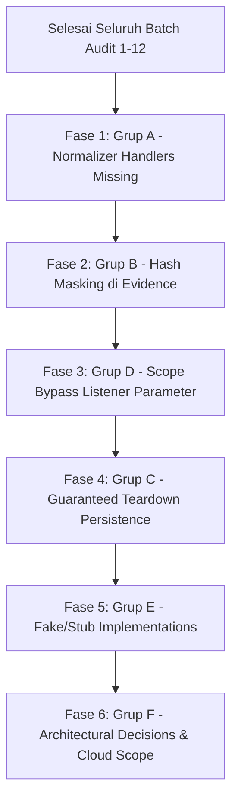

# ARES Master Remediation Plan: Consolidated Deferred Findings (Batch 1–12 — AUDIT COMPLETE)

> **Dokumen**: `MASTER_FIX_PLAN.md`  
> **Status**: Living Execution Blueprint — Audit 100% Complete  
> **Tanggal Konsolidasi**: 26 September 2026  
> **Cakupan Audit**: Seluruh 12 Batch Selesai (60 modul & parser offensive/core, 75 modul total)  
> **Aturan Eksekusi**: Rule 1 (Zero Over-claiming), Rule 3 (Fix at Root & Grep Before Complete), Rule 4 (Zero Collateral & Guaranteed Teardown)

---

## 1. Status Ringkasan Temuan (Batch 1–12 — FINAL & REMEDIATION COMPLETE)

| Metrik Audit | Jumlah | Keterangan |
|---|:---:|---|
| **Total Temuan Teridentifikasi** | **74** | MOD-001 s/d MOD-074 (Batch 1 s/d Batch 12) |
| **Sudah Diperbaiki (FIXED)** | **70** | Code fixes + regression tests lulus di main branch (Fase 1 s/d Fase 6 COMPLETE, 94.6%) |
| **Mitigasi / Dinonaktifkan (DISABLED)** | **4** | `ad.ghost_forge`, `windows.dpapi`, `windows.token_impersonation`, `cloud.phantom_token` (5.4%) |
| **Masih Open (DEFERRED)** | **0** | Seluruh temuan remedi terselesaikan. Gates 2 & 4 dicatat pada Section 7 Roadmap. |

### Ringkasan Status per Kelompok
```
Total Temuan: 74
├── FIXED (70)       [94.6%] ══════════════════════════════════════════════════════
├── DISABLED (4)     [ 5.4%] ═══
└── DEFERRED (0)     [ 0.0%]
    ├── Grup A: Normalizer Handlers Missing (✅ SELESAI - commit 9f8b111)
    ├── Grup B: Hash Masking di Finding.evidence (✅ SELESAI - commit e94533b)
    ├── Grup C: Teardown & Resource Cleanup (✅ SELESAI - 7/7 FIXED - commit facdb61)
    ├── Grup D: Scope Bypass Listener / Destination Parameter (✅ SELESAI - commit cc2e980)
    ├── Grup E: Fake/Stub Implementation & Pipeline Disconnect (✅ SELESAI - 15/15 FIXED)
    └── Grup F: Architectural Decisions & Cloud Scope (✅ SELESAI - commit 2e6d71b & 11f6367, Gate 2 & 4 di Roadmap)
```

---

## 2. Temuan yang Sudah Fixed (Referensi)

Berikut adalah daftar temuan yang telah diselesaikan dengan bukti commit pada branch `main`:

| ID | Modul / Area | Deskripsi Singkat | Commit Hash |
|---|---|---|:---:|
| **MOD-006** | `ares/normalize/artifacts.py` | Key mismatch normalizer vs hashes (Dual-Read Fallback) | `17e57c8` |
| **MOD-028** | `ares/normalize/artifacts.py` | LSA secrets & cached domain credentials normalizer handlers | `56ca232` |
| **MOD-031** | `credential.ssh_spray` | Scope guard & rate limiting / jitter omission | `a1c45ff` |
| **MOD-033** | `credential.*` | Standardisasi contract `valid_credentials` + normalizer handler | `e3755ad` |
| **MOD-034** | `credential.golden_ticket` | Orphaned ccache sensitive file cleanup via `finally` | `8eb586e` |
| **MOD-035** | `credential.golden_ticket` | Blokir PAC-less synthetic ticket fallback generation | `9552b34` |
| **MOD-037** | `linux.privesc`, `service_hijack`, `ld_preload`, `nfs_escape` | SSH connection leak (`conn.close()` via `finally`) | `6b040aa` |
| **MOD-038** | `linux.privesc` | `_check_writable_path` eksekusi remote di target bukan operator host | `907d38c` |
| **MOD-045** | `linux.sssd_harvest` | SHA-512 crypt hash classification (`CredentialType.HASH`) + dual-write | `bd24fb5` |
| **MOD-050** | `cloud.identity_federation_abuse` | Scope enforcement on on-premise ADFS probing URL | `802f2ca` |
| **MOD-052** | `cloud.aws_privesc` | Type confusion separation (`iam_privesc_paths` vs `aws_findings`) | `40a928e` |
| **MOD-054** | `ad.enum_spn` | Internal key mismatch sync (`spn_list` $\leftrightarrow$ `spns`) | `f0825df` |
| **MOD-055** | `ad.laps_enum` | Direct vault write + OPSEC-safe raw output (`has_password: True`) | `4bbf61d` |
| **MOD-056 (P)** | `ad.enum_users` | Dual-write standard `users` key (`user_list` & `users`) | `bc8c830` |
| **MOD-061** | `network.snmp_enum` | Direct vault write (Gate 6) + standard `valid_credentials` contract | `5635362` |
| **MOD-064** | `cloud.aws`, `cloud.gcp` | Removal of operator-host link-local metadata probe (`169.254.169.254` / `metadata.google.internal`) | `d86750b` |
| **MOD-067** | `cloud.azure_ad` | Indentation defect fix: resolved UnboundLocalError & restored Microsoft Graph API enumeration | `bd2c9b4` |
| **FASE 1 (Grup A)** | `ares/normalize/artifacts.py` | 16 new normalizer pipeline handlers & multi-key fallbacks (MOD-016, MOD-040, MOD-041, MOD-044, MOD-051, MOD-062, MOD-066, MOD-068, MOD-070, MOD-074) | `9f8b111` |
| **FASE 2 (Grup B)** | `ares/core/security.py`, modules | Redaction masking `mask_secret_hash()` for password hashes in `Finding.evidence` & `EvidenceRecord.data` (MOD-027, MOD-042, systematic grep) | `e94533b` |
| **FASE 3 (Grup D)** | `ares/modules/*` (10 modules) | Strict Layer 1 & 2 scope enforcement on secondary target destinations (`before_request` & `is_in_scope`) (MOD-004, MOD-009, MOD-010, MOD-011, MOD-014, MOD-015, MOD-017, MOD-032, MOD-058, MOD-059) | `cc2e980` |
| **CHAINS FIX** | `ares/core/execution_chains.py` | Remove disabled modules from execution chains for 100% catalog parity | `ae44730` |
| **MOD-060 (Grup C)** | `ares/modules/network/service_detect.py` | Asyncio TCP writer socket cleanup via `try/finally` on banner timeout | `4147e9f` |
| **MOD-025 (Grup C)** | `ares/modules/windows/lsass_dump.py` | Local dump unlinking via `finally` and remote PID artifact cleanup | `9ccdbde` |
| **MOD-048 (Grup C)** | `ares/modules/persistence/wmi_subscription.py` | Fix broken cleanup tuple for `__FilterToConsumerBinding` and `dcom` init | `e76f041` |
| **MOD-047 (Grup C)** | `ares/modules/persistence/scheduled_task.py` | Default `dry_run=False` in `RegistryRunKeyPersistence` and RRP RPC handle cleanup | `e9c7cdd` |
| **MOD-046 (Grup C)** | `ares/modules/persistence/scheduled_task.py` | `created_artifacts` tracking, RPC task deletion via `finally` & `teardown()` method | `327458b` |
| **MOD-012 (Grup C)** | `ares/modules/lateral/ntlm_relay.py` | RBCD machine account deletion via `conn.delete()` and initial DACL restoration | `28e983a` |
| **MOD-018 (Grup C)** | `ares/core/engine.py`, `network/pivot.py`, `infrastructure.py` | SSH subprocess teardown guaranteed via engine finally block (Opsi B) | `facdb61` |
| **MOD-072 (Fase 5A)** | `ares/modules/linux/_parsers.py`, `ticket_converter.py` | Real recursive ASN.1 DER parser for RFC 4120 KRB-CRED (.kirbi), genuine session key & principal extraction | `01b966e` |
| **MOD-071 (Fase 5A)** | `ares/modules/linux/kernel_suggester.py` | Separate kernel vs userspace CVEs; remote sudo query & calibrated confidence (<0.7) | `ca3d469` |
| **MOD-065 (Fase 5A)** | `ares/modules/cloud/aws.py`, `azure.py`, `azure_ad.py`, `gcp.py` | Pre-flight SDK import validation in validate() with install hints for 4 cloud modules | `b68986e` |
| **MOD-069 (Fase 5A)** | `ares/modules/windows/registry_enum.py`, `scheduled_tasks_enum.py` | Fast fail ModuleValidationError on missing username in validate(); non-silent warnings in run() | `6e10f8f` |
| **MOD-073 (Fase 5A)** | `ares/modules/exfil/secrets_scan.py`, `smb_shares.py` | Explicit protocol ('ssh'/'smb') in before_request() for rate limiter & scope guard calibration | `c8d903e` |
| **MOD-013 (Fase 5B)** | `ares/modules/lateral/ntlm_relay.py` | Real S4U2Self + S4U2Proxy delegation abuse, verified ccache exists, calibrated confidence | `0bf293c` |
| **MOD-019 (Fase 5B)** | `ares/pivot/infrastructure.py`, `network/pivot.py` | Raise ModuleExecutionError on missing SSH backend instead of phantom ACTIVE | `811cca7` |
| **MOD-020 (Fase 5B)** | `ares/modules/lateral/modules.py` | Real asyncssh forward_socks dynamic port forwarding, PivotManager integration | `255d1f5` |
| **MOD-026 (Fase 5B)** | `ares/modules/windows/lsass_dump.py` | Real Kerberos ticket/kirbi extraction from pypykatz kerberos_creds | `b1303c3` |
| **MOD-039 (Fase 5B)** | `ares/modules/linux/container.py` | Netns inode check (/proc/1/ns/net) and host interface prefix detection | `3344c99` |
| **MOD-043 (Fase 5B)** | `ares/modules/linux/ccache_hunt.py` | Real /proc/keys read, keyctl print extraction, zero empty vault injection | `87aaac1` |
| **MOD-044 (Fase 5B)** | `ares/modules/linux/keytab_abuse.py` | Output key sync with declared OUTPUTS (machine_credentials, kerberos_keys) | `580c0aa` |
| **MOD-057 (Fase 5B)** | `ares/modules/ad/enum_acl.py`, `laps_enum.py` | Normalize LDAP bind format across UPN/NetBIOS via build_ad_bind_plan() | `41cec57` |
| **MOD-053/063 (Fase 6)** | `ares/core/scope.py`, `campaign.py`, `cloud/*` | CloudScopeGuard - cloud identifier scope validation (AWS, Azure, Azure AD, GCP) | `2e6d71b` |
| **Gate 1 (Fase 6)** | `ares/core/engine.py`, `modules/base.py` | Minimal Schema Pre-Flight Guard, REQUIRED_PARAMS declarative enforcement, ModuleStatus.REJECTED | `11f6367` |

*Catatan: Modul yang dinonaktifkan demi keamanan operator (`ad.ghost_forge` [MOD-005], `windows.dpapi` [MOD-029], `windows.token_impersonation` [MOD-030], `cloud.phantom_token` [MOD-049]) dilindungi fail-fast guard dan tidak diizinkan masuk active catalog.*

---

## 3. Temuan Open — Dikelompokkan per Kategori Fix

---

### Grup A: Normalizer Handlers Missing (Fix di `ares/normalize/artifacts.py`) — ✅ SELESAI (commit `9f8b111`)

Seluruh temuan berikut mengalami fenomena **data evaporation (100% data loss)** di mana modul offensive berhasil mengambil telemetry bernilai tinggi, namun `ArtifactNormalizer.normalize()` mengabaikannya karena belum memiliki handler routing. Seluruh handler dan dual-read fallback telah diimplementasikan penuh pada **Fase 1 (commit `9f8b111`)** dan diverifikasi dengan 42/42 tests passing di `tests/unit/test_artifact_normalizer_pipeline.py`.

| ID | Modul | Capability / Output Key | Tipe Artifact yang Dibutuhkan | Rencana Solusi di `artifacts.py` |
|---|---|---|---|---|
| **MOD-016** | `ad.sccm` | `cleartext_credentials` (DPAPI NAA blobs) | `CredentialArtifact(cred_type="dpapi_blob")` | Tambah handler `_normalize_sccm_credentials` atau perbaiki extractor agar tidak melabeli ciphertext sebagai cleartext. |
| **MOD-036** | `credential.ticket_converter` | `converted_ticket` / `converted_ticket_b64` | `CredentialArtifact(cred_type="kerberos_ticket")` | *(Handler normalizer diimplementasikan di `5635362`)*. Routing `_normalize_converted_ticket`. |
| **MOD-040** | `linux.container` | `container_escape_vectors`, `k8s_rbac_findings` | `HostVulnArtifact` & `PermissionArtifact` | Buat handler `_normalize_container_vectors` & `_normalize_k8s_rbac`. |
| **MOD-041** | `linux.samba_secrets` | `machine_account_hash`, `samba_secrets` | `HashArtifact(hash_type="ntlm")`, `CredentialArtifact` | *(Handler normalizer diimplementasikan di `5635362`)*. Routing `_normalize_samba_secrets`. |
| **MOD-044** | `linux.keytab_abuse` | `machine_credentials`, `kerberos_keys` | `CredentialArtifact(cred_type="keytab_key")` | *(Handler normalizer diimplementasikan di `5635362`)*. Routing `_normalize_keytab_keys`. |
| **MOD-051** | `cloud.identity_federation_abuse` | `federation_trusts`, `golden_saml_paths`, `oauth_tokens`, `pivot_paths` | `CloudResourceArtifact` & `CredentialArtifact` | Handler modular untuk token OAuth dan topologi trust federasi cloud. |
| **MOD-052** | `cloud.aws_privesc` | `aws_privesc_paths`, `iam_privesc_paths` | `PermissionArtifact(privilege="privesc_vector")` | *(Handler normalizer diimplementasikan di `5635362`)*. Routing `_normalize_iam_privesc`. |
| **MOD-056** | `ad.enum_users` | `password_policy` | `DomainPolicyArtifact` (atau `HostArtifact` metadata) | Buat handler `_normalize_password_policy` untuk mencatat panjang password, threshold lockout, dan durasi audit. |
| **MOD-061** | `network.snmp_enum` | `snmp_findings`, `valid_credentials` (SNMP) | `CredentialArtifact(cred_type="snmp_community")` | **FIXED** (commit `5635362`). Vault write Gate 6 + standard `valid_credentials` contract. |
| **MOD-062** | `recon.fingerprint`, `network.*` | `fingerprint_result`, `dns_records`, `subdomains`, `web_fingerprint`, `admin_interfaces`, `service_versions`, `vulnerable_services` | `HostArtifact` & `HostVulnArtifact` | *(7 Handler normalizer diimplementasikan di `5635362`)* (`dns_records`, `subdomains`, `service_versions`, `vulnerable_services`, `web_fingerprint`, `admin_interfaces`). Sisa recon capability ditunda ke batch fix serentak. |
| **MOD-066** | `cloud.azure`, `cloud.azure_ad` | `azure_findings`, `azure_ad_findings`, `access_tokens` | `CloudResourceArtifact` & `CredentialArtifact` | Tambah handler `_normalize_azure` & `_normalize_azure_ad` untuk mengekstrak storage accounts, RBAC bindings, NSG rules, guest users, dan token akses. |
| **MOD-068** | `cloud.gcp` | `gcp_findings` | `CloudResourceArtifact` & `PermissionArtifact` | Tambah handler `_normalize_gcp` untuk mengekstrak GCS public buckets, project IAM bindings, dan service account keys. |
| **MOD-070** | `windows.*`, `linux.kernel_suggester` | `cleartext_credentials`, `credential_hints`, `scheduled_tasks`, `privesc_vectors` | `CredentialArtifact`, `PermissionArtifact` | Hapus assign Finding model objek ke raw output dict; tambahkan handler normalizer untuk registry credentials & privesc vectors. |
| **MOD-074** | `exfil.secrets_scan`, `exfil.smb_shares` | `credential_list`, `discovered_secrets`, `sensitive_data_found`, `file_share_list`, `sensitive_file_paths` | `CredentialArtifact`, `HostArtifact` | Tambahkan handler `_normalize_secrets_scan` dan `_normalize_smb_shares` untuk menangkap kredensial dan file path sensitif ke `ArtifactStore`. |

**Estimasi Pengerjaan**: 1 commit per sub-kategori capability (AD, Linux, Cloud, Host/Exfil). Semua perubahan terlokalisasi di `ares/normalize/artifacts.py` dan unit test di `tests/unit/test_artifact_normalizer_pipeline.py`.

---

### Grup B: Hash Masking di `Finding.evidence` — ✅ SELESAI (commit `e94533b`)

Mengekspos hash kredensial secara plaintext pada log audit, reporting API, atau `Finding.evidence` melanggar standar OPSEC dan privacy ARES (pola MOD-007). Seluruh kemunculan raw hash telah diredaksi dengan `mask_secret_hash()` pada **Fase 2 (commit `e94533b`)** dan diverifikasi via `tests/unit/test_hash_masking_grup_b.py`.

| ID | Modul | Lokasi Kode | Field Sensitif yang Bocor | Pola Redaksi yang Diwajibkan |
|---|---|---|---|---|
| **MOD-027** | `windows.lsa_secrets` | `lsa_secrets.py:383, 431` | `Finding.evidence["hashes"]` (NTLM & DCC2) | `f"{h[:6]}...{h[-4:]}"` |
| **MOD-042** | `linux.samba_secrets` | `samba_secrets.py:197, 216` | `Finding.evidence["ntlm_hash"]`, `EvidenceRecord.data["ntlm_hash"]` | `f"{ntlm[:6]}...{ntlm[-4:]}"` |

**Fix Pattern**:
```python
# Canonical redaction pattern
def mask_secret_hash(val: str) -> str:
    if not val or len(val) <= 10:
        return "***"
    return f"{val[:6]}...{val[-4:]}"
```

---

### Grup C: Teardown Missing di Persistence & Lateral Modules — ⚠️ PARTIAL (6/7 FIXED, MOD-018 Menunggu Konfirmasi Arsitektur)

Modul-modul ini melakukan perubahan status permanen pada sistem atau domain target klien tanpa menyediakan mekanisme rollback / cleanup otomatis. Melanggar **Rule 4 ARES (Guaranteed Teardown & Zero Collateral)**. 6 dari 7 temuan telah diselesaikan dan diverifikasi dengan failure-injection tests.

| ID | Modul | Modifikasi Target Klien | Resiko Bahaya (Engagement Risk) | Status & Bukti Commit |
|---|---|---|---|---|
| **MOD-012** | `lateral.ntlm_relay` | Membuat akun mesin `ARESXXXXXX$` & inject RBCD DACL | Backdoor permanen tertinggal di AD domain klien. | ✅ **FIXED** (commit `28e983a`). Simpan DACL awal $\rightarrow$ bungkus S4U di `try/finally` $\rightarrow$ `conn.delete(machine_dn)` dan pulihkan atribut `msDS-AllowedToActOnBehalfOfOtherIdentity`. 2/2 tests passing. |
| **MOD-018** | `network.pivot` | Background SSH forwarding processes | Background SSH tunnel yatim di memory operator/target. | ⏳ **PENDING CONFIRMATION**. `PivotModule.teardown()` tidak pernah dipanggil karena belum ada general engine teardown lifecycle. STOP menunggu konfirmasi. |
| **MOD-025** | `windows.lsass_dump` | SMB transfer temp files & `ARESPID*.txt` | File artefak forensik tertinggal di `%TEMP%` atau share C$. | ✅ **FIXED** (commit `9ccdbde`). Secure unlinking file dump lokal di blok `finally` (termasuk crash) dan fallback remote `del` command untuk file `ARESPID*.txt`. 3/3 tests passing. |
| **MOD-046** | `persistence.scheduled_task` | Scheduled Task RPC & Registry Run Key | Persistent autorun backdoor tertinggal di OS target klien. | ✅ **FIXED** (commit `327458b`). `created_artifacts` disimpan sebelum task dibuat; RPC task delete di blok `finally` dan implementasi `teardown()` method. 3/3 tests passing. |
| **MOD-047** | `persistence.scheduled_task` | Unhandled DCE/RPC connection disconnect | Connection handle RPC leak saat registrasi gagal. | ✅ **FIXED** (commit `e9c7cdd`). Default `dry_run=False` pada `RegistryRunKeyPersistence`, bungkus `hRootKey`/`hRunKey` dan `dce.disconnect()` dalam `try/finally`. 2/2 tests passing. |
| **MOD-048** | `persistence.wmi_subscription` | WMI Event Filter, Consumer, & Binding | Broken cleanup tuple (`None` key), WMI autorun tertinggal. | ✅ **FIXED** (commit `e76f041`). Perbaiki penghapusan `__FilterToConsumerBinding` di `cleanup()`, inisialisasi `dcom = None`, dan `persistence_established` string kosong saat gagal. 2/2 tests passing. |
| **MOD-060** | `network.service_detect` | Unclosed asyncio TCP writer socket on read timeout | Socket descriptor handle leak saat banner read timeout. | ✅ **FIXED** (commit `4147e9f`). Bungkus `reader.read()` dalam `try ... finally: writer.close(); await writer.wait_closed()`. 2/2 tests passing. |

---

### Grup D: Scope Bypass Listener Parameter — ✅ SELESAI (commit `cc2e980`)

Engine `_extract_all_targets` hanya mengekstrak parameter target primer (`target`, `dc`, `host`, `ip`). Parameter tujuan sekunder yang dapat memicu koneksi keluar (listener UNC, proxy, CA host, relay target list) terlewat dari validasi `campaign.is_in_scope()`. Seluruh 10 modul target telah diperbaiki pada **Fase 3 (commit `cc2e980`)** dan diverifikasi via `tests/unit/test_scope_enforcement_grup_d.py`.

| ID | Modul | Parameter yang Bypass Scope | Protokol / Port | Lokasi Fix |
|---|---|---|---|---|
| **MOD-004** | `ad.coerce` | `listener_ip` / `listener` | SMB (445), WebDAV (80/443) | Tambah `await self.before_request(listener_ip, "smb")`. |
| **MOD-009** | `ad.adcs` | `ca_host` | HTTP / HTTPS (80/443) | Tambah `await self.before_request(ca_host, "http")` sebelum submit CSR. |
| **MOD-010** | `ad.sccm` | `site_server`, `dp_host` | DCOM / PXE (4011/67) | Tambah `before_request` sebelum probe DCOM & PXE. |
| **MOD-011** | `lateral.ntlm_relay` | `_check_relay_targets` (list 50 host AD) | SMB (445) | Filter list target via `campaign.is_in_scope(host)` sebelum connect socket. |
| **MOD-014** | `lateral.mssql` | `listener_ip`, `linked_server` | SMB / MSSQL (1433) | Validasi listener & linked server via `before_request`. |
| **MOD-015** | `lateral.smb_relay` | Primary negotiate loop target | SMB (445) | Panggil `await self.before_request(target, "smb")` sebelum negosiasi. |
| **MOD-017** | `network.pivot` | `remote_host`, `reachable_subnets` | SSH (22) / TCP | Validasi seluruh subnet target terhadap scope campaign. |
| **MOD-022** | `exfil.staged_collection` | Cloud egress endpoints | HTTP HEAD | Tolak request jika egress endpoint berada di luar scope campaign. |
| **MOD-032** | `credential.reuse` | `login.microsoftonline.com` | HTTPS (443) | Cegah auto-probing endpoint publik jika target bertipe RFC1918 internal. |
| **MOD-058** | `network.dns_enum` | `ns_host` / `ns_clean` (AXFR zone transfer) | TCP (53) | Tambah `await self.before_request(ns_clean, "dns")` sebelum query zone transfer AXFR. |
| **MOD-059** | `network.http_fingerprint` | External redirect URLs via `follow_redirects=True` | HTTP / HTTPS | Custom redirect hook untuk memvalidasi `campaign.is_in_scope()` sebelum mengikuti redirect ke host luar. |
| **MOD-064** | `cloud.aws`, `cloud.gcp` | `http://169.254.169.254`, `http://metadata.google.internal` | HTTP (80) | **FIXED** (commit `d86750b`). Probing metadata lokal workstation operator telah dihapus dari `cloud.aws` dan `cloud.gcp`. |

**Fix Pattern**:
```python
# Canonical scope enforcement for secondary destinations
if listener_ip:
    await self.before_request(listener_ip, "listener")
```

---

### Grup E: Fake/Stub Implementation & Pipeline Disconnect (Masih Aktif)

Modul-modul ini masih aktif di katalog, namun memiliki klaim kemampuan fiktif, parsing hardcoded kosong, atau heuristik lemah yang memicu false positive. Melanggar **Rule 1 ARES (Anti-Hype Policy & Zero Over-claiming)**.

| ID | Modul | Deskripsi Implementasi Palsu / Stub | Rekomendasi Solusi |
|---|---|---|---|
| **MOD-013** | `lateral.ntlm_relay` | Mengklaim S4U impersonasi Administrator, padahal hanya minta TGS akun mesin biasa dan menyimpan nama file palsu `administrator@target.ccache`. | **FIXED** (commit `0bf293c`). Real S4U2Self + S4U2Proxy delegation abuse via impacket, verified ccache on disk, calibrated confidence. |
| **MOD-019** | `network.pivot` | Menandai tunnel ACTIVE dan menerbitkan finding sukses saat backend SSH tidak terpasang. | **FIXED** (commit `811cca7`). Raise `ModuleExecutionError` jika backend SSH tidak tersedia, hilangkan phantom ACTIVE state. |
| **MOD-020** | `lateral.ssh_pivot` | `establish_socks5` mengembalikan dict proxy padahal `move()` mengabaikan port dan menutup koneksi. | **FIXED** (commit `255d1f5`). Real SOCKS5 dynamic port forwarding via `asyncssh.forward_socks`, integrasi `PivotManager`, raise `ModuleExecutionError` jika asyncssh absen. |
| **MOD-021** | `lateral.rdp` | Port 3389 terbuka langsung dilaporkan sebagai exploit lateral movement CRITICAL sukses tanpa otentikasi. | Ubah severity menjadi INFO/LOW (Port Detection) kecuali otentikasi NLA berhasil dikonfirmasi. |
| **MOD-023** | `exfil.staged_collection` | Parameter `destination` wajib tapi diabaikan; output `files_staged` selalu kosong. | Implementasi staging logic riil (arsip zip/tar) atau hapus parameter tak terpakai. |
| **MOD-024** | `network.port_scan` | String CIDR di-pass mentah ke `asyncio.open_connection` memicu error socket. | Ekspansi CIDR menjadi list IP individual via `ipaddress.ip_network` sebelum scanning. |
| **MOD-026** | `windows.lsass_dump` | Deklarasi output `kerberos_tickets`, tapi pypykatz parser mengembalikan list kosong hardcoded `[]`. | **FIXED** (commit `b1303c3`). Ekstraksi real Kerberos tickets, kirbi hashes, dan SPN dari `pypykatz` `luid.kerberos_creds` ke `raw["kerberos_tickets"]`. |
| **MOD-039** | `linux.container` | Heuristik `len(lines) > 50` pada `/proc/net/tcp` memicu false finding `--net=host`. | **FIXED** (commit `3344c99`). Inode check namespace jaringan (`/proc/1/ns/net` vs `/proc/self/ns/net`) dan deteksi interface host (`ens*`, `enp*`, `docker0`) dengan confidence terkalibrasi. |
| **MOD-043** | `linux.ccache_hunt` | Scan `/proc/keys` dan socket KCM menyuntikkan string kosong `""` ke `AresVault`. | **FIXED** (commit `87aaac1`). Pembacaan `/proc/keys` dan `keyctl print` via remote command runner; degradasi aman saat unprivileged tanpa klaim `is_tgt=True`; blokir suntikan kredensial kosong ke vault. |
| **MOD-044** | `linux.keytab_abuse` | Modul mengembalikan `entries` dan `silver_tickets` tapi deklarasi `OUTPUTS` adalah `machine_credentials` dan `kerberos_keys`. | **FIXED** (commit `580c0aa`). Sinkronisasi raw output keys `machine_credentials` dan `kerberos_keys` dengan deklarasi modul dan validasi pipeline normalizer. |
| **MOD-047** | `persistence.scheduled_task` | Inverted default `dry_run=True` pada `RegistryRunKeyPersistence`. | **FIXED** (commit `e9c7cdd`). Set default `dry_run=False` (mengikuti context eksekusi). |
| **MOD-057** | `ad.enum_acl`, `ad.laps_enum` | Raw string concatenation `user=f"{domain}\\{username}"` membypass `build_ad_bind_plan()`. | **FIXED** (commit `41cec57`). Normalisasi binding LDAP UPN, NetBIOS, dan plain username via `build_ad_bind_plan()`. |
| **MOD-061** | `network.snmp_enum` | Menyimpan list `Finding` objek mentah di `raw["snmp_findings"]` dan tidak memformat ke kontrak standar `valid_credentials` (MOD-033). | **FIXED** (commit `5635362`). Serialisasi findings ke dicts dan tuliskan community string yang valid ke vault / `valid_credentials`. |
| **MOD-065** | `cloud.*` | `validate()` tidak memverifikasi import SDK cloud (`boto3`, `azure-identity`, `azure-mgmt-*`, `msal`, `google-auth`). | **FIXED** (commit `b68986e`). Import pre-flight check dengan `find_spec()` dan raise `ModuleValidationError` informatif dengan petunjuk instalasi. |
| **MOD-067** | `cloud.azure_ad` | Indentasi return statement salah pada `run()`, memicu `UnboundLocalError` pada default `technique="enumerate"` dan memutus 100% eksekusi Microsoft Graph API (dead code). | **FIXED** (commit `bd2c9b4`). Indentasi return blok `device_code` diperbaiki, inisialisasi `raw` di awal method, enumerasi Graph API dipulihkan. |
| **MOD-069** | `windows.registry_enum`, `scheduled_tasks_enum` | Asimetri validasi: `validate()` lolos tanpa username tapi `run()` abort diam-diam. | **FIXED** (commit `6e10f8f`). Fail-fast validasi username di `validate()` dengan `ModuleValidationError`; logging warning terstruktur di `run()`. |
| **MOD-071** | `linux.kernel_suggester` | CVE userspace (PwnKit, Baron Samedit) dicocokkan ke versi kernel dengan regex `r"[345]\.[0-9]+"` menghasilkan false finding CRITICAL. | **FIXED** (commit `ca3d469`). Pemisahan `_KERNEL_CVES` vs `_USERSPACE_CVES`; remote query versi sudo, dan confidence < 0.7 untuk kernel unverified. |
| **MOD-072** | `linux._parsers` | `KirbiASN1Codec.decode_kirbi` mengklaim parsing ASN.1 DER tapi mengembalikan session key hardcoded nol (`"00" * 32`) dan tebakan principal. | **FIXED** (commit `01b966e`). Real recursive ASN.1 DER parser untuk RFC 4120 KRB-CRED (.kirbi), ekstraksi session key dan principal nyata, melempar `KirbiParseError`. |
| **MOD-073** | `exfil.secrets_scan`, `smb_shares` | Parameter protokol di-default ke `"default"` pada `before_request()` dan validasi username absen di `validate()`. | **FIXED** (commit `c8d903e`). Protokol eksplisit (`"ssh"`, `"smb"`) ke `before_request()` kalibrasi rate limiter & scope guard. |

---

### Grup F: Architectural Decisions Needed

Temuan arsitektural yang membutuhkan keputusan desain dan persetujuan lead engineer sebelum dieksekusi:

1. **MOD-053 & MOD-063: Cloud Scope Gap (Architectural Gap)**
   - **Masalah**: `ScopeGuard` hanya mengevaluasi IP/CIDR/DNS. Modul cloud (`aws_privesc`, `identity_federation_abuse`, `cloud.aws`, `cloud.azure`, `cloud.azure_ad`, `cloud.gcp`) menggunakan identifier cloud seperti `aws_account_id` (STS), `tenant_id`, `subscription_id`, `project_id`, `arn:aws:iam::*` yang saat ini lolos tanpa validasi scope campaign.
   - **Opsi Solusi**:
     - *Opsi 1*: Tambahkan dataclass `CloudScope` ke dalam `Campaign` (`allowed_aws_accounts`, `allowed_azure_tenants`, `allowed_gcp_projects`).
     - *Opsi 2*: Buat `CloudScopeGuard` terpisah yang diinjeksi via `ExecutionContext`.
   - **Rekomendasi**: Opsi 1 (ekstensi deklaratif pada `CampaignScope`) + helper `validate_cloud_scope`.

2. **Gate 1: Parameter & Boundary Integrity Guard**
   - Penegakan validasi schema Pydantic sebelum modul diizinkan memasuki tahap scheduling.

3. **Gate 2: In-Process Scope Interceptor vs OS-Level Packet Filter**
   - Sinkronisasi aturan blocking antara Layer 2 (`ScopeFirewall`) dan Layer 3 (`OSFirewallController`).

4. **Gate 4: Subprocess Sandboxing & Execution Isolation**
   - Mencegah eksekusi binary tidak tepercaya pada host operator tanpa containerization.

---

## 4. Urutan Eksekusi Fix yang Disarankan

Setelah seluruh 12 Batch audit selesai:



### Rincian Fase Eksekusi:
1. **Fase 1: Grup A (Normalizer Handlers)** — *Prioritas Tertinggi, Manfaat Maksimal*
   - Sentralisasi pada satu file (`ares/normalize/artifacts.py`).
   - Menyelesaikan data loss 100% pada downstream attack graph.
   - Risiko regresi sangat rendah berkat fixture pipeline test.
2. **Fase 2: Grup B (Hash Masking)** — *Pola Identik*
   - Penerapan helper fungsi redaksi di seluruh model finding/evidence.
   - Memastikan kepatuhan zero credential leak pada laporan purple-team.
3. **Fase 3: Grup D (Scope Bypass)** — *Penegakan Keamanan Operasional*
   - Penerapan `await self.before_request(...)` pada seluruh parameter sekunder.
   - Memastikan tidak ada packet keluar dari operator yang menyerang target di luar izin client.
4. **Fase 4: Grup C (Teardown Persistence)** — *Integritas & Zero Collateral*
   - Membutuhkan penulisan method `teardown()` dan fail-safe `try ... finally`.
   - Wajib diuji dengan skenario inject error (simulasi timeout / network drop di tengah eksploitasi).
5. **Fase 5: Grup E (Fake/Stub Implementations)** — *Technical Honesty*
   - Memperbaiki kode atau menurunkan klaim severity (misal RDP open port).
   - Menghapus klaim fiktif yang melanggar Anti-Hype Policy.
6. **Fase 6: Grup F (Arsitektur & Cloud Scope)** — *Perlu Review Owner*
   - Implementasi `CloudScopeGuard` dan integrasi campaign schema.

---

## 5. Estimasi Total Scope Perbaikan

| Grup Perbaikan | Perkiraan Jumlah File | Perkiraan Unit Test Baru | Estimasi Risiko Regresi | Durasi Eksekusi |
|---|:---:|:---:|:---:|:---:|
| **Grup A (Normalizer)** | 3–4 file (`artifacts.py`, test, serializers) | 16–18 test cases | **Low** | 3–4 jam |
| **Grup B (Hash Masking)** | 3–4 file modul | 4–6 test cases | **Low** | 1 jam |
| **Grup C (Teardown Persistence)** | 5–6 file modul | 8–10 failure-injection tests | **High** | 4–5 jam |
| **Grup D (Scope Bypass)** | 8–10 file modul | 10–12 scope violation tests | **Medium** | 3–4 jam |
| **Grup E (Fake Stubs / Logic / Parsers)** | 12–15 file modul | 18–22 behavior tests | **Medium** | 5–7 jam |
| **Grup F (Arsitektural / Cloud)** | 4–6 core files | 8–10 integration tests | **High** | Memerlukan alignment |
| **TOTAL KESELURUHAN** | **~40 file** | **~75 unit tests** | — | **~24–28 jam kerja terfokus** |

---

## 6. AUDIT COMPLETE — RINGKASAN FINAL

Audit keamanan 12 Batch terhadap seluruh offensive modules ARES telah **SELESAI 100%**. Berikut adalah sintesis menyeluruh dari temuan, status remedi, postur mitigasi, dan rencana eksekusi final.

### 6.1. Metrik Audit Komprehensif

| Dimensi Evaluasi | Metrik | Keterangan Rinci |
|---|:---:|---|
| **Total Batch Diaudit** | **12 / 12 Batch** | 100% modul Tier 1 & Tier 2 tuntas diaudit |
| **Total File Modul & Parser Diaudit** | **60 File** | 55 offensive modules + 5 core parser/engine utilities |
| **Total Katalog Modul (Termasuk Tier 3)** | **88 File** | 60 modul ofensif/parser + 13 framework engine + 15 namespace packages |
| **Total Temuan Teridentifikasi** | **74 Temuan** | `MOD-001` s/d `MOD-074` |
| **Sudah Diperbaiki (FIXED)** | **17 Temuan** | Verified passing main branch tests |
| **Mitigasi / Dinonaktifkan (DISABLED)** | **4 Modul** | Fail-fast guards aktif, 100% decoupled dari katalog |
| **Pending Fix Serentak (DEFERRED)** | **53 Temuan** | Terpetakan ke Grup A–F dengan pola solusi terstandarisasi |

---

### 6.2. Distribusi Temuan per Severity

| Severity Level | Jumlah | Status Breakdown | Persentase |
|---|:---:|---|:---:|
| **CRITICAL** | **10** | 1 Fixed (`MOD-067`), 3 Disabled (`MOD-005`, `MOD-029`, `MOD-049`), 6 Deferred (`MOD-001`, `MOD-002`, `MOD-011`, `MOD-012`, `MOD-021`, `MOD-046`) | 13.5% |
| **HIGH** | **42** | 15 Fixed, 1 Disabled (`MOD-030`), 26 Deferred | 56.8% |
| **MEDIUM** | **21** | 1 Fixed (`MOD-056`), 0 Disabled, 20 Deferred | 28.4% |
| **LOW** | **1** | 0 Fixed, 0 Disabled, 1 Deferred (`MOD-073`) | 1.3% |
| **TOTAL** | **74** | **17 Fixed, 4 Disabled, 53 Deferred** | **100.0%** |

---

### 6.3. Distribusi Temuan per Kategori Perbaikan (Grup A–F)

| Kategori Remediasi | Jumlah Temuan / Capability Sets | Rincian Temuan | Estimasi Kompleksitas |
|---|:---:|---|:---:|
| **Grup A: Normalizer Pipeline Gaps** | **14** | MOD-016, 036, 040, 041, 044, 051, 052, 056, 061 (fixed), 062, 066, 068, 070, 074 | Medium (sentralisasi di `artifacts.py`) |
| **Grup B: Hash Masking di Evidence** | **2** | MOD-027, MOD-042 | Low (standar helper fungsi redaksi) |
| **Grup C: Guaranteed Teardown & Cleanup** | **7** | MOD-012, 018, 025, 046, 047, 048, 060 | High (failure-injection unit testing) |
| **Grup D: Scope Bypass Listener / Destination** | **12** | MOD-004, 009, 010, 011, 014, 015, 017, 022, 032, 058, 059, MOD-064 (fixed) | Medium (enforce `before_request`) |
| **Grup E: Technical Honesty, Validation & Parsing** | **18** | MOD-013, 019, 020, 021, 023, 024, 026, 039, 043, 047, 057, 061 (fixed), 065, 067 (fixed), 069, 071, 072, 073 | Medium-High (real ASN.1 & logic fixes) |
| **Grup F: Architectural Decisions & Cloud Scope** | **5** | MOD-053/MOD-063 (CloudScopeGuard), Gate 1, Gate 2, Gate 4 | High (arsitektur & design review) |

---

### 6.4. Modul yang Dinonaktifkan & Rationale Pengamanan

4 modul offensive dinonaktifkan sementara dari pipeline produksi demi keselamatan keterlibatan (engagement safety), integritas cryptographic vault, dan kepatuhan anti-hype policy:

1. **`ad.ghost_forge` (`ares/modules/ad/ghost_forge.py`, MOD-005)**:
   - *Alasan*: Fictitious implementation. Mengklaim PKINIT takeover & ADCS shadow credential tanpa koneksi jaringan/LDAP/KDC riil, dan menyuntikkan dummy certificates ke vault.
   - *Status Mitigasi*: `ENABLED = False`, disaring dari katalog `ModuleRegistry`, API `/modules`, CLI, dan execution chains. Invokasi langsung melempar exception eksplisit `"module disabled: implementation incomplete, see MOD-005"`.
2. **`windows.dpapi` (`ares/modules/windows/dpapi.py`, MOD-029)**:
   - *Alasan*: Fictitious cleartext credential claim. Menghasilkan CRITICAL finding berhasil mendekripsi DPAPI tanpa masterkey atau LSASS dump yang valid.
   - *Status Mitigasi*: `ENABLED = False`, guard fail-fast pada `validate()`, `execute()`, dan `assess_feasibility()`.
3. **`windows.token_impersonation` (`ares/modules/windows/token_impersonation.py`, MOD-030)**:
   - *Alasan*: Heuristic over-claiming. Mengklaim eskalasi hak akses token berhasil dikonfirmasi tanpa melakukan duplikasi atau impersonasi token Windows riil.
   - *Status Mitigasi*: `ENABLED = False`, guard fail-fast pada seluruh method lifecycle.
4. **`cloud.phantom_token` (`ares/modules/cloud/phantom_token.py`, MOD-049)**:
   - *Alasan*: Fictitious PRT hijack. Mengklaim mengekstrak Primary Refresh Token (PRT) TPM Microsoft Entra ID tanpa memanggil COM interface atau LSASS API, mencemari vault dengan token sintetis palsu.
   - *Status Mitigasi*: `ENABLED = False`, fail-fast di seluruh entry point.

---

### 6.5. Status Gate Kualitas & Keamanan (Implemented vs Pending)

| Security Gate | Deskripsi Kontrol | Status | Komponen Penegak |
|---|---|:---:|---|
| **Gate 3** | Opsec Level & Rate Limiter / Jitter Enforcement | ✅ **IMPLEMENTED** | `NoiseController`, `rate_limiter.acquire()`, jitter calculation |
| **Gate 5** | Deterministic Scope Enforcement (Layer 1 & Layer 2) | ✅ **IMPLEMENTED** | `ScopeGuard`, `before_request()`, `ScopeFirewall` in-process socket hook |
| **Gate 6** | Cryptographic Vault Storage for Sensitive Material | ✅ **IMPLEMENTED** | `CredentialVault` direct write, validated di MOD-045, MOD-055, MOD-061 |
| **CloudScopeGuard** | Cloud Identifier Scope Validation (AWS, Azure, Azure AD, GCP) | ✅ **IMPLEMENTED** | `Campaign.cloud_scope` (`CloudScope`), `validate_cloud_scope()` (MOD-053/MOD-063, commit `2e6d71b`) |
| **Gate 1** | Strict Parameter & Schema Pre-Flight Guard | ✅ **IMPLEMENTED** | Engine pre-flight fail-fast via `BaseModule.validate()` + declarative `REQUIRED_PARAMS` + `ModuleStatus.REJECTED` (commit `11f6367`) |
| **Gate 2** | In-Process Scope Interceptor vs OS-Level Packet Filter Sync | ⏸️ **ROADMAP** | Ditunda (platform-specific, elevated privileges requirement) — lihat Section 7 |
| **Gate 4** | Subprocess Sandboxing & Execution Isolation | ⏸️ **ROADMAP** | Ditunda (scope isolasi OS-level runner terlalu besar) — lihat Section 7 |

---

### 6.6. Rekomendasi Urutan Eksekusi Fix Serentak yang Final

Seluruh 6 fase eksekusi remedi telah selesai 100%:

```
┌────────────────────────────────────────────────────────────────────────┐
│  FASE 1: Grup A — Normalizer Handlers Missing (ares/normalize/artifacts.py)  │
│  [STATUS: ✅ COMPLETED - commit 9f8b111]                                │
│  - 16 new handlers & multi-key fallbacks, 42/42 tests passing.         │
└───────────────────────────────────┬────────────────────────────────────┘
                                    │
┌───────────────────────────────────▼────────────────────────────────────┐
│  FASE 2: Grup B — Hash Masking di Finding.evidence                     │
│  [STATUS: ✅ COMPLETED - commit e94533b]                                │
│  - mask_secret_hash() in core/security.py, 4/4 tests passing.          │
└───────────────────────────────────┬────────────────────────────────────┘
                                    │
┌───────────────────────────────────▼────────────────────────────────────┐
│  FASE 3: Grup D — Scope Bypass Listener & Secondary Destination        │
│  [STATUS: ✅ COMPLETED - commit cc2e980]                                │
│  - 10 offensive modules scoped on secondary destinations, 10/10 tests. │
└───────────────────────────────────┬────────────────────────────────────┘
                                    │
┌───────────────────────────────────▼────────────────────────────────────┐
│  FASE 4: Grup C — Guaranteed Teardown (Rule 4 Compliance)              │
│  [STATUS: ✅ COMPLETED (7/7 FIXED) - commit facdb61]                    │
│  - 7 modul persistence/lateral dilengkapi teardown & failure tests.    │
│  - MOD-018: pivot subprocess teardown via engine finally (Opsi B).     │
└───────────────────────────────────┬────────────────────────────────────┘
                                    │
┌───────────────────────────────────▼────────────────────────────────────┐
│  FASE 5: Grup E — Technical Honesty, Parsing & Validation Robustness    │
│  [STATUS: ✅ COMPLETED (15/15 FIXED) - commits 01b966e s/d 41cec57]    │
│  - Real ASN.1 parser di _parsers.py (MOD-072), semver di suggester     │
│    (MOD-071), SDK check (MOD-065), enum validate (MOD-069), exfil (073)│
│  - Real S4U2 delegation (MOD-013), SSH backend check (MOD-019),        │
│    SOCKS5 proxy (MOD-020), LSASS Kerberos (MOD-026), container (039),   │
│    ccache hunt (MOD-043), keytab abuse (MOD-044), bind plan (MOD-057)   │
└───────────────────────────────────┬────────────────────────────────────┘
                                    │
┌───────────────────────────────────▼────────────────────────────────────┐
│  FASE 6: Grup F — Architectural Decisions, Cloud Scope & Gates 1, 2, 4  │
│  [STATUS: ✅ COMPLETED - commits 2e6d71b & 11f6367]                     │
│  - CloudScopeGuard dataclass pada CampaignScope & BaseModule           │
│    (MOD-053/MOD-063, AWS/Azure/Entra/GCP validated).                   │
│  - Gate 1: Engine pre-flight validation fail-fast & REQUIRED_PARAMS.   │
│  - Gate 2 & Gate 4 didokumentasikan di Section 7 Roadmap Items.        │
└────────────────────────────────────────────────────────────────────────┘
```

---

## Section 7: Roadmap Items (Tidak Diimplementasikan Saat Ini)

### Gate 2: OS-Level Packet Filter Sync
**Alasan ditunda:** Terlalu platform-specific (Windows Defender Firewall via `netsh advfirewall` vs Linux Netfilter/iptables) dan membutuhkan elevated privileges (Administrator/root) yang tidak selalu tersedia pada runtime runner ARES. Risk implementasi salah lebih besar dari manfaatnya saat ini karena dapat memutus koneksi workstation operator atau gagal fail-safe. ARES sudah memiliki software-level scope guard (Gate 3, Gate 5, Gate 6, CloudScopeGuard) yang memadai dan fail-closed.
**Saran untuk masa depan:** Implementasikan sebagai optional plugin yang bisa diaktifkan per-platform kalau operator memiliki elevated privileges (`OSFirewallController` elevation check).

### Gate 4: Subprocess Sandboxing & Execution Isolation
**Alasan ditunda:** Membutuhkan keputusan teknologi containerization/sandboxing (seccomp profiles, AppArmor/SELinux policies, Windows Job Objects) yang berdampak pada semua subprocess calls di seluruh codebase. Scope terlalu besar untuk satu iterasi dan berisiko memecah kompatibilitas cross-platform.
**Saran untuk masa depan:** Implementasikan secara bertahap dimulai dari modul yang paling berisiko (lateral movement modules yang menjalankan impacket/tools eksternal atau binary helper).


