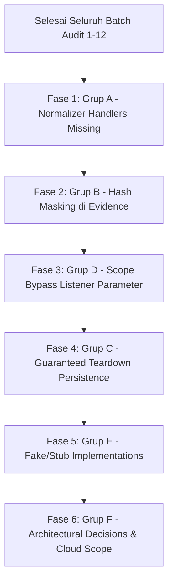

# ARES Master Remediation Plan: Consolidated Deferred Findings (Batch 1–9)

> **Dokumen**: `MASTER_FIX_PLAN.md`  
> **Status**: Living Execution Blueprint  
> **Tanggal Konsolidasi**: 26 September 2026  
> **Cakupan Audit**: Batch 1 sampai Batch 9 (45 modul offensive/core)  
> **Aturan Eksekusi**: Rule 1 (Zero Over-claiming), Rule 3 (Fix at Root & Grep Before Complete), Rule 4 (Zero Collateral & Guaranteed Teardown)

---

## 1. Status Ringkasan Temuan (Batch 1–9)

| Metrik Audit | Jumlah | Keterangan |
|---|:---:|---|
| **Total Temuan Teridentifikasi** | **57** | MOD-001 s/d MOD-057 |
| **Sudah Diperbaiki (FIXED)** | **14** | Code fixes + regression tests lulus di main branch |
| **Mitigasi / Dinonaktifkan (DISABLED)** | **4** | `ad.ghost_forge`, `windows.dpapi`, `windows.token_impersonation`, `cloud.phantom_token` |
| **Masih Open (DEFERRED)** | **39** | Dikonsolidasikan ke dalam Grup A–F untuk eksekusi serentak |

### Ringkasan Status per Kelompok
```
Total Temuan: 57
├── FIXED (14)       [24.6%] ══════════════
├── DISABLED (4)     [ 7.0%] ═══
└── DEFERRED (39)    [68.4%] ═══════════════════════════════════
    ├── Grup A: Normalizer Handlers Missing (8 temuan / capability sets)
    ├── Grup B: Hash Masking di Finding.evidence (2 temuan)
    ├── Grup C: Teardown Missing di Persistence/Lateral (6 temuan)
    ├── Grup D: Scope Bypass Listener Parameter (9 temuan)
    ├── Grup E: Fake/Stub Implementation Active (10 temuan)
    └── Grup F: Architectural Decisions Needed (4 temuan / gates)
```

---

## 2. Temuan yang Sudah Fixed (Referensi)

Berikut adalah daftar temuan yang telah diselesaikan dengan bukti commit pada branch `main`:

| ID | Modul / Area | Deskripsi Singkat | Commit Hash |
|---|---|---|:---:|
| **MOD-006** | `ares/normalize/artifacts.py` | Key mismatch normalizer vs hashes (Dual-Read Fallback) | `17e57c8` |
| **MOD-028** | `ares/normalize/artifacts.py` | LSA secrets & cached domain credentials normalizer handlers | `56ca232` |
| **MOD-031** | `credential.ssh_spray` | Scope guard & rate limiting / jitter omission | `a1c45ff` |
| **MOD-033** | `credential.*` | Standardisasi contract `valid_credentials` + normalizer handler | `e3755ad` |
| **MOD-034** | `credential.golden_ticket` | Orphaned ccache sensitive file cleanup via `finally` | `8eb586e` |
| **MOD-035** | `credential.golden_ticket` | Blokir PAC-less synthetic ticket fallback generation | `9552b34` |
| **MOD-037** | `linux.privesc`, `service_hijack`, `ld_preload`, `nfs_escape` | SSH connection leak (`conn.close()` via `finally`) | `6b040aa` |
| **MOD-038** | `linux.privesc` | `_check_writable_path` eksekusi remote di target bukan operator host | `907d38c` |
| **MOD-045** | `linux.sssd_harvest` | SHA-512 crypt hash classification (`CredentialType.HASH`) + dual-write | `bd24fb5` |
| **MOD-050** | `cloud.identity_federation_abuse` | Scope enforcement on on-premise ADFS probing URL | `802f2ca` |
| **MOD-052** | `cloud.aws_privesc` | Type confusion separation (`iam_privesc_paths` vs `aws_findings`) | `40a928e` |
| **MOD-054** | `ad.enum_spn` | Internal key mismatch sync (`spn_list` $\leftrightarrow$ `spns`) | `f0825df` |
| **MOD-055** | `ad.laps_enum` | Direct vault write + OPSEC-safe raw output (`has_password: True`) | `4bbf61d` |
| **MOD-056 (P)** | `ad.enum_users` | Dual-write standard `users` key (`user_list` & `users`) | `bc8c830` |

*Catatan: Modul yang dinonaktifkan demi keamanan operator (`ad.ghost_forge` [MOD-005], `windows.dpapi` [MOD-029], `windows.token_impersonation` [MOD-030], `cloud.phantom_token` [MOD-049]) dilindungi fail-fast guard dan tidak diizinkan masuk active catalog.*

---

## 3. Temuan Open — Dikelompokkan per Kategori Fix

---

### Grup A: Normalizer Handlers Missing (Fix di `ares/normalize/artifacts.py`)

Seluruh temuan berikut mengalami fenomena **data evaporation (100% data loss)** di mana modul offensive berhasil mengambil telemetry bernilai tinggi, namun `ArtifactNormalizer.normalize()` mengabaikannya karena belum memiliki handler routing.

| ID | Modul | Capability / Output Key | Tipe Artifact yang Dibutuhkan | Rencana Solusi di `artifacts.py` |
|---|---|---|---|---|
| **MOD-016** | `ad.sccm` | `cleartext_credentials` (DPAPI NAA blobs) | `CredentialArtifact(cred_type="dpapi_blob")` | Tambah handler `_normalize_sccm_credentials` atau perbaiki extractor agar tidak melabeli ciphertext sebagai cleartext. |
| **MOD-036** | `credential.ticket_converter` | `converted_ticket` / `converted_ticket_b64` | `CredentialArtifact(cred_type="kerberos_ticket")` | Mapping capability `converted_ticket` $\rightarrow$ `_normalize_kerberos_tickets` dengan decoder base64 otomatis. |
| **MOD-040** | `linux.container` | `container_escape_vectors`, `k8s_rbac_findings` | `HostVulnArtifact` & `PermissionArtifact` | Buat handler `_normalize_container_vectors` & `_normalize_k8s_rbac`. |
| **MOD-041** | `linux.samba_secrets` | `machine_account_hash`, `samba_secrets` | `HashArtifact(hash_type="ntlm")`, `CredentialArtifact` | Routing ke `_normalize_ntlm_hashes` dan handler baru `_normalize_samba_secrets`. |
| **MOD-044** | `linux.keytab_abuse` | `machine_credentials`, `kerberos_keys` | `CredentialArtifact(cred_type="keytab_key")` | Handler `_normalize_keytab_keys` memparsing entri keytab (KVNO, encryption type, key bytes). |
| **MOD-051** | `cloud.identity_federation_abuse` | `federation_trusts`, `golden_saml_paths`, `oauth_tokens`, `pivot_paths` | `CloudResourceArtifact` & `CredentialArtifact` | Handler modular untuk token OAuth dan topologi trust federasi cloud. |
| **MOD-052** | `cloud.aws_privesc` | `aws_privesc_paths`, `iam_privesc_paths` | `PermissionArtifact(privilege="privesc_vector")` | Handler `_normalize_iam_privesc` mengonversi daftar path eksploitasi IAM ke permission finding terstruktur. |
| **MOD-056** | `ad.enum_users` | `password_policy` | `DomainPolicyArtifact` (atau `HostArtifact` metadata) | Buat handler `_normalize_password_policy` untuk mencatat panjang password, threshold lockout, dan durasi audit. |

**Estimasi Pengerjaan**: 1 commit per sub-kategori capability (AD, Linux, Cloud). Semua perubahan terlokalisasi di `ares/normalize/artifacts.py` dan unit test di `tests/unit/test_artifact_normalizer_pipeline.py`.

---

### Grup B: Hash Masking di `Finding.evidence`

Mengekspos hash kredensial secara plaintext pada log audit, reporting API, atau `Finding.evidence` melanggar standar OPSEC dan privacy ARES (pola MOD-007).

| ID | Modul | Lokasi Kode | Field Sensitif yang Bocor | Pola Redaksi yang Diwajibkan |
|---|---|---|---|---|
| **MOD-027** | `windows.lsa_secrets` | `lsa_secrets.py:383, 431` | `Finding.evidence["hashes"]` (NTLM & DCC2) | `f"{h[:6]}...{h[-4:]}"` |
| **MOD-042** | `linux.samba_secrets` | `samba_secrets.py:197, 216` | `Finding.evidence["ntlm_hash"]`, `EvidenceRecord.data["ntlm_hash"]` | `f"{ntlm[:6]}...{ntlm[-4:]}"` |

**Fix Pattern**:
```python
# Canonical redaction pattern
def mask_secret_hash(val: str) -> str:
    if not val or len(val) <= 10:
        return "***"
    return f"{val[:6]}...{val[-4:]}"
```

---

### Grup C: Teardown Missing di Persistence & Lateral Modules

Modul-modul ini melakukan perubahan status permanen pada sistem atau domain target klien tanpa menyediakan mekanisme rollback / cleanup otomatis. Melanggar **Rule 4 ARES (Guaranteed Teardown & Zero Collateral)**.

| ID | Modul | Modifikasi Target Klien | Resiko Bahaya (Engagement Risk) | Pola Teardown yang Diperlukan |
|---|---|---|---|---|
| **MOD-012** | `lateral.ntlm_relay` | Membuat akun mesin `ARESXXXXXX$` & inject RBCD DACL | Backdoor permanen tertinggal di AD domain klien. | Simpan DACL awal $\rightarrow$ bungkus S4U di `try/finally` $\rightarrow$ `conn.delete(machine_dn)` dan pulihkan atribut `msDS-AllowedToActOnBehalfOfOtherIdentity`. |
| **MOD-018** | `network.pivot` | Background SSH forwarding processes | Background SSH tunnel yatim di memory operator/target. | Register cleanup handler di `teardown()` dan `atexit` engine lifecycle. |
| **MOD-025** | `windows.lsass_dump` | SMB transfer temp files & `ARESPID*.txt` | File artefak forensik tertinggal di `%TEMP%` atau share C$. | SMB delete file di blok `finally` saat transfer selesai atau gagal. |
| **MOD-046** | `persistence.scheduled_task` | Scheduled Task RPC & Registry Run Key | Persistent autorun backdoor tertinggal di OS target klien. | Implementasi method `teardown()` menggunakan `hSchRpcDeleteTask` dan `hBaseRegDeleteValue`. Simpan identifier artefak ke `raw["created_artifacts"]`. |
| **MOD-047** | `persistence.scheduled_task` | Unhandled DCE/RPC connection disconnect | Connection handle RPC leak saat registrasi gagal. | Bungkus eksekusi RPC dalam `try ... finally: dce.disconnect()`. |
| **MOD-048** | `persistence.wmi_subscription` | WMI Event Filter, Consumer, & Binding | Broken cleanup tuple (`None` key), WMI autorun tertinggal. | Perbaiki tuple cleanup WMI, pastikan `__FilterToConsumerBinding` dihapus deterministik. |

---

### Grup D: Scope Bypass Listener Parameter

Engine `_extract_all_targets` hanya mengekstrak parameter target primer (`target`, `dc`, `host`, `ip`). Parameter tujuan sekunder yang dapat memicu koneksi keluar (listener UNC, proxy, CA host, relay target list) terlewat dari validasi `campaign.is_in_scope()`.

| ID | Modul | Parameter yang Bypass Scope | Protokol / Port | Lokasi Fix |
|---|---|---|---|---|
| **MOD-004** | `ad.coerce` | `listener_ip` / `listener` | SMB (445), WebDAV (80/443) | Tambah `await self.before_request(listener_ip, "smb")`. |
| **MOD-009** | `ad.adcs` | `ca_host` | HTTP / HTTPS (80/443) | Tambah `await self.before_request(ca_host, "http")` sebelum submit CSR. |
| **MOD-010** | `ad.sccm` | `site_server`, `dp_host` | DCOM / PXE (4011/67) | Tambah `before_request` sebelum probe DCOM & PXE. |
| **MOD-011** | `lateral.ntlm_relay` | `_check_relay_targets` (list 50 host AD) | SMB (445) | Filter list target via `campaign.is_in_scope(host)` sebelum connect socket. |
| **MOD-014** | `lateral.mssql` | `listener_ip`, `linked_server` | SMB / MSSQL (1433) | Validasi listener & linked server via `before_request`. |
| **MOD-015** | `lateral.smb_relay` | Primary negotiate loop target | SMB (445) | Panggil `await self.before_request(target, "smb")` sebelum negosiasi. |
| **MOD-017** | `network.pivot` | `remote_host`, `reachable_subnets` | SSH (22) / TCP | Validasi seluruh subnet target terhadap scope campaign. |
| **MOD-022** | `exfil.staged_collection` | Cloud egress endpoints | HTTP HEAD | Tolak request jika egress endpoint berada di luar scope campaign. |
| **MOD-032** | `credential.reuse` | `login.microsoftonline.com` | HTTPS (443) | Cegah auto-probing endpoint publik jika target bertipe RFC1918 internal. |

**Fix Pattern**:
```python
# Canonical scope enforcement for secondary destinations
if listener_ip:
    await self.before_request(listener_ip, "listener")
```

---

### Grup E: Fake/Stub Implementation (Masih Aktif)

Modul-modul ini masih aktif di katalog, namun memiliki klaim kemampuan fiktif, parsing hardcoded kosong, atau heuristik lemah yang memicu false positive. Melanggar **Rule 1 ARES (Anti-Hype Policy & Zero Over-claiming)**.

| ID | Modul | Deskripsi Implementasi Palsu / Stub | Rekomendasi Solusi |
|---|---|---|---|
| **MOD-013** | `lateral.ntlm_relay` | Mengklaim S4U impersonasi Administrator, padahal hanya minta TGS akun mesin biasa dan menyimpan nama file palsu `administrator@target.ccache`. | Implementasi protokol S4U2self + S4U2proxy nyata via impacket atau turunkan klaim & ubah nama ccache menjadi tiket akun mesin. |
| **MOD-019** | `network.pivot` | Menandai tunnel ACTIVE dan menerbitkan finding sukses saat backend SSH tidak terpasang. | Return failure / raise `ModuleExecutionError` jika dependency tidak terpenuhi. |
| **MOD-020** | `lateral.ssh_pivot` | `establish_socks5` mengembalikan dict proxy padahal `move()` mengabaikan port dan menutup koneksi. | Implementasikan SOCKS5 proxy handler berbasis asyncio atau tandai experimental. |
| **MOD-021** | `lateral.rdp` | Port 3389 terbuka langsung dilaporkan sebagai exploit lateral movement CRITICAL sukses tanpa otentikasi. | Ubah severity menjadi INFO/LOW (Port Detection) kecuali otentikasi NLA berhasil dikonfirmasi. |
| **MOD-023** | `exfil.staged_collection` | Parameter `destination` wajib tapi diabaikan; output `files_staged` selalu kosong. | Implementasi staging logic riil (arsip zip/tar) atau hapus parameter tak terpakai. |
| **MOD-024** | `network.port_scan` | String CIDR di-pass mentah ke `asyncio.open_connection` memicu error socket. | Ekspansi CIDR menjadi list IP individual via `ipaddress.ip_network` sebelum scanning. |
| **MOD-026** | `windows.lsass_dump` | Deklarasi output `kerberos_tickets`, tapi pypykatz parser mengembalikan list kosong hardcoded `[]`. | Hapus `kerberos_tickets` dari `OUTPUTS` sampai parser Kirbi/ccache diimplementasikan. |
| **MOD-039** | `linux.container` | Heuristik `len(lines) > 50` pada `/proc/net/tcp` memicu false finding `--net=host`. | Periksa kesamaan inode namespace network (`/proc/1/ns/net` vs `/proc/self/ns/net`). |
| **MOD-043** | `linux.ccache_hunt` | Scan `/proc/keys` dan socket KCM menyuntikkan string kosong `""` ke `AresVault`. | Blokir penyimpanan vault jika byte tiket kosong (sejalan dengan Gate 6). |
| **MOD-047** | `persistence.scheduled_task` | Inverted default `dry_run=True` pada `RegistryRunKeyPersistence`. | Set default `dry_run=False` (mengikuti setting context eksekusi). |
| **MOD-057** | `ad.enum_acl`, `ad.laps_enum` | Raw string concatenation `user=f"{domain}\\{username}"` membypass `build_ad_bind_plan()`. | Migrasi ke `build_ad_bind_plan()` untuk standardisasi UPN/NTLM domain binding. |

---

### Grup F: Architectural Decisions Needed

Temuan arsitektural yang membutuhkan keputusan desain dan persetujuan lead engineer sebelum dieksekusi:

1. **MOD-053: Cloud Scope Gap (Architectural Gap)**
   - **Masalah**: `ScopeGuard` hanya mengevaluasi IP/CIDR/DNS. Modul cloud (`aws_privesc`, `identity_federation_abuse`) menggunakan identifier cloud seperti `aws_account_id`, `tenant_id`, `subscription_id`, `arn:aws:iam::*`.
   - **Opsi Solusi**:
     - *Opsi 1*: Tambahkan dataclass `CloudScope` ke dalam `Campaign` (`allowed_aws_accounts`, `allowed_azure_tenants`).
     - *Opsi 2*: Buat `CloudScopeGuard` terpisah yang diinjeksi via `ExecutionContext`.
   - **Rekomendasi**: Opsi 1 (ekstensi deklaratif pada `CampaignScope`).

2. **Gate 1: Parameter & Boundary Integrity Guard**
   - Penegakan validasi schema Pydantic sebelum modul diizinkan memasuki tahap scheduling.

3. **Gate 2: In-Process Scope Interceptor vs OS-Level Packet Filter**
   - Sinkronisasi aturan blocking antara Layer 2 (`ScopeFirewall`) dan Layer 3 (`OSFirewallController`).

4. **Gate 4: Subprocess Sandboxing & Execution Isolation**
   - Mencegah eksekusi binary tidak tepercaya pada host operator tanpa containerization.

---

## 4. Urutan Eksekusi Fix yang Disarankan

Setelah seluruh 12 Batch audit selesai:



### Rincian Fase Eksekusi:
1. **Fase 1: Grup A (Normalizer Handlers)** — *Prioritas Tertinggi, Manfaat Maksimal*
   - Sentralisasi pada satu file (`ares/normalize/artifacts.py`).
   - Menyelesaikan data loss 100% pada downstream attack graph.
   - Risiko regresi sangat rendah berkat fixture pipeline test.
2. **Fase 2: Grup B (Hash Masking)** — *Pola Identik*
   - Penerapan helper fungsi redaksi di seluruh model finding/evidence.
   - Memastikan kepatuhan zero credential leak pada laporan purple-team.
3. **Fase 3: Grup D (Scope Bypass)** — *Penegakan Keamanan Operasional*
   - Penerapan `await self.before_request(...)` pada seluruh parameter sekunder.
   - Memastikan tidak ada packet keluar dari operator yang menyerang target di luar izin client.
4. **Fase 4: Grup C (Teardown Persistence)** — *Integritas & Zero Collateral*
   - Membutuhkan penulisan method `teardown()` dan fail-safe `try ... finally`.
   - Wajib diuji dengan skenario inject error (simulasi timeout / network drop di tengah eksploitasi).
5. **Fase 5: Grup E (Fake/Stub Implementations)** — *Technical Honesty*
   - Memperbaiki kode atau menurunkan klaim severity (misal RDP open port).
   - Menghapus klaim fiktif yang melanggar Anti-Hype Policy.
6. **Fase 6: Grup F (Arsitektur & Cloud Scope)** — *Perlu Review Owner*
   - Implementasi `CloudScopeGuard` dan integrasi campaign schema.

---

## 5. Estimasi Total Scope Perbaikan

| Grup Perbaikan | Perkiraan Jumlah File | Perkiraan Unit Test Baru | Estimasi Risiko Regresi | Durasi Eksekusi |
|---|:---:|:---:|:---:|:---:|
| **Grup A (Normalizer)** | 2–3 file (`artifacts.py`, test) | 12–15 test case | **Low** | 2–3 jam |
| **Grup B (Hash Masking)** | 3–4 file modul | 4–6 test case | **Low** | 1 jam |
| **Grup C (Teardown Persistence)** | 5–6 file modul | 8–10 failure-injection tests | **High** | 4–5 jam |
| **Grup D (Scope Bypass)** | 8–10 file modul | 10–12 scope violation tests | **Medium** | 3–4 jam |
| **Grup E (Fake Stubs / Logic)** | 9–11 file modul | 12–16 behavior tests | **Medium** | 4–6 jam |
| **Grup F (Arsitektural / Cloud)** | 4–6 core files | 8–10 integration tests | **High** | Memerlukan alignment |
| **TOTAL KESELURUHAN** | **~35 file** | **~60 unit tests** | — | **~18–22 jam kerja terfokus** |

---

## 6. Template Konsolidasi untuk Batch 10–12

Setiap temuan baru yang diidentifikasi pada Batch 10, 11, dan 12 harus langsung diklasifikasikan ke salah satu Grup (A, B, C, D, E, F) atau mendefinisikan Grup Baru jika karakteristik temuan belum tercakup.

*Dokumen ini diperbarui secara berkala seiring berjalannya audit.*
