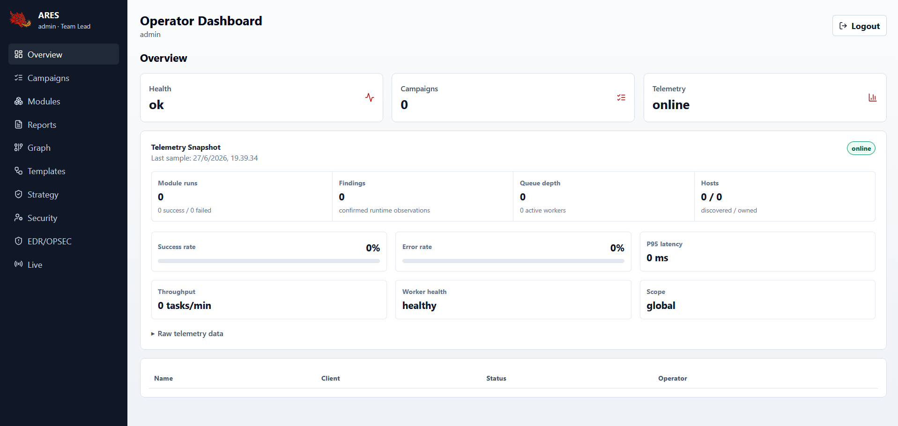

<div align="center">


# ARES

### Automated Red Team Engagement System

ARES is an authorized red-team engagement framework for scoped campaigns,
module orchestration, OPSEC-aware execution, encrypted credential handling,
and professional report generation.

[](https://python.org)
[](https://fastapi.tiangolo.com)
[](https://react.dev)
[](LICENSE)
[](tests/)

**Built for labs, internal security teams, and authorized engagements only.**

</div>

---

## What ARES Is

ARES turns a red-team or security-validation engagement into a structured,
auditable workflow:

1. Create a campaign.
2. Define explicit scope.
3. Select modules from the catalog.
4. Validate parameters with dry-run mode.
5. Execute authorized checks.
6. Store evidence and credentials safely.
7. Review findings, graph data, and OPSEC risk.
8. Generate branded reports.
9. Clean up test campaigns from the dashboard.

ARES is designed for the part of an engagement where authorization already
exists and the operator needs discipline, repeatability, reporting, and guardrails.

## What ARES Is Not

ARES is not:

- A C2 framework.
- An implant or beacon framework.
- A phishing framework.
- An initial-access toolkit.
- A tool for testing systems without written authorization.

Do not use ARES against systems you do not own or have explicit permission to
assess.

---

## Why It Exists

Offensive security work can become messy fast: scattered scripts, loose notes,
untracked evidence, unclear scope, repeated manual validation, and reports that
take longer than the test.

ARES focuses on the operational layer:

| Problem | ARES Approach |
| --- | --- |
| "What campaign is this finding from?" | Campaign-scoped storage and reports. |
| "Can this module run safely?" | Parameter validation, dry-run mode, OPSEC levels. |
| "Are we inside scope?" | Scope-first campaign model and backend validation. |
| "Where did this credential come from?" | Encrypted credential vault and campaign audit trail. |
| "How do we explain results?" | MITRE-aware findings and branded report generation. |
| "How do we avoid UI clutter?" | Campaign and API-key delete flows with backend cleanup. |
| "How do we test the app after changes?" | Local validation lab script. |

---

## Core Features

### Operator Dashboard

ARES has two dashboard serving modes:

- Local development: run the launcher from the repository root and open the
  Vite dashboard at `http://127.0.0.1:5173/dashboard/`.
- Production/static serving: after the frontend assets are built, FastAPI
  serves the compiled dashboard at `/dashboard`.

Recommended local development command:

```bash
ares dashboard dev
```

Windows virtualenv example:

```powershell
.\.venv\Scripts\ares.exe dashboard dev
```

Dashboard preview:



Dashboard shell:

- The left sidebar routes between the major dashboard pages.
- The topbar menu button collapses and expands the sidebar.
- Topbar quick search is client-side navigation over the currently loaded
  dashboard context: page names/routes, campaigns, modules, reports, and
  templates. It is not a server-backed global search across unloaded historical
  data.
- The notification bell is the status surface. There is no separate topbar
  status pill labeled `Offline` or `Live`.
- The notification badge counts unread notifications only. Opening the drawer
  marks visible notifications as read; individual dismiss and clear-all actions
  remove notifications from the current session. The frontend stores only
  notification state, not bodies, tokens, API keys, stack traces, or raw
  payloads.
- The topbar also shows the signed-in identity and logout action.
- Page headers provide context, and page tabs switch the visible content for
  the current section.

Dashboard areas:

| Page | Purpose |
| --- | --- |
| Overview | Health, operator telemetry metrics, and campaign summary. Overview has no variation tabs. |
| Campaigns | `List`, `Scope`, and `Findings` tabs for campaign creation, inspection, compare/restore/dry-run actions, and cleanup. |
| Modules | `Catalog`, `Run Panel`, and `Results` tabs for browsing modules, filling backend-generated parameter forms, and reviewing execution output. |
| Reports | `Generate` and `Library` tabs for authenticated campaign report creation, listing, and download. |
| Graph | `Entities`, `Attack Paths`, and `Ingest` tabs for graph review and BloodHound/SharpHound import. |
| Templates | `Templates` and `Plan Builder` tabs for selecting built-in plans and generating reviewable execution stages. |
| Strategy | `Objective`, `Active`, and `Result` tabs for authorized goal-based planning and state review. |
| Security | `Account`, `API Keys`, and `Audit` tabs for password changes, API key lifecycle, audit output, and user review. |
| EDR/OPSEC | `Knowledge Base` and `Report Outcome` tabs for defensive telemetry and controlled outcome records. |
| Live | `Stream` and `Buffer` tabs for campaign WebSocket feedback and buffered event review. |

Recommended dashboard workflow:

1. Start in `Campaigns` and create a campaign with a name, client, targets,
   and scope CIDRs.
2. Use `Modules` to search for a module, pick the campaign, fill the generated
   parameters, and run it in dry-run mode first. The page shows a running state
   while execution is in progress and surfaces scope or validation errors in the
   result panel.
3. Use `Graph` only after a campaign exists. To ingest BloodHound or
   SharpHound data, enter a JSON file or directory path that is local to the
   machine running the ARES API, then click `Ingest`.
4. Use `Templates` when you want a repeatable plan. Select a built-in template,
   optionally provide JSON parameters, and click `Generate Plan`. This creates
   a structured execution plan for review; it does not silently execute modules.
5. Use `Strategy` for goal-based planning. Select a campaign, choose a goal
   such as `domain_admin`, provide explicit authorization notes, and click
   `Engage`. RBAC and backend authorization checks still apply.
6. Use `Reports` to generate HTML, PDF, Markdown, or JSON output for a campaign.
   PDF generation writes the PDF artifact directly; HTML is generated only when
   you choose the HTML format. Report evidence is rendered as readable tables
   and key-value rows where possible instead of unformatted report objects.
7. Use `Security` for account administration. API keys are for scripts and
   integrations; the Security Audit panel reports dependency-audit status for
   the ARES environment, not findings from a target network.
8. Use `EDR/OPSEC` to record controlled bypass outcomes and review historical
   telemetry. This page stores defensive-validation data; it does not generate
   payloads or bypass logic.

Common page inputs and outputs:

| Area | What you provide | What ARES returns | Use it when |
| --- | --- | --- | --- |
| Templates | Template name plus optional JSON parameters. | A reviewable execution plan with stages and module IDs. | You want a consistent plan for a common engagement type. |
| Strategy | Campaign, goal, and authorization notes. | Active engagement state and strategy events. | You want ARES to plan toward an authorized objective while preserving RBAC checks. |
| Security Audit | No target input; team-lead access only. | Dependency-audit snapshot, scanner status, and environment warnings. | You want to verify the ARES runtime dependencies and security posture. |
| EDR/OPSEC | Technique ID, EDR vendor, version, outcome, campaign, and notes. | Historical success-rate telemetry and outcome records. | You want to track defensive visibility and tune OPSEC decisions from controlled tests. |
| Graph Ingest | Campaign plus local BloodHound/SharpHound JSON path. | Campaign graph nodes, links, and attack-path candidates. | You already collected BloodHound-style data and want it mapped into ARES. |

Telemetry note:

The Overview telemetry panel is an in-memory operational snapshot for the
currently running ARES API process. It shows module run totals, success/failure
counts, latency, throughput, findings, hosts, queue depth, and worker health. It
is useful while operating or recording a demo, but it is not the durable
campaign database and resets when the API process restarts. Use Campaigns,
Findings, and Reports for permanent engagement history.

Planning modes:

| Mode | Where to use it | Requires LLM key? | What it does |
| --- | --- | --- | --- |
| Template plan | `Templates` page | No | Builds a deterministic plan from a named template such as `internal_pentest`. It is for review and does not execute modules by itself. |
| AI planner module | `Modules` page, module `ai.autonomous_planner` | Yes, unless using local Ollama | Reads campaign context and asks Claude, OpenAI, or a local Ollama model to produce a proposed execution plan with reasoning, confidence, and OPSEC warnings. |
| Strategy engagement | `Strategy` page | Usually yes | Starts a background goal-based strategy loop for an existing campaign. It uses AI planning and OPSEC checks, then sends progress events to the `Live` page. |
| Internal scorer | CLI / engine internals | No | Ranks possible next modules from local campaign/session state. This is AI-style scoring, not an external LLM call. |

The ARES API key created in the `Security` page is not an OpenAI, Anthropic,
or Ollama key. It authenticates scripts and integrations to the ARES API.
LLM provider keys are configured separately in the ARES server environment.
Creating an ARES API key opens the `Save your key` modal. The full secret is
shown once, the `Copy` button changes to `Copied` after a successful copy, and
`Done` closes the modal and clears the in-memory new-key state. The key list
shows metadata and a prefix only; the full secret cannot be retrieved later.

See [docs/dashboard-guide.md](docs/dashboard-guide.md).

### Campaign System

- Explicit campaign scope.
- Campaign-specific findings, hosts, credentials, loot, reports, and graph data.
- Team-lead-only campaign deletion for lab cleanup.
- Vault restore after restart.
- Campaign diff and CVSS summary.

### Module Orchestration

- 60+ built-in modules across AD, Windows, Linux, cloud, network, credential,
  lateral movement, EDR/OPSEC, exfil exposure checks, persistence review, and AI
  planning.
- Backend-driven module parameter schema.
- Dry-run default in the dashboard.
- OPSEC levels for module risk.
- High-noise and sensitive modules remain guarded by authorization and
  confirmation checks.
- MITRE ATT&CK metadata for reporting.

See [docs/modules.md](docs/modules.md).

### Security Controls

- JWT access tokens with refresh-token rotation.
- Token revocation on logout.
- API key lifecycle with revoked-key removal from dashboard lists.
- RBAC roles: team lead, operator, recon, reporter.
- Encrypted data handling for sensitive credential material.
- Backend validation for scope, params, paths, and auth.
- Rate limiting for sensitive flows.
- Security headers and audit visibility.

See [docs/security-model.md](docs/security-model.md).

### User Roles And Accounts

ARES creates the first `admin` account automatically when the user table is
empty. That bootstrap account is assigned the `team_lead` role and uses the
password provided in `ARES_DEFAULT_ADMIN_PASSWORD`. Change that password after
the first login.

Bootstrap happens only when the user table is empty. Changing
`ARES_DEFAULT_ADMIN_PASSWORD` after an `admin` user already exists does not
reset that user's password. For local development, either change the password
from the `Security` page after logging in or recreate the local database if you
intend to discard existing local data.

Local development reset warning: this deletes local dashboard data in
`ares.db`. Do not use it on real or shared deployments.

```powershell
New-Item -ItemType Directory -Force ".\_db_backup" | Out-Null
if (Test-Path ".\ares.db") {
  Copy-Item ".\ares.db" ".\_db_backup\ares.db.before-reset" -Force
}
Remove-Item ".\ares.db" -Force -ErrorAction SilentlyContinue
```

Roles are assigned when a `team_lead` creates a user:

| Role | Intended use | Practical access |
| --- | --- | --- |
| `team_lead` | Engagement lead or local administrator. | Full API access, user registration, security audit, campaign deletion, high-noise authorization, and normal operator work. |
| `operator` | Day-to-day operator account. | Campaign workflows, module execution, reports, graph, artifacts, and standard validation flows. Cannot register users. |
| `recon` | Low-risk review/recon identity. | Read-heavy access. The internal module permission matrix marks enumeration, fingerprint, and network modules as recon-safe, but the main dashboard execution endpoints are still operator-gated. |
| `reporter` | Report reviewer or stakeholder account. | Read-only access to campaign/report/graph-style data. No module execution and no user administration. |

Create additional users through the API while logged in as `team_lead`:

```powershell
$token = (Invoke-RestMethod `
  -Method Post `
  -Uri http://localhost:8080/auth/token `
  -ContentType "application/x-www-form-urlencoded" `
  -Body "username=admin&password=YOUR_CURRENT_ADMIN_PASSWORD").access_token

$headers = @{ Authorization = "Bearer $token" }

Invoke-RestMethod `
  -Method Post `
  -Uri http://localhost:8080/auth/register `
  -Headers $headers `
  -ContentType "application/json" `
  -Body (@{
    username = "alice"
    password = "StrongPass1!"
    role = "operator"
  } | ConvertTo-Json)
```

Valid role values are exactly `team_lead`, `operator`, `recon`, and `reporter`.
Passwords must be at least 12 characters and include uppercase, lowercase,
number, and special-character content. The current dashboard lists users in the
Security page, but role assignment is done at account creation time through
`POST /auth/register`.

### Reporting

- HTML, Markdown, and JSON report output.
- PDF output through WeasyPrint when available, with a Chromium-compatible
  browser fallback for local environments that do not have WeasyPrint native
  libraries installed.
- ARES branding in generated reports with footer-safe page spacing.
- Findings, readable evidence tables, severity, timeline, MITRE, and
  remediation-oriented sections.
- Authenticated report download through the dashboard.

### Validation Lab

ARES includes a local validation harness for checking the app after changes.

It validates:

- Health endpoint.
- Login and current profile.
- Campaign input validation.
- Local campaign create/list/delete.
- Module dry-run validation.
- Module API parameter validation.
- Report generation and listing.
- API key create/list/delete/list-after-delete.

See [docs/validation-lab.md](docs/validation-lab.md).

---

## Quickstart

### 1. Configure Required Secrets

ARES does not ship deployment secrets. The operator or organization deploying
ARES must generate these values and provide them through environment variables
or a private `.env` file.

The required values are:

| Variable | Who creates it? | Purpose |
| --- | --- | --- |
| `ARES_SECRET_KEY` | The deployer/client | Signs JWT/session security data. Generate a random high-entropy string. |
| `ARES_ENCRYPTION_KEY` | The deployer/client | Encrypts sensitive stored data such as vault/checkpoint material. Generate a Fernet key and keep it stable. |
| `ARES_DEFAULT_ADMIN_PASSWORD` | The deployer/client | Bootstrap password for the first `admin` account only when the user table is empty. Change it after first login. |

PowerShell:

```powershell
$bytes = [byte[]]::new(32)
[System.Security.Cryptography.RandomNumberGenerator]::Fill($bytes)
$env:ARES_SECRET_KEY = -join ($bytes | ForEach-Object { $_.ToString("x2") })

$env:ARES_ENCRYPTION_KEY = .\.venv\Scripts\python -c "from cryptography.fernet import Fernet; print(Fernet.generate_key().decode())"
$env:ARES_DEFAULT_ADMIN_PASSWORD = "replace-with-your-own-strong-admin-password"
```

Bash:

```bash
export ARES_SECRET_KEY="$(openssl rand -hex 32)"
export ARES_ENCRYPTION_KEY="$(python -c 'from cryptography.fernet import Fernet; print(Fernet.generate_key().decode())')"
export ARES_DEFAULT_ADMIN_PASSWORD="replace-with-your-own-strong-admin-password"
```

Do not commit these values. Do not reuse the example password. Keep
`ARES_ENCRYPTION_KEY` backed up securely; changing it after data has been
encrypted can make existing encrypted records unreadable.

Dashboard API keys are separate from these startup secrets. Create API keys
from the Security page only after login when you need scripts, integrations, or
automation to call the API with `X-API-Key` instead of an interactive session.
The dashboard shows a new API key secret once in the `Save your key` modal and
then lists only key metadata and a prefix.

Optional AI planner provider keys:

| Variable | Used by | Notes |
| --- | --- | --- |
| `ANTHROPIC_API_KEY` | `ai.autonomous_planner` with `llm_backend=claude`; Strategy default path. | Required when using Claude-backed planning. |
| `OPENAI_API_KEY` | `ai.autonomous_planner` with `llm_backend=openai`. | Required when using OpenAI-backed planning. |
| Local Ollama at `http://localhost:11434` | `ai.autonomous_planner` with `llm_backend=local`. | No cloud key required, but Ollama and the selected model must already be running. |

Example:

```powershell
$env:OPENAI_API_KEY="sk-..."
```

or:

```powershell
$env:ANTHROPIC_API_KEY="sk-ant-..."
```

### 2. Start the API and Dashboard

Recommended local dashboard startup from the repository root:

```bash
ares dashboard dev
```

Windows virtualenv example:

```powershell
.\.venv\Scripts\ares.exe dashboard dev
```

The launcher starts both services in one terminal:

- Backend API: `http://127.0.0.1:8080`
- Dashboard dev server: `http://127.0.0.1:5173/dashboard/`

It prints both URLs, opens the dashboard by default, prefixes backend/frontend
logs, and shuts both child processes down when you press `Ctrl+C`. Login with:

- Username: `admin`
- Password: the value of `ARES_DEFAULT_ADMIN_PASSWORD` in `.env`

The command does not print the password value. If `frontend/node_modules` is
missing, run `npm ci` in `frontend/` or start with:

```bash
ares dashboard dev --install
```

Use `--no-open` when you want the command to print the URL without opening a
browser.

Manual fallback for troubleshooting:

Terminal 1:

```powershell
Set-Location C:\path\to\ARES
.\.venv\Scripts\python.exe -m uvicorn ares.api.server:app --host 127.0.0.1 --port 8080 --reload
```

Terminal 2:

```powershell
Set-Location C:\path\to\ARES\frontend
"C:\Program Files\nodejs\npm.cmd" run dev -- --host 127.0.0.1 --port 5173
```

Open:

```text
http://127.0.0.1:5173/dashboard/
```

### 3. Check Health

```powershell
Invoke-RestMethod http://localhost:8080/health
```

Expected:

```text
status version db
------ ------- --
ok     6.0.0   connected
```

### 4. Run the Local Validation Lab

```powershell
$env:ARES_LAB_PASSWORD="replace-with-your-current-admin-password"
.\scripts\run_validation_lab.ps1
```

Expected ending:

```text
Validation lab passed.
```

### 5. Check Prerequisites With Doctor

`ares doctor` checks the runtime you are about to operate: Python, required
packages, optional module dependencies, common service sockets, environment
configuration, settings loading, and database connectivity.

```bash
ares doctor
```

A green check means the dependency is available. A yellow warning usually means
an optional module family or external OS tool is not installed. It does not
block the base dashboard, API, validation lab, or unit suite. A red failure
means a required runtime check should be fixed before running that workflow.

Optional module families can be installed only when you need them:

```bash
pip install -e ".[ad]"
pip install -e ".[cloud]"
pip install -e ".[container]"
pip install -e ".[windows]"
pip install -e ".[pdf]"
pip install -e ".[full]"
```

External tools such as `hashcat` and `john` are operating-system packages, not
Python extras. Install them with your platform package manager if you want the
related modules to use them.

---

## Developer Setup

Backend:

```bash
python -m venv .venv
source .venv/bin/activate
pip install -e ".[dev]"
pytest tests/unit -q
```

Windows PowerShell:

```powershell
.\.venv\Scripts\python.exe -m pytest tests/unit -q --tb=short --timeout=60 --timeout-method=thread
```

Frontend:

```bash
cd frontend
npm ci
npm run build
```

Production build assets are served by FastAPI from `frontend/dist` at
`/dashboard`.

Platform notes:

- Windows: use PowerShell and `.\.venv\Scripts\python.exe`.
- Linux, Kali, and macOS: use `source .venv/bin/activate`.
- The package targets Python 3.10+. Keep one project virtual environment per
  OS instead of copying `.venv` directories between machines.
- Optional AD, cloud, container, Windows, and PDF dependencies are not required
  for the core dashboard to start.

---

## Module Ecosystem

ARES modules are grouped by operational purpose:

| Category | Examples | Purpose |
| --- | --- | --- |
| Active Directory | `ad.enum_users`, `ad.kerberoast`, `ad.adcs` | Domain enumeration and authorized AD path validation. |
| Credential | `credential.crack`, `credential.pass_spray` | Credential workflow and offline validation. |
| Lateral | `lateral.winrm`, `lateral.wmiexec`, `lateral.psexec` | Approved lateral movement validation. |
| Windows | `windows.registry_enum`, `windows.uac_bypass` | Windows endpoint posture review. |
| Linux | `linux.kernel_suggester`, `linux.container` | Linux and container posture review. |
| Cloud | `cloud.aws`, `cloud.azure`, `cloud.gcp` | Cloud identity and control-plane review. |
| Network | `network.dns_enum`, `network.http_fingerprint` | Network and service discovery inside scope. |
| EDR/OPSEC | `edr.bypass_adaptive`, `opsec.coverage_predictor` | Defensive visibility and OPSEC decision support. |
| AI | `ai.autonomous_planner` | Goal-based planning from campaign context. |

High-noise modules require careful authorization and should be tested first in
dry-run mode.

---

## ARES SDK Surface

ARES exposes a public SDK import path for module authors and local
integrations:

```python
from ares.sdk import BaseModule, ExecutionContext, ModuleResult
```

Current SDK surface:

- Module contracts: `BaseModule`, module metadata, generated parameter schemas,
  `ExecutionContext`, findings, validation results, dry-run behavior, OPSEC
  metadata, and report-ready outputs.
- Frontend API client: typed dashboard calls under `frontend/src/api` for auth,
  campaigns, modules, reports, graph, security, EDR/OPSEC, and live workflows.
- Documentation: [docs/module-development.md](docs/module-development.md) and
  [docs/module_sdk.md](docs/module_sdk.md) describe how to build and test ARES
  modules without bypassing scope validation, RBAC, or audit controls.

`ares.sdk` is the preferred import path for new code. The older
`ares.modules.sdk` import path remains available so existing local modules keep
working.

---

## Architecture

```text
Browser Dashboard
       |
       v
FastAPI Server  ->  RBAC, auth, validation, rate limits
       |
       v
ARES Engine     ->  module registry, execution context, OPSEC checks
       |
       v
Modules         ->  AD, cloud, network, credential, EDR, reporting
       |
       v
Database        ->  campaigns, findings, vault records, API keys, audit data
```

Important design boundaries:

- The frontend improves UX but does not replace backend enforcement.
- Module forms are generated from backend metadata.
- Sensitive data stays behind authentication.
- Reports require authenticated download through the dashboard or API.
- Local validation flows use localhost by default.

See [docs/architecture.md](docs/architecture.md) and
[docs/engine_design.md](docs/engine_design.md).

---

## Documentation

| Document | Description |
| --- | --- |
| [QUICKSTART.md](QUICKSTART.md) | First engagement walkthrough. |
| [docs/dashboard-guide.md](docs/dashboard-guide.md) | Dashboard page-by-page guide. |
| [docs/modules.md](docs/modules.md) | Module catalog and safe workflows. |
| [docs/api-reference.md](docs/api-reference.md) | API endpoints and request/response examples. |
| [docs/security-model.md](docs/security-model.md) | Security controls and threat model. |
| [docs/validation-lab.md](docs/validation-lab.md) | Local validation harness. |
| [docs/module-development.md](docs/module-development.md) | Build new modules. |
| [docs/module_sdk.md](docs/module_sdk.md) | Module SDK reference. |
| [docs/github-publish-guide.md](docs/github-publish-guide.md) | GitHub push and release checklist. |
| [docs/community-posts.md](docs/community-posts.md) | Facebook, Discord, and release announcement drafts. |

---

## Project Status

Current local verification:

```text
unit suite passed
frontend build passed
validation lab passed
ares doctor dependency display and local-env isolation covered by tests
PDF report visual QA passed through browser fallback and Poppler render checks
```

Runtime features confirmed locally:

- Production/static dashboard loads from FastAPI at `/dashboard` after frontend
  assets are built; local Vite dev mode uses `http://127.0.0.1:5173/dashboard/`.
- Health endpoint returns connected DB.
- Login, password change, API key lifecycle, and campaign cleanup work.
- Report generation and authenticated download work.
- PDF report layout, footer branding, and evidence rendering work.
- Overview telemetry records API-triggered module runs in the current process.
- Campaign delete removes stored child data and updates the UI immediately.

---

## Responsible Use

ARES is dual-use software. Use it only for:

- Owned lab environments.
- Internal security validation.
- Authorized red-team engagements.
- Training environments with permission.

Do not use ARES for unauthorized access, persistence, data theft, or testing
systems outside approved scope.

If you discover a security issue in ARES, follow [SECURITY.md](SECURITY.md).

---

## Contributing

Contributions are welcome when they improve safety, clarity, module quality,
operator experience, tests, documentation, or defensive validation workflows.

Start here:

- [CONTRIBUTING.md](CONTRIBUTING.md)
- [docs/module-development.md](docs/module-development.md)
- [docs/module_sdk.md](docs/module_sdk.md)

Before opening a PR:

```bash
pytest tests/unit -q
cd frontend && npm run build
```

Do not commit `.env`, `.venv`, local databases, reports with real client data,
API keys, tokens, or screenshots that expose secrets.

---

## License

ARES is released under the [MIT License](LICENSE).

---

<div align="center">

**ARES - scoped, auditable, OPSEC-aware red-team engagement automation.**

</div>
