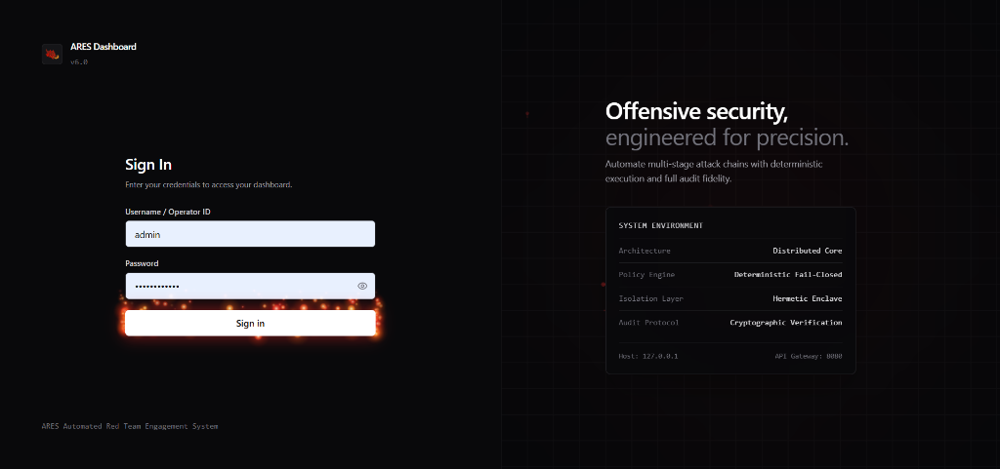
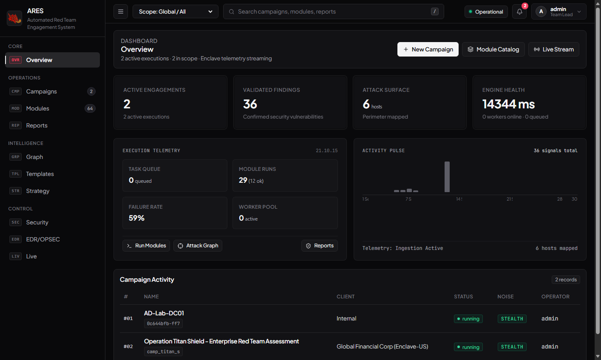
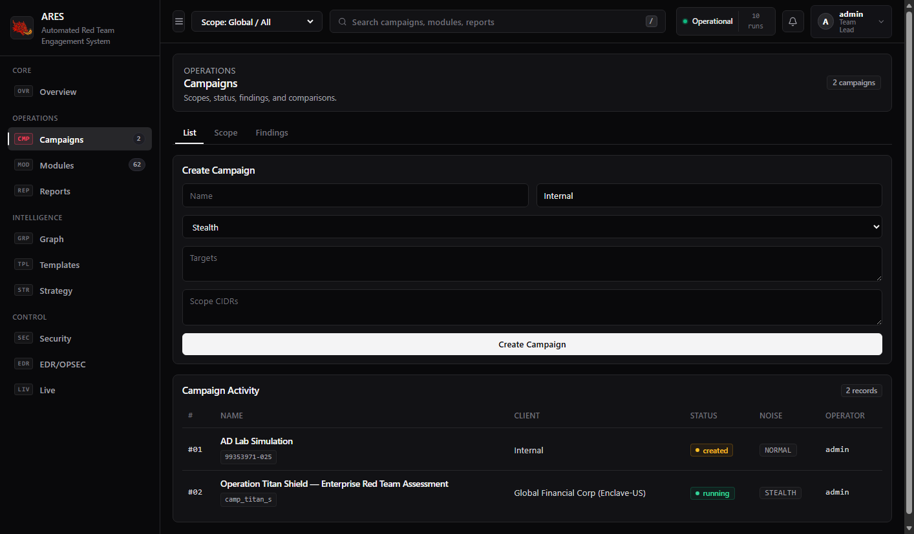
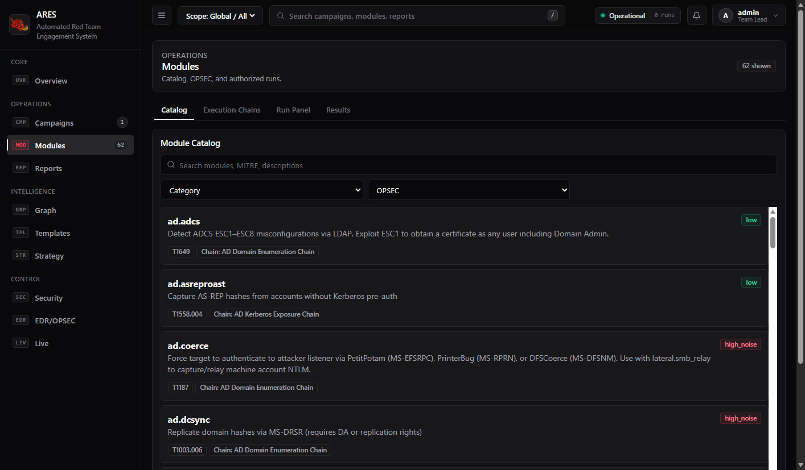
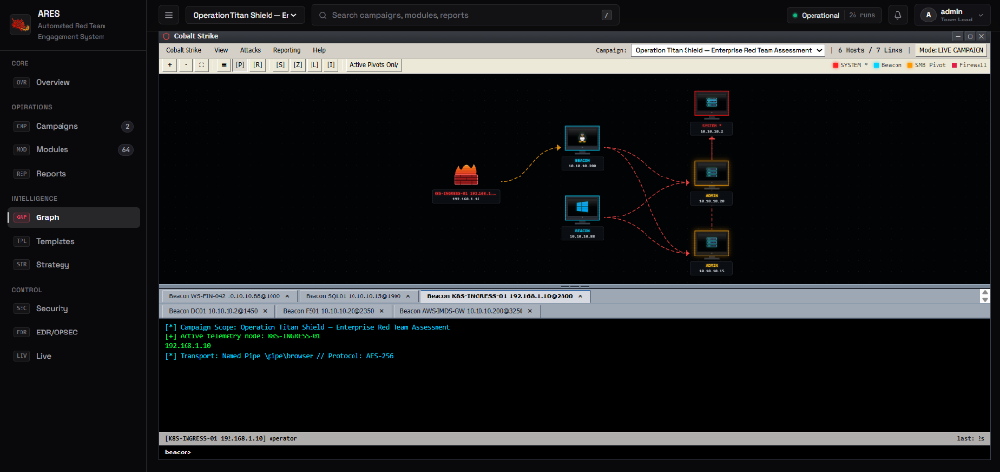
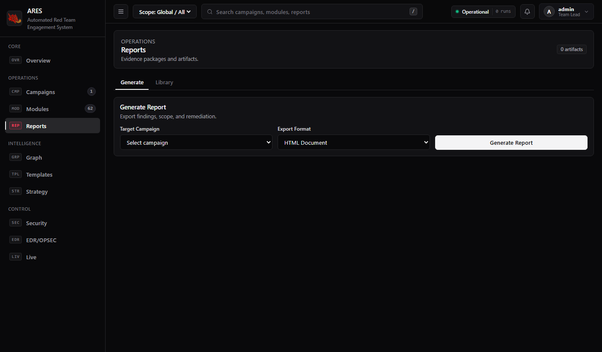
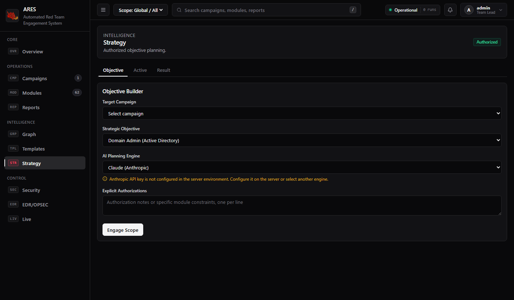
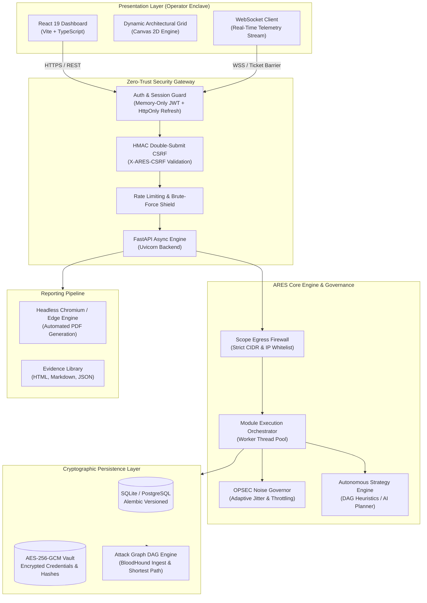

<div align="center">


# ARES™
### Autonomous Red Team Engagement & Continuous Security Validation Platform

**The open-core platform empowering enterprise red teams, MSSPs, and security operations centers to execute targeted offensive engagements, discover deterministic attack paths, and continuously validate defensive posture with zero collateral risk.**

<br>

[](releases/)
[](https://python.org)
[](https://fastapi.tiangolo.com)
[](https://react.dev)
[](docs/modules.md)
[](docs/security-model.md)
[](LICENSE)
[](tests/)

<br>

[**Platform Showcase**](#-platform-showcase--control-surfaces) • [**Why ARES?**](#-why-enterprises-choose-ares) • [**Competitive Matrix**](#-market-comparison-matrix) • [**Architecture**](#-system-architecture--data-pipeline) • [**MITRE Matrix**](#-adversary-techniques--mitre-attck-matrix) • [**Quickstart**](#-quickstart-up-and-running-in-60-seconds) • [**Zero-Trust Security**](#-enterprise-security-model--compliance) • [**Documentation**](docs/)

</div>

---

## ⚡ Executive Summary

Traditional penetration testing is fundamentally flawed: it is expensive, episodic, point-in-time, and leaves organizations blind to newly introduced misconfigurations and emerging adversary tradecraft. Meanwhile, automated vulnerability scanners overwhelm SOC teams with thousands of hypothetical CVEs without demonstrating exploitability or multi-stage lateral attack paths.

**ARES bridges this gap.** Built from the ground up for modern enterprise infrastructure, ARES delivers an **autonomous, goal-directed red team engagement platform** that models real-world threat actors. By combining hard kernel-level scope firewalls, adaptive OPSEC noise profiling, an interactive directed acyclic graph (DAG) attack solver, and 60+ weaponized techniques mapped to MITRE ATT&CK, ARES allows security teams to prove vulnerability exploitability, locate shortest compromise paths to Active Directory Crown Jewels, and generate executive-ready deliverables with zero operational downtime.

---

## 🎯 Why Enterprises Choose ARES

```
                                    THE ARES ADVANTAGE
 ┌─────────────────────────┐   ┌─────────────────────────┐   ┌─────────────────────────┐
 │   STRICT SCOPE ENCLAVE  │   │   AUTONOMOUS DAG ENGINE │   │ ZERO-TRUST ARCHITECTURE │
 │ Hard kernel CIDR egress │   │ Computes shortest paths │   │ Memory-only JWT tokens, │
 │ whitelisting prevents   │───│ to Domain Admins & Crown│───│ AES-256 encrypted vault,│
 │ any collateral impact.  │   │ Jewels deterministically│   │ strict HMAC-CSRF checks.│
 └─────────────────────────┘   └─────────────────────────┘   └─────────────────────────┘
                                            │
                                            ▼
                               ┌─────────────────────────┐
                               │ INSTANT EXECUTIVE SUITE │
                               │ Branded PDF, HTML, JSON │
                               │ deliverables with zero  │
                               │ native GTK dependencies │
                               └─────────────────────────┘
```

### Core Value Pillars

1. **🛡️ Zero-Collateral Scope Governance**: Every campaign runs inside an isolated cryptographic boundary. Hard target IP and CIDR validations at the network socket layer guarantee that no packet ever touches out-of-scope infrastructure.
2. **🧠 Autonomous Goal-Directed Planning**: Operators set high-level objectives (e.g. `domain_admin`, `full_compromise`, `cloud_audit`), and the ARES decision engine autonomously synthesizes multi-stage execution paths using graph heuristics and optional LLM agents (Claude / OpenAI / local Ollama).
3. **🕸️ Multi-Vector Attack Graph (DAG)**: Ingest BloodHound collections or map active domain sessions in real time. The built-in graph engine calculates shortest attack paths, highlights chokepoints, and simulates lateral pivot feasibility.
4. **🔐 Defense-in-Depth Security Model**: Engineered for zero-trust environments. Database-authoritative sessions, memory-only short-lived JWT access tokens, HttpOnly rotating refresh credentials, and AES-256-GCM encrypted local vaults protect harvested hashes and sensitive client evidence.
5. **📑 Automated Deliverables Pipeline**: One-click generation of branded, audit-ready compliance deliverables in PDF, HTML, Markdown, and JSON formats. Features automated headless browser PDF rendering on Windows/Linux without external GTK dependencies.

---

## 📊 Market Comparison Matrix

| Operational Capability | Traditional Manual Pentest | Legacy Vulnerability Scanners | ARES Autonomous Platform |
| :--- | :---: | :---: | :---: |
| **Testing Frequency** | Annual / Semi-Annual | Scheduled Daily / Weekly | **Continuous / On-Demand** |
| **Exploitability Validation** | Manual & Labor Intensive | ❌ Theoretical CVE Matching | **Deterministic Multi-Stage Proof** |
| **Multi-Hop Attack Paths** | Manual Drawing | ❌ None | **Real-Time Interactive DAG** |
| **Scope Enclave & Egress Firewall** | Operator Discipline Only | Network Firewalls Only | **Hard Socket-Level CIDR Enforcement** |
| **Active Directory Lateral Paths** | Slow Script Execution | ❌ No Active Paths | **Native BloodHound & Kerberos Suite** |
| **Credential Security & Storage** | Loose Flat Files / Cleartext | Vulnerability Logs | **AES-256-GCM Encrypted Vault** |
| **OPSEC & Telemetry Throttling** | Manual Jitter Scripts | High Network Noise | **Adaptive Noise Profiles & Governor** |
| **Delivery Time for Reports** | 1–2 Weeks Post-Engagement | Raw Data Dumps | **Instant Multi-Format Artifacts** |
| **Deployment Footprint** | External Consultants | Bulky Cloud Agents | **Air-Gapped Local / Self-Hosted** |

---

## 🖥️ Platform Showcase & Control Surfaces

The ARES Platform features a high-performance, responsive operator dashboard engineered with dark-tech aesthetics, low cognitive load, and audited operational control.

```powershell
# Launch local development environment
.\.venv\Scripts\ares.exe dashboard dev --no-reload
```

---

### 1. 🛡️ Operator Enclave & Zero-Trust Gateway

*Autonomous entry barrier designed specifically for authorized offensive operators and security personnel.*

<div align="center">



*ARES Operator Enclave — Sign In button erupts with crimson plasma fire on hover, click, and Enter key. Dynamic Architectural Grid canvas, system environment specifications, and ARES Cyber Dragon mascot on the right panel.*

</div>

- **The Problem Solved**: Eliminates unauthorized operator access, token replay attacks, and token leakage to local browser storage.
- **Key Capabilities**:
  - **Crimson Fire Signature Interaction**: Real-time HTML5 Canvas particle fire system envelops the Sign In button on hover (continuous), click (burst), and Enter key (burst without pointer) — physics-based particles with buoyancy, turbulence, and radial glow using `requestAnimationFrame`.
  - **ARES Cyber Dragon Ambient Mascot**: Integrated brand mascot watermark on the telemetry pane with calibrated opacity and crimson back-glow, harmonized with frosted glass environment specs.
  - Live **Dynamic Architectural Grid Canvas**: Low-overhead hardware-accelerated 60 FPS HTML5 canvas with real-time traveling data pulses and cursor proximity illumination.
  - **Memory-Only Token Isolation**: Short-lived JWTs reside strictly in memory; refresh credentials use host-only, HttpOnly cookies with one-time rotation.
  - **Enterprise Multi-Tenant SSO (SAML 2.0 & OIDC)**: SP-initiated federated authentication with Okta, Azure AD, and Google Workspace. Features App-level Fernet credential encryption, one-time replay protection (`InResponseTo`/`nonce`), JIT role mapping, and strict local password lockout for federated identities. (See [**SSO Setup Guide**](docs/sso-setup.md)).
  - **HMAC Double-Submit CSRF Protection**: Constant-time verification on all state-mutating requests (`X-ARES-CSRF`).
  - **Cryptographic Brute-Force Shield**: Enforces exponential backoff and IP-based rate limiting on authentication attempts.

---

### 2. 📊 Executive Command Center & Telemetry

*Real-time operational command console providing instant posture visibility across active campaigns.*

<div align="center">



*Executive Command Center displaying real-time telemetry, confirmed findings by severity, and operational health.*

</div>

- **The Problem Solved**: Aggregates scattered offensive metrics into a single real-time operational pane without requiring manual status queries.
- **Key Capabilities**:
  - **Unified Scope Context**: Switch seamlessly between `Scope: Global / All` (enterprise-wide telemetry) and specific engagement campaigns (`AD Lab Simulation`).
  - **Finding Severity Breakdown**: Live counters for Critical, High, Medium, Low, and Informational findings with CVSS v3 score tracking.
  - **Telemetry & Worker Health**: Monitor background task queue depth, execution error rates, and active worker statuses in real time.
  - **Audited Activity Stream**: Immutable event log tracking every module dispatch, credential discovery, and lateral progression.

---

### 3. 🎯 Scoped Campaign & Target Boundary Management

*Zero-collateral target governance enforcing hard CIDR whitelist boundaries and encrypted evidence isolation.*

<div align="center">



*Campaign Management interface showing target scopes, CIDR boundaries, noise controls, and encrypted credential vault.*

</div>

- **The Problem Solved**: Prevents catastrophic out-of-scope scanning and eliminates unencrypted credential files on operator laptops.
- **Key Capabilities**:
  - **Hard CIDR Whitelists**: Network-level boundary enforcement. The engine intercepts and drops any request targeting unapproved IP addresses or subnets.
  - **Noise Profiles & Jitter**: Configure engagement throttle levels (`Stealth`, `Low Noise`, `Aggressive`) with randomized delay distributions.
  - **AES-256 Encrypted Enclave Vault**: Harvested NTLM hashes, Kerberos tickets, and service credentials are encrypted at rest with AES-256-GCM.
  - **Clean Teardown Workflows**: Single-click campaign deletion that securely cleans up all associated database rows, graph vertices, and temporary artifacts.

---

### 4. ⚡ Modular Adversary Orchestration (60+ Modules)

*Extensive catalog of weaponized adversary techniques aligned with the MITRE ATT&CK enterprise matrix.*

<div align="center">



*Module Catalog with MITRE ATT&CK categorization, dynamic parameter generation, and dry-run safety modes.*

</div>

- **The Problem Solved**: Replaces unvalidated, unreliable GitHub scripts with typed, reproducible, and auditable adversary modules.
- **Key Capabilities**:
  - **Comprehensive Vector Coverage**: 60+ modular techniques covering Active Directory (`ad.kerberoast`, `ad.adcs`, `ad.enum_users`), Windows (`windows.uac_bypass`), Linux, Cloud (AWS, Azure, GCP), and Network infrastructure.
  - **Dynamic Typed Schemas**: UI forms are generated dynamically from Python Pydantic models with strict validation.
  - **Dry-Run Safety Engine**: Validate target responsiveness, parameters, and expected outcome before transmitting offensive traffic.
  - **Role-Gated Execution**: Operator and Team Lead permissions required for execution; sensitive high-noise modules require explicit confirmation.

---

### 5. 🕸️ Multi-Vector Attack Graph & Objective Replay

*Interactive directed acyclic graph (DAG) solver visualizing enterprise attack paths and privilege escalation chains.*

<div align="center">



*Multi-Vector Attack Graph mapping enterprise entities, sessions, and deterministic paths to Domain Admin.*

</div>

- **The Problem Solved**: Translates raw vulnerability data into actionable, visual compromise paths that executives and engineers can understand immediately.
- **Key Capabilities**:
  - **Shortest Path Algorithms**: Deterministically calculates the fewest hops required to compromise Domain Controllers or cloud root credentials.
  - **Native BloodHound / SharpHound Ingest**: Directly import BloodHound JSON archives into the ARES graph engine for unified analysis.
  - **Interactive Entity Inspection**: Explore relationships between users, groups, computers, ACLs, and active Kerberos sessions with fluid navigation.
  - **Objective Replay**: Re-simulate historical attack chains to verify defensive patch efficacy.

---

### 6. 📑 Automated Report Engine & Evidence Library

*Instant deliverable generation producing branded, audit-ready compliance reports across multiple standard formats.*

<div align="center">



*Report Engine and Artifact Library supporting multi-format exports with synchronized real-time lifecycle management.*

</div>

- **The Problem Solved**: Eliminates the 40+ hours typically spent manually writing, formatting, and redacting pentest reports.
- **Key Capabilities**:
  - **Multi-Format Export**: One-click generation of **PDF**, **HTML**, **Markdown**, and **JSON** deliverables.
  - **Automated Headless PDF Engine**: Integrated fallback using Microsoft Edge / Chromium headless mode for clean PDF export without complex GTK dependencies on Windows.
  - **Automated Evidence Redaction**: Automatically redacts sensitive raw passwords and private keys in customer deliverables while retaining audit proofs.
  - **Synchronized Report Library**: Authenticated artifact repository with instant downloads, per-report deletion, and real-time UI state synchronization.

---

### 7. 🧠 Autonomous Strategy & AI Planner

*Goal-directed autonomous engine that plans, prioritizes, and executes complex attack chains while respecting OPSEC limits.*

<div align="center">



*Autonomous Strategy Console for goal-based campaign planning and adaptive containment governance.*

</div>

- **The Problem Solved**: Coordinates multi-module attack chains autonomously without requiring constant manual operator intervention.
- **Key Capabilities**:
  - **Goal-Directed Execution Engine**: Define high-level objectives (`domain_admin`, `full_compromise`, `cloud_audit`), and let the engine chain techniques.
  - **Plug-and-Play AI Planners**: Integrate with Anthropic Claude, OpenAI, or local Ollama models to analyze engagement context and propose optimal next steps.
  - **Adaptive Containment Governor**: Continuously evaluates defensive telemetry and noise thresholds, automatically slowing down or aborting aggressive actions when detection risk peaks.

---

## 🎛️ Control Surfaces Breakdown

| Surface | Core Responsibility | Available Sub-Tabs | Primary Operators |
| :--- | :--- | :--- | :--- |
| **Overview** | Executive health, telemetry counters, finding severity metrics. | Single Pane | All Stakeholders |
| **Campaigns** | Scope whitelisting, noise profiles, encrypted credential vault. | `List`, `Scope`, `Findings` | Team Lead, Operator |
| **Modules** | 60+ module catalog, parameter input forms, execution console. | `Catalog`, `Run Panel`, `Results` | Operator |
| **Reports** | Deliverable builder, evidence packages, Report Library lifecycle. | `Generate`, `Library` | Operator, Reporter |
| **Graph** | DAG entity exploration, shortest attack paths, BloodHound ingest. | `Entities`, `Attack Paths`, `Ingest` | Operator, Recon |
| **Templates** | Repeatable engagement playbooks and multi-stage workflow plans. | `Templates`, `Plan Builder` | Team Lead, Operator |
| **Strategy** | Goal-directed autonomous engine, AI planner integration. | `Objective`, `Active`, `Result` | Team Lead, Operator |
| **Security** | Operator credentials, API key lifecycle, dependency audit checks. | `Account`, `API Keys`, `Audit` | Team Lead |
| **EDR/OPSEC** | Defensive telemetry, bypass tracking, detection evasion rules. | `Knowledge Base`, `Report Outcome` | Operator |
| **Live** | Real-time WebSocket event streams and buffered telemetry logs. | `Stream`, `Buffer` | Operator |

---

## 🏗️ System Architecture & Data Pipeline

ARES follows a strict defense-in-depth architecture separating presentation, execution orchestration, security governance, and persistent cryptographic storage:


```mermaid
flowchart TB
    subgraph Client["Presentation Layer (Operator Enclave)"]
        UI["React 19 Dashboard<br>(Vite + TypeScript)"]
        Mesh["Dynamic Architectural Grid<br>(Canvas 2D Engine)"]
        WSClient["WebSocket Client<br>(Real-Time Telemetry Stream)"]
    end

    subgraph Gateway["Zero-Trust Security Gateway"]
        FastAPI["FastAPI Async Engine<br>(Uvicorn Backend)"]
        AuthGuard["Auth & Session Guard<br>(Memory-Only JWT + HttpOnly Refresh)"]
        CSRF["HMAC Double-Submit CSRF<br>(X-ARES-CSRF Validation)"]
        RateLimit["Rate Limiting & Brute-Force Shield"]
    end

    subgraph Core["ARES Core Engine & Governance"]
        ScopeFirewall["Scope Egress Firewall<br>(Strict CIDR & IP Whitelist)"]
        Governor["OPSEC Noise Governor<br>(Adaptive Jitter & Throttling)"]
        Orchestrator["Module Execution Orchestrator<br>(Worker Thread Pool)"]
        AutoPlanner["Autonomous Strategy Engine<br>(DAG Heuristics / AI Planner)"]
    end

    subgraph Storage["Cryptographic Persistence Layer"]
        DB[(SQLite / PostgreSQL<br>Alembic Versioned)]
        Vault[(AES-256-GCM Vault<br>Encrypted Credentials & Hashes)]
        GraphEngine["Attack Graph DAG Engine<br>(BloodHound Ingest & Shortest Path)"]
    end

    subgraph Deliverables["Reporting Pipeline"]
        PDFGen["Headless Chromium / Edge Engine<br>(Automated PDF Generation)"]
        Artifacts["Evidence Library<br>(HTML, Markdown, JSON)"]
    end

    UI -->|HTTPS / REST| AuthGuard
    WSClient -->|WSS / Ticket Barrier| AuthGuard
    AuthGuard --> CSRF --> RateLimit --> FastAPI
    FastAPI --> ScopeFirewall
    ScopeFirewall --> Orchestrator
    Orchestrator --> Governor
    Orchestrator --> AutoPlanner
    Orchestrator --> Storage
    Storage --> GraphEngine
    FastAPI --> Deliverables
```

---

## ⚔️ Adversary Techniques & MITRE ATT&CK Matrix

ARES implements 60+ modular adversary techniques natively mapped to the MITRE ATT&CK Enterprise Framework:

```
┌──────────────────────────────────────────────────────────────────────────────────────────────────────────────────┐
│                                         MITRE ATT&CK MATRIX COVERAGE                                             │
├─────────────────────┬─────────────────────┬─────────────────────┬─────────────────────┬──────────────────────────┤
│ DISCOVERY           │ CREDENTIAL ACCESS   │ LATERAL MOVEMENT    │ PRIVILEGE ESCALATION│ DEFENSE EVASION / CLOUD  │
├─────────────────────┼─────────────────────┼─────────────────────┼─────────────────────┼──────────────────────────┤
│ • T1087 User Enum   │ • T1558.003 Kerberoast│ • T1021.002 SMB/RPC │ • T1548.002 UAC Byps│ • T1070 Indicator Removal│
│ • T1069 Group Enum  │ • T1558.004 AS-REP  │ • T1021.006 WinRM   │ • T1068 Token Privs │ • T1562 Impair Defenses  │
│ • T1046 Port/Net    │ • T1003 LSASS Dump  │ • T1550 Use Ticket  │ • T1053 Scheduled   │ • T1078 Cloud IAM Enum   │
│ • T1018 Host Disc   │ • T1649 ADCS ESC1-8 │ • T1071 App Layer   │ • T1055 Injection   │ • T1580 Cloud Discovery  │
│ • T1082 System Info │ • T1110 Pass Spray  │ • T1021.001 RDP     │ • T1134 Access Token│ • T1526 Cloud Hierarchy  │
└─────────────────────┴─────────────────────┴─────────────────────┴─────────────────────┴──────────────────────────┘
```

- **Active Directory Lab Suites**: Full SPN discovery, Kerberoasting (`ad.kerberoast`), AS-REP Roasting, ADCS Certificate Template abuse (ESC1 through ESC8), DCSync account replication, and BloodHound data generation.
- **Endpoint Posture Checkers**: Windows UAC Bypass methods, registry key persistence inspection, Linux container breakouts, and Sudo privilege enumeration.
- **Cloud Control Plane**: Multi-cloud identity auditing across AWS IAM, Azure Active Directory / Entra ID role assignments, and GCP IAM bindings.

---

## 🚀 Quickstart: Up and Running in 60 Seconds

### Prerequisites
- **Python**: 3.11 or 3.12 (Python 3.12 recommended for Windows).
- **Node.js**: v18+ (tested on Node v20 LTS).
- **OS**: Windows 11/10 (PowerShell), Linux (Ubuntu/Debian/Kali), or macOS.

### Fast Path (PowerShell on Windows)

```powershell
# 1. Clone the repository
git clone https://github.com/Mafifrizi/ARES.git
Set-Location .\ARES

# 2. Setup isolated Python virtual environment
py -3.12 -m venv .venv
.\.venv\Scripts\python.exe -m pip install -U pip
.\.venv\Scripts\python.exe -m pip install -e ".[dev,pdf]"

# 3. Install frontend dependencies
Set-Location frontend
& "C:\Program Files\nodejs\npm.cmd" ci
Set-Location ..

# 4. Configure local Edge PDF rendering engine & verify doctor status
$env:ARES_PDF_BROWSER = "C:\Program Files (x86)\Microsoft\Edge\Application\msedge.exe"
.\.venv\Scripts\ares.exe doctor --pdf-smoke

# 5. Launch development server (Frontend + Backend proxy)
.\.venv\Scripts\ares.exe dashboard dev --no-reload
```

Open your browser to **`http://127.0.0.1:5173/dashboard/`**.
- **Initial Operator**: `admin`
- **Initial Password**: Configured via `ARES_DEFAULT_ADMIN_PASSWORD` in `.env` (default: `Admin123456!`)

---

## 🔐 Enterprise Security Model & Compliance

ARES was designed for environments with the most stringent compliance and confidentiality requirements:

### Defense-in-Depth Authentication
- **Memory-Only Access Tokens**: Short-lived JWTs (15-minute lifespan) exist purely within in-memory React state and are never written to `localStorage` or `sessionStorage`.
- **Rotating Refresh Family**: Long-lived refresh credentials are bound to strict, host-only, HttpOnly cookies (`ares_refresh`) with one-time rotation and automatic reuse revocation.
- **HMAC CSRF Barrier**: State-changing endpoints mandate valid `X-ARES-CSRF` headers matched against cryptographically secure cookie tokens.

### Role-Based Access Control (RBAC)
ARES enforces strict RBAC permissions across all API endpoints and UI controls:

| Role | Operational Scope | Administrative Authority |
| :--- | :--- | :--- |
| **`team_lead`** | Complete platform authority: campaign creation/deletion, user provisioning, security audits, high-noise module overrides. | Full |
| **`operator`** | Day-to-day operations: execute authorized modules, review findings, explore attack graph, generate reports. | Standard |
| **`recon`** | Read-heavy reconnaissance: execute safe discovery and network fingerprinting modules. Execution of disruptive modules is blocked. | Read-Heavy |
| **`reporter`** | Stakeholder review: read-only access to campaign analytics, findings, attack graphs, and generated deliverables. | Read-Only |

---

## 🛠️ Extensible Developer SDK

Build custom adversary modules, integrate proprietary attack tools, or extend telemetry parsers using the clean `ares.sdk` interface:

```python
from ares.sdk import BaseModule, ExecutionContext, ModuleResult

class CustomKerberoastModule(BaseModule):
    id = "custom.ad.kerberoast"
    name = "Custom SPN Extraction & Kerberoasting"
    description = "Extracts SPNs from targeted Active Directory domain controllers."
    category = "active_directory"
    mitre_techniques = ["T1558.003"]
    opsec_level = "medium"

    def run(self, ctx: ExecutionContext) -> ModuleResult:
        # Hard scope validation is enforced automatically by ctx
        target_ip = ctx.params.get("target_ip")
        
        if ctx.is_dry_run:
            return ModuleResult.ok("Dry-run validated: target inside approved scope.")

        # Execute check inside scope boundary
        hashes = self._extract_spn_hashes(target_ip)
        
        # Save captured hash to AES-256 encrypted campaign vault
        ctx.vault.store_credential(
            cred_type="kerberos_hash",
            target=target_ip,
            secret=hashes
        )
        
        return ModuleResult.ok(f"Extracted {len(hashes)} SPN hashes.", data={"count": len(hashes)})
```

See [docs/module-development.md](docs/module-development.md) for full developer documentation.

---

## 📚 Documentation Sitemap

Comprehensive documentation is available in the [`docs/`](docs/) directory:

- [**Documentation Portal & Subsystem Index**](docs/README.md)
- [**Quickstart Engagement Guide**](QUICKSTART.md)
- [**Dashboard Surface-by-Surface Manual**](docs/dashboard-guide.md)
- [**Adversary Module Catalog & Schemas**](docs/modules.md)
- [**API Endpoint Reference & Payloads**](docs/api-reference.md)
- [**Enterprise SSO Integration Guide (SAML 2.0 / OIDC)**](docs/sso-setup.md)
- [**Enterprise Security & Threat Model**](docs/security-model.md)
- [**Validation Lab & Test Harness**](docs/validation-lab.md)
- [**Module Authoring SDK Guide**](docs/module-development.md)

---

## ⚖️ Responsible Use & Legal Disclaimer

> [!IMPORTANT]
> **ARES is a dual-use software framework designed exclusively for authorized cybersecurity research, internal enterprise resilience validation, and professional red-team engagements with explicit written permission.**

- **Do NOT** execute ARES against any network, host, or cloud infrastructure without prior written authorization from the system owners.
- Unauthorized system access or testing violates national and international cybercrime legislation (e.g. Computer Fraud and Abuse Act 18 U.S.C. § 1030).
- The creators and maintainers of ARES assume no liability for misuse, damages, or regulatory violations caused by this software.

To report security vulnerabilities in ARES, please follow our [Security Policy](SECURITY.md).

---

## 📄 License

ARES is distributed under the open-source **[MIT License](LICENSE)**.

<br>

<div align="center">

**ARES — Enterprise-Grade Autonomous Red Team Engagement System.**  
*Continuous Security Validation. Zero Collateral Risk.*

</div>
