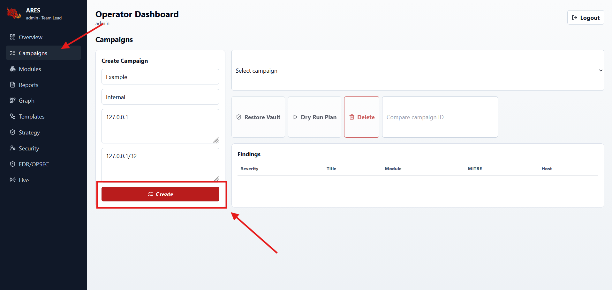
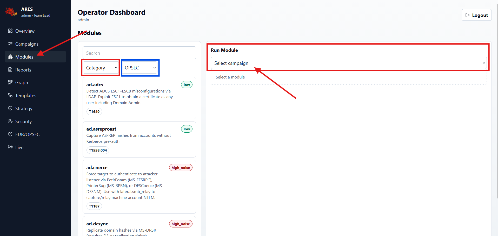
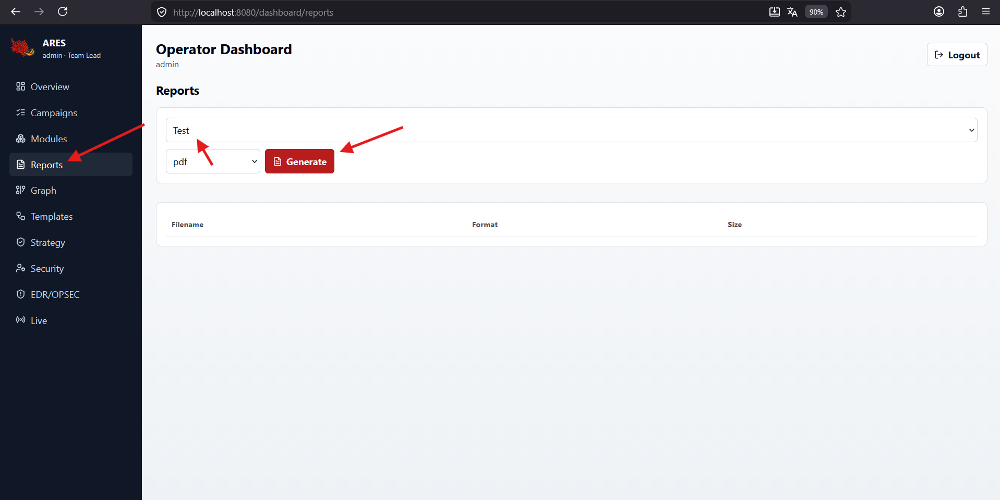

# ARES Dashboard Guide

The dashboard is the operator UI for ARES. It turns the API, module catalog,
campaign state, reports, graph data, and security controls into one workflow.

Production/static route after frontend assets are built:

```text
/dashboard
```

## Local Developer Startup

Recommended local dashboard startup from the repository root:

```bash
ares dashboard dev
```

Windows virtualenv example:

```powershell
.\.venv\Scripts\ares.exe dashboard dev
```

This one-terminal launcher starts:

- Backend API: `python -m uvicorn ares.api.server:app --host 127.0.0.1 --port 8080 --reload`
- Frontend: `npm run dev -- --host 127.0.0.1 --port 5173`

It prints `http://127.0.0.1:5173/dashboard/`, opens it by default, and stops
both child processes when you press `Ctrl+C`. Login with username `admin` and
the value of `ARES_DEFAULT_ADMIN_PASSWORD` from the current environment or
`.env` file; the launcher does not print that password. Use
`ares dashboard dev --no-open` to skip browser open, or
`ares dashboard dev --install` to run `npm ci` if `frontend/node_modules` is
missing.

Options: `--api-host`, `--api-port`, `--ui-host`, `--ui-port`, `--no-open`,
`--no-reload`, and `--install`.

Manual fallback for troubleshooting:

Terminal 1:

```powershell
Set-Location "<ARES repo root>"
.\.venv\Scripts\python.exe -m uvicorn ares.api.server:app --host 127.0.0.1 --port 8080 --reload
```

Terminal 2:

```powershell
Set-Location "<ARES repo root>\frontend"
& "C:\Program Files\nodejs\npm.cmd" run dev -- --host 127.0.0.1 --port 5173
```

Open:

```text
http://127.0.0.1:5173/dashboard/
```

## Screenshot Set

The dashboard screenshots in this repository use local/demo data only. Do not
publish screenshots that show real client names, real targets, passwords, API
keys, bearer tokens, or sensitive report URLs.

| View | File | Use |
| --- | --- | --- |
| Overview | `docs/assets/screenshots/dashboard-overview.png` | Health, telemetry cards, and campaign summary. |
| Campaigns | `docs/assets/screenshots/dashboard-campaigns.png` | Campaign creation, target/scope input, and management actions. |
| Modules | `docs/assets/screenshots/dashboard-modules-catalog.png` | Module catalog filters, OPSEC labels, campaign selection, and parameter forms. |
| Reports | `docs/assets/screenshots/dashboard-reports.png` | Campaign report generation and artifact list. |

## Dashboard Shell

The dashboard shell has a left sidebar, a topbar, page headers, and page-level
tabs.

- Use the left sidebar to move between Overview, Campaigns, Modules, Reports,
  Graph, Templates, Strategy, Security, EDR/OPSEC, and Live.
- Use the topbar menu button to collapse or expand the sidebar.
- Topbar quick search is client-side quick navigation over the currently
  loaded dashboard context: page names/routes, campaigns, modules, reports, and
  templates. It is not a server-backed global search across unloaded historical
  data.
- The notification bell is the status surface. The topbar no longer has a
  separate status pill labeled `Offline` or `Live`.
- The bell badge counts unread notifications only. Opening the drawer marks
  visible notifications as read. Individual dismiss and clear-all remove
  notifications from the current session.
- Notification read/deleted state is frontend session state. The UI does not
  store notification bodies, API keys, tokens, stack traces, or raw payloads.
- The topbar also shows the signed-in identity and logout action.

## Login

Use the admin account created at startup or an account created by a team lead.

After first login, change the default admin password from `Security`.

Roles:

| Role | Meaning |
| --- | --- |
| `Team Lead` | Admin/operator lead. Full API access, user registration, security audit, campaign deletion, high-noise authorization, and normal operator work. |
| `Operator` | Day-to-day operator. Can run normal campaign/module/report workflows but cannot register users. |
| `Recon` | Read-heavy recon identity. The backend module permission matrix marks enumeration, fingerprint, and network modules as recon-safe; main dashboard execution paths are still operator-gated. |
| `Reporter` | Read-only reporting and review. No module execution or user administration. |

Role names in API requests must use lowercase values: `team_lead`,
`operator`, `recon`, or `reporter`.

### Creating Users And Assigning Roles

The first account is created automatically:

- Username: `admin`.
- Role: `team_lead`.
- Password source: `ARES_DEFAULT_ADMIN_PASSWORD`.

This bootstrap account is created only when the user table is empty. Changing
`ARES_DEFAULT_ADMIN_PASSWORD` after `admin` already exists does not reset the
existing password. Change the bootstrap password from the `Security` page after
first login. For disposable local development data, recreate the local
database only when you intentionally want to discard existing users and
campaign data.

Local development reset warning: this deletes local dashboard data in
`ares.db`. Do not use it on real or shared deployments.

```powershell
New-Item -ItemType Directory -Force ".\_db_backup" | Out-Null
if (Test-Path ".\ares.db") {
  Copy-Item ".\ares.db" ".\_db_backup\ares.db.before-reset" -Force
}
Remove-Item ".\ares.db" -Force -ErrorAction SilentlyContinue
```

Additional users are created by a `team_lead` through `POST /auth/register`.
The dashboard currently shows users in the `Security` page, but it does not
include a role editor. In the current release, the role is assigned when the
account is created.

PowerShell example:

```powershell
$token = (Invoke-RestMethod `
  -Method Post `
  -Uri http://127.0.0.1:8080/auth/token `
  -ContentType "application/x-www-form-urlencoded" `
  -Body "username=admin&password=YOUR_CURRENT_ADMIN_PASSWORD").access_token

$headers = @{ Authorization = "Bearer $token" }

Invoke-RestMethod `
  -Method Post `
  -Uri http://127.0.0.1:8080/auth/register `
  -Headers $headers `
  -ContentType "application/json" `
  -Body (@{
    username = "bob"
    password = "StrongPass1!"
    role = "operator"
  } | ConvertTo-Json)
```

Password rules:

- Minimum 12 characters.
- At least one uppercase letter.
- At least one lowercase letter.
- At least one digit.
- At least one special character.

To review users, open `Security` as a `team_lead` or call
`GET /security/users` with a team-lead token.


## State And Navigation Behavior

The dashboard keeps the active campaign, selected module, and recent result panels aligned with the current page context. When you change campaign, module, report format, graph path, or template input, stale results from the previous context are hidden so the UI does not imply that old output belongs to the new action.

The `Live` page uses a browser WebSocket session. Leaving the page closes that browser connection. When you return, select the campaign and reconnect to start listening again. The underlying campaign data remains in the backend; only the current browser stream session is temporary.

Current page tabs:

| Page | Tabs |
| --- | --- |
| Overview | No variation tabs; the page shows its current telemetry and campaign summary directly. |
| Campaigns | `List`, `Scope`, `Findings` |
| Modules | `Catalog`, `Run Panel`, `Results` |
| Reports | `Generate`, `Library` |
| Graph | `Entities`, `Attack Paths`, `Ingest` |
| Templates | `Templates`, `Plan Builder` |
| Strategy | `Objective`, `Active`, `Result` |
| Security | `Account`, `API Keys`, `Audit` |
| EDR/OPSEC | `Knowledge Base`, `Report Outcome` |
| Live | `Stream`, `Buffer` |

## Pages

### Overview


Purpose: quick system status.

Shows:

- API health.
- Campaign count.
- Telemetry status.
- Telemetry metric cards for module runs, findings, latency, throughput,
  queue depth, worker health, and scope counters.
- Expandable raw telemetry snapshot for debugging.
- Campaign summary table.

Overview does not have variation tabs; the accepted dashboard view is shown
directly.

Use it to confirm the server is alive before running modules and to see whether
the current API process is actively recording module activity. Telemetry is
in-memory operational monitoring, not permanent campaign history. It resets
when the API process restarts; use campaign details and reports for durable
records.

### Campaigns

Purpose: create and manage engagement containers.



Use it for:

- Create a campaign.
- Define client, targets, and scope CIDRs.
- Select an existing campaign.
- Restore vault data after restart.
- Run a dry-run plan.
- Compare two campaigns.
- Review detail, CVSS summary, diff, and findings.
- Delete old validation or lab campaigns.

Delete behavior:

- Requires `Team Lead`.
- Asks for confirmation.
- Removes the campaign from the list immediately after success.
- Cleans stored findings, hosts, credentials, and loot for that campaign.

### Modules

Purpose: run individual modules safely.



Use it for:

- Browse the loaded module catalog.
- Render built-in module IDs, names, categories, OPSEC labels, and parameter
  schemas from backend metadata.
- Filter by category and OPSEC level.
- Select a campaign.
- Fill module parameters generated by the backend schema.
- Run with `dry_run` enabled by default.
- Confirm high-noise or sensitive execution when required.
- Watch the run button/loading state while backend execution is in progress.
- Review validation and scope errors without checking the terminal.

Good habit:

1. Select campaign.
2. Select module.
3. Fill params.
4. Run dry-run.
5. Review validation output.
6. Run live only if authorized.

Scope behavior:

- Targeted modules can run only against targets inside the selected campaign
  scope.
- For a local demo target such as `127.0.0.1`, create the campaign with target
  `127.0.0.1` and scope CIDR `127.0.0.1/32`.
- If a campaign has no scope CIDRs, or the target is outside scope, the
  dashboard shows a clear validation message and the backend rejects execution.

### Reports

Purpose: generate and download campaign reports.



Formats:

- HTML.
- Markdown.
- JSON.
- PDF through WeasyPrint when available, with an Edge/Chrome/Chromium browser
  fallback for local environments that do not have WeasyPrint native libraries.
- On Windows, run the dashboard from normal non-Administrator PowerShell with
  Python 3.12.x. If browser auto-detection needs help, set
  `ARES_PDF_BROWSER=C:\Program Files (x86)\Microsoft\Edge\Application\msedge.exe`.
- WeasyPrint on Windows requires native GTK/Pango libraries in addition to the
  pip package; use `ares doctor --pdf-smoke` to validate the active backend.

HTML and PDF reports render finding evidence as readable tables and key-value
rows where possible. Use JSON output when you need raw machine-readable data.

Use the dashboard Download button. Directly opening the file URL in the address
bar will return `401` because report files require an authenticated request.

### Graph

Purpose: understand relationships and attack paths.

Use it for:

- Campaign graph review.
- Attack path review.
- BloodHound JSON ingest.

This is useful after enumeration modules create users, computers, groups, and
relationships.

### Templates

Purpose: generate repeatable plans.

Use it for:

- Listing built-in templates.
- Generating a plan from template parameters.
- Keeping campaign execution consistent.

Templates are deterministic. They do not call an LLM and they do not execute
modules automatically. Use them when you want a predictable checklist-style
plan for a common engagement type, then review the returned stages before
running anything against a campaign.

Typical flow:

1. Select a built-in template such as `internal_pentest`.
2. Optionally provide JSON parameters such as domain, DC, or usernames.
3. Click `Generate Plan`.
4. Review the returned stages and module IDs.
5. Run the plan manually through campaign execution only after authorization.

### Strategy

Purpose: start or monitor goal-based engagement planning.

Use it for:

- Viewing active strategy state.
- Starting an authorized goal such as `domain_admin`.
- Providing explicit authorizations.

Backend RBAC still controls whether a user can start or execute sensitive
flows.

Strategy starts a background engagement loop for an existing campaign. It is
not the same as the Templates page. The backend default LLM backend is Claude,
so set `ANTHROPIC_API_KEY` before using the default Strategy path, or call the
API directly with another `llm_backend`.

Strategy emits progress events to the campaign WebSocket. Use the `Live` page
to watch those events while the engagement is running.

Safe usage:

1. Create a scoped campaign first.
2. Confirm the campaign has the context needed for planning.
3. Set the required LLM provider key in the ARES server environment.
4. Select a goal such as `domain_admin`.
5. Add authorization notes for sensitive actions.
6. Click `Engage` and monitor `Live`.

### AI Planner Module

Purpose: generate an LLM-backed execution plan from campaign context.

Use it from:

- `Modules` page.
- Module ID: `ai.autonomous_planner`.

Inputs:

- `goal`: `domain_admin`, `enterprise_admin`, `cloud_admin`, `data_exfil`,
  `persistence`, or `full_compromise`.
- `llm_backend`: `claude`, `openai`, or `local`.
- `llm_model`: optional model override.
- `auto_approve`: keep this disabled unless you have an explicit review process.

Provider setup:

- `llm_backend=claude` requires `ANTHROPIC_API_KEY`.
- `llm_backend=openai` requires `OPENAI_API_KEY`.
- `llm_backend=local` expects Ollama at `http://localhost:11434`.

Output:

- Proposed execution stages.
- AI reasoning.
- Confidence score.
- OPSEC warnings.
- Alternative plan data when available.

The AI planner module performs a local planning/LLM call only. It does not
contact the target network by itself. Review its plan before running any
generated modules.

### Security

Purpose: account and security administration.

Use it for:

- Change password.
- Create API keys.
- Delete API keys.
- Review security audit output.
- Review users.

User management notes:

- Only `team_lead` can create users.
- The Security page lists users for review.
- Assign a role by passing `role` to `POST /auth/register`.
- The current release does not expose dashboard role editing for existing
  users.

API key behavior:

- API keys are created after login; they are not the same thing as
  `ARES_SECRET_KEY` or `ARES_ENCRYPTION_KEY`.
- Use API keys for scripts, CI jobs, integrations, or validation labs that need
  to call ARES with `X-API-Key` instead of a browser login.
- Creating a key opens the `Save your key` modal.
- The full secret is shown only once at creation time.
- The `Copy` button changes to `Copied` after a successful copy.
- `Done` closes the modal and clears the in-memory new-key state.
- The list shows metadata and a prefix only; the full secret cannot be
  retrieved later.
- After delete, revoked keys disappear from the list.
- Deleted keys cannot authenticate.

### EDR/OPSEC

Purpose: record and review EDR bypass outcomes.

Use it for:

- EDR bypass stats.
- Reporting bypass outcomes.
- Feeding adaptive OPSEC decisions.

### Live

Purpose: watch campaign WebSocket events.

Use it for:

- Module start/complete events.
- Campaign execution status.
- Live feedback during a run.

## Recommended Daily Flow

1. Start the API server.
2. Open dashboard.
3. Check Overview.
4. Create or select a Campaign.
5. Run module dry-runs.
6. Execute authorized modules.
7. Review findings and graph.
8. Generate report.
9. Delete temporary validation campaigns.
10. Log out.

## Troubleshooting

| Problem | Meaning | Fix |
| --- | --- | --- |
| `401 Not authenticated` | Browser request has no bearer token. | Use dashboard buttons or log in again. |
| `422 Request failed` | Input validation rejected the request. | Check required fields and parameter types. |
| `429 Global rate limit exceeded` | Too many rapid requests. | Wait a moment and retry. |
| Campaign remains after delete | Browser cache or old server process. | Restart ARES and press `Ctrl+F5`. |
| Module says target is not in scope | Selected campaign has no matching scope CIDR. | Create or select a campaign whose scope includes the target, such as `127.0.0.1/32` for local testing. |
| Telemetry looks empty after restart | Telemetry is an in-memory runtime snapshot. | Run modules in the current API process, or use Reports/Campaigns for durable history. |
| PDF generation fails | No PDF backend or browser fallback is available. | Run `ares doctor --pdf-smoke` from normal non-Administrator PowerShell to check WeasyPrint, native GTK/Pango libraries, `ARES_PDF_BROWSER`, browser profile writability, and report output writability; install the PDF extra/native libraries or set `ARES_PDF_BROWSER` to Edge/Chrome/Chromium. |
## Cross-Platform Notes

The core API, dashboard, database migrations, SDK imports, and unit suite are designed to run on Windows, Linux, and macOS. Package metadata allows Python 3.10-3.12, but the tested release path for the dashboard, Windows PDF browser fallback, and Windows AD/Impacket lab modules is Python 3.12.x. Optional module dependencies can vary by operating system. Use `ares doctor` on each host to see which optional integrations are available before running modules that need AD, cloud, container, PDF, or native password-cracking tooling.
