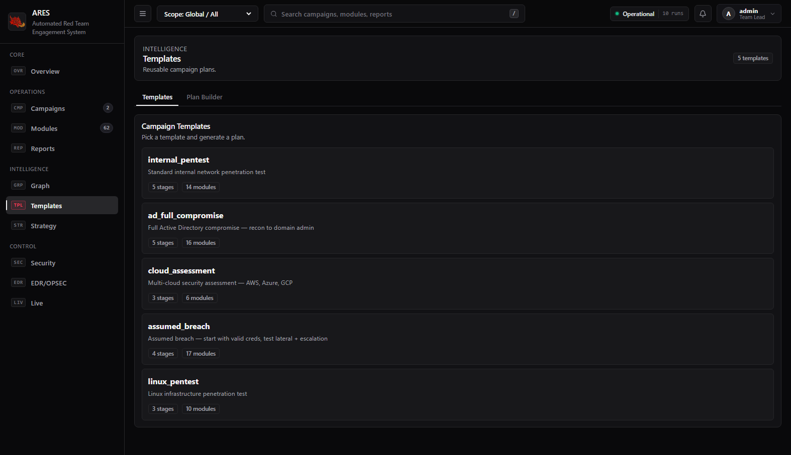
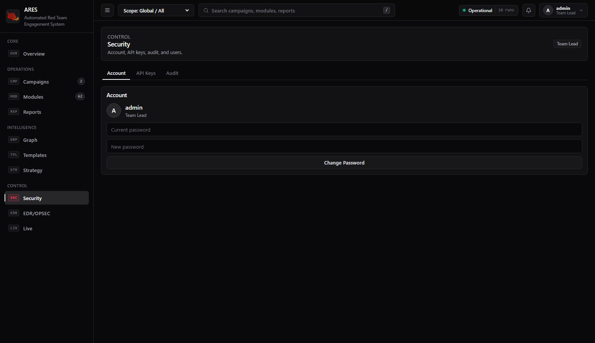
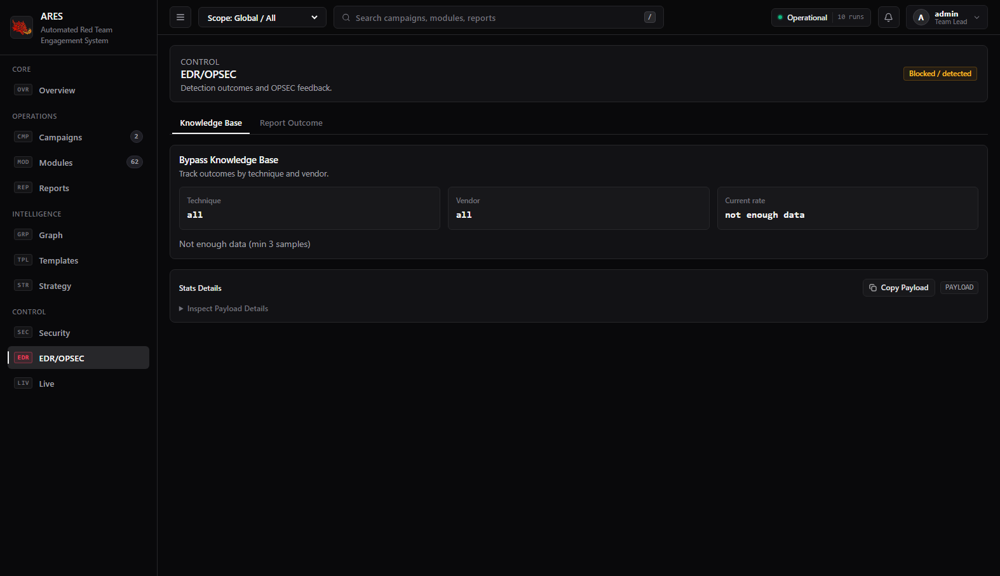
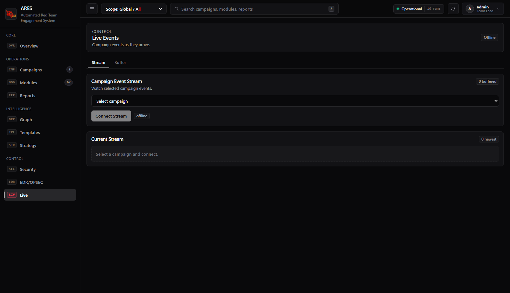

# ARES Dashboard Guide

The dashboard is the operator UI for ARES. It turns the API, module catalog,
campaign state, reports, graph data, and security controls into one workflow.

Production/static route after frontend assets are built:

```text
/dashboard
```

## Local Developer Startup

Recommended local dashboard startup from the repository root:

```bash
ares dashboard dev --no-reload
```

Windows virtualenv example:

```powershell
.\.venv\Scripts\ares.exe dashboard dev --no-reload
```

This one-terminal launcher starts:

- Backend API: `python -m uvicorn ares.api.server:app --host 127.0.0.1 --port 8080 --reload`
- Frontend: `npm run dev -- --host 127.0.0.1 --port 5173 --strictPort`

It prints `http://127.0.0.1:5173/dashboard/`, opens it by default, and stops
both child processes when you press `Ctrl+C`. Login with username `admin` and
the value of `ARES_DEFAULT_ADMIN_PASSWORD` from the current environment or
`.env` file; the launcher does not print that password. Use
`ares dashboard dev --no-open` to skip browser open, or
`ares dashboard dev --install` to run `npm ci` if `frontend/node_modules` is
missing. Use `--no-reload` for stable demos and recording.

Options: `--api-host`, `--api-port`, `--ui-host`, `--ui-port`, `--no-open`,
`--no-reload`, and `--install`.

Manual fallback for troubleshooting:

Terminal 1:

```powershell
Set-Location "<ARES repo root>"
.\.venv\Scripts\python.exe -m uvicorn ares.api.server:app --host 127.0.0.1 --port 8080 --reload
```

Terminal 2:

```powershell
Set-Location "<ARES repo root>\frontend"
& "C:\Program Files\nodejs\npm.cmd" run dev -- --host 127.0.0.1 --port 5173
```

Open:

```text
http://127.0.0.1:5173/dashboard/
```

## Screenshot Set

The dashboard screenshots in this repository use local/demo data only. Do not
publish screenshots that show real client names, real targets, passwords, API
keys, bearer tokens, or sensitive report URLs.

| View | File | Use |
| --- | --- | --- |
| Overview (Standby / Zero-State) | `docs/assets/screenshots/dashboard-overview-empty.png` | Clean onboarding hero, platform readiness strip, and initialization quick actions. |
| Overview (Active Telemetry) | `docs/assets/screenshots/dashboard-overview.png` | Health, telemetry cards, confirmed findings, and campaign summary. |
| Campaigns | `docs/assets/screenshots/dashboard-campaigns.png` | Campaign creation, target/scope input, and management actions. |
| Modules | `docs/assets/screenshots/dashboard-modules-catalog.png` | Module catalog filters, OPSEC labels, campaign selection, and parameter forms. |
| Graph & Beacon Console | `docs/assets/screenshots/dashboard-graph.png` | Cobalt Strike Hierarchical Pivot Graph & docked dual-row Beacon session terminal with real-time command execution and privilege status. |
| Reports | `docs/assets/screenshots/dashboard-reports.png` | Campaign report generation and artifact list. |

## Dashboard Shell

The dashboard shell has a left sidebar, a topbar, page headers, and page-level
tabs.

- Use the left sidebar to move between Overview, Campaigns, Modules, Reports,
  Graph, Templates, Strategy, Security, EDR/OPSEC, and Live.
- Use the topbar menu button to collapse or expand the sidebar.
- Topbar quick search is client-side quick navigation over the currently
  loaded dashboard context: page names/routes, campaigns, modules, reports, and
  templates. It is not a server-backed global search across unloaded historical
  data.
- The notification bell is the status surface. The topbar no longer has a
  separate status pill labeled `Offline` or `Live`.
- The bell badge counts unread notifications only. Opening the drawer marks
  visible notifications as read. Individual dismiss and clear-all remove
  notifications from the current session.
- Notification read/deleted state is frontend session state. The UI does not
  store notification bodies, API keys, tokens, stack traces, or raw payloads.
- The topbar also shows the signed-in identity and logout action.

## Login

The login console (`frontend/src/features/auth/LoginPage.tsx`) is a clean, centered enterprise authentication card (`width: 380px`). It provides direct username/password inputs, explicit focus states, and a solid high-contrast submit button without theatrical sci-fi or decorative cyber elements.

Use the admin account created at startup or an account created by a team lead.

After first login, change the default admin password from `Security`.

Roles:

| Role | Meaning |
| --- | --- |
| `Team Lead` | Admin/operator lead. Full API access, user registration, security audit, campaign deletion, high-noise authorization, and normal operator work. |
| `Operator` | Day-to-day operator. Can run normal campaign/module/report workflows but cannot register users. |
| `Recon` | Read-heavy recon identity. The backend module permission matrix marks enumeration, fingerprint, and network modules as recon-safe; main dashboard execution paths are still operator-gated. |
| `Reporter` | Read-only reporting and review. No module execution or user administration. |

Role names in API requests must use lowercase values: `team_lead`,
`operator`, `recon`, or `reporter`.

### Creating Users And Assigning Roles

The first account is created automatically:

- Username: `admin`.
- Role: `team_lead`.
- Password source: `ARES_DEFAULT_ADMIN_PASSWORD`.

This bootstrap account is created only when the user table is empty. Changing
`ARES_DEFAULT_ADMIN_PASSWORD` after `admin` already exists does not reset the
existing password. Change the bootstrap password from the `Security` page after
first login. For disposable local development data, recreate the local
database only when you intentionally want to discard existing users and
campaign data.

Local development reset warning: this deletes local dashboard data in
`ares.db`. Do not use it on real or shared deployments.

```powershell
New-Item -ItemType Directory -Force ".\_db_backup" | Out-Null
if (Test-Path ".\ares.db") {
  Copy-Item ".\ares.db" ".\_db_backup\ares.db.before-reset" -Force
}
Remove-Item ".\ares.db" -Force -ErrorAction SilentlyContinue
```

Additional users are created by a `team_lead` through `POST /auth/register`.
The dashboard currently shows users in the `Security` page, but it does not
include a role editor. In the current release, the role is assigned when the
account is created.

Create users through the same-origin dashboard. Browser authentication first
bootstraps CSRF with `GET /auth/csrf`; login then reuses that cookie jar and
sends the exact browser `Origin` plus `X-ARES-CSRF`. The login response returns
an access token and nonsecret coordination metadata only. Refresh authority is
held exclusively in the HttpOnly cookie and is never returned to JavaScript.

For automated API access, create and use a scoped API key. Do not automate the
browser login endpoint or transport refresh credentials in JSON, headers,
queries, `sessionStorage`, or `localStorage`.

Password rules:

- Minimum 12 characters.
- At least one uppercase letter.
- At least one lowercase letter.
- At least one digit.
- At least one special character.

To review users, open `Security` as a `team_lead` or call
`GET /security/users` with a team-lead token.


## State And Navigation Behavior

The dashboard keeps the active campaign, selected module, and recent result panels aligned with the current page context. When you change campaign, module, report format, graph path, or template input, stale results from the previous context are hidden so the UI does not imply that old output belongs to the new action.

The `Live` page uses a browser WebSocket session. Leaving the page closes that browser connection. When you return, select the campaign and reconnect to start listening again. The underlying campaign data remains in the backend; only the current browser stream session is temporary.

Current page tabs:

| Page | Tabs |
| --- | --- |
| Overview | No variation tabs; the page shows its current telemetry and campaign summary directly. |
| Campaigns | `List`, `Scope`, `Findings` |
| Modules | `Catalog`, `Run Panel`, `Results` |
| Reports | `Generate`, `Library` |
| Graph | `Entities`, `Attack Paths`, `Ingest` |
| Templates | `Templates`, `Plan Builder` |
| Strategy | `Objective`, `Active`, `Result` |
| Security | `Account`, `API Keys`, `Audit` |
| EDR/OPSEC | `Knowledge Base`, `Report Outcome` |
| Live | `Stream`, `Buffer` |

## Pages

### Overview


*Active Telemetry Overview - Real-time telemetry, validated findings, queue metrics, and campaign status.*

Purpose: quick system status.

Shows:

- API & system heartbeat status (`Operational` / `Offline`).
- Tier 1 Executive HUD: Active Engagements, Validated Findings, Attack Surface, and Engine Health (P95 latency, worker pool, queue depth).
- Tier 2 Operational Telemetry (50/50 split): Task Queue, Module Runs, Failure Rate, Worker Pool, and 14-day Activity Pulse sparkline.
- Tier 3 Campaign Activity Table for inventory management and instant scope isolation.

Overview does not have variation tabs; the accepted dashboard view is shown
directly.

Use it to confirm the server is alive before running modules and to see whether
the current API process is actively recording module activity. Telemetry is
in-memory operational monitoring, not permanent campaign history. It resets
when the API process restarts; use campaign details and reports for durable
records.

### Campaigns

Purpose: create and manage engagement containers.


Use it for:

- Create a campaign.
- Define client, targets, and scope CIDRs.
- Select an existing campaign.
- Restore vault data after restart.
- Run a dry-run plan.
- Compare two campaigns.
- Review detail, CVSS summary, diff, and findings.
- Delete old validation or lab campaigns.

Delete behavior:

- Requires `Team Lead`.
- Asks for confirmation.
- Removes the campaign from the list immediately after success.
- Cleans stored findings, hosts, credentials, and loot for that campaign.

### Modules

Purpose: run individual modules safely.


Use it for:

- Browse the loaded module catalog.
- Render built-in module IDs, names, categories, OPSEC labels, and parameter
  schemas from backend metadata.
- Filter by category and OPSEC level.
- Select a campaign.
- Fill module parameters generated by the backend schema.
- Run with `dry_run` enabled by default.
- Confirm high-noise or sensitive execution when required.
- Watch the run button/loading state while backend execution is in progress.
- Review the backend outcome label and message without checking the terminal.

Good habit:

1. Select campaign.
2. Select module.
3. Fill params.
4. Run dry-run.
5. Review validation output.
6. Run live only if authorized.

Results distinguish confirmed findings, completed runs with no confirmed
findings, operator/dependency/network errors, unsupported runs, and unexpected
module errors. A dry-run result is a validation preview only; it is not evidence
that the target is vulnerable or reachable.

Scope behavior:

- Targeted modules can run only against targets inside the selected campaign
  scope.
- For a local demo target such as `127.0.0.1`, create the campaign with target
  `127.0.0.1` and scope CIDR `127.0.0.1/32`.
- If a campaign has no scope CIDRs, or the target is outside scope, the
  dashboard shows a clear validation message and the backend rejects execution.

### Reports

Purpose: generate, download, and manage campaign report artifacts.


Formats:

- HTML.
- Markdown.
- JSON.
- PDF through WeasyPrint when available, with an Edge/Chrome/Chromium browser
  fallback for local environments that do not have WeasyPrint native libraries.
- On Windows, run the dashboard from normal non-Administrator PowerShell with
  Python 3.12.x. If browser auto-detection needs help, set
  the session fallback before running doctor or starting the dashboard:

  ```powershell
  $env:ARES_PDF_BROWSER = "C:\Program Files (x86)\Microsoft\Edge\Application\msedge.exe"
  .\.venv\Scripts\ares.exe doctor --pdf-smoke
  ```

- WeasyPrint on Windows requires native GTK/Pango libraries in addition to the
  pip package; use `ares doctor --pdf-smoke` to validate the active backend.

HTML and PDF reports render finding evidence as readable tables and key-value
rows where possible. Use JSON output when you need raw machine-readable data.

Use the dashboard Download button. Directly opening the file URL in the address
bar will return `401` because report files require an authenticated request.

The Library tab lists generated artifacts for the selected campaign. Each row
supports authenticated Download and per-report Delete. The Library header also
offers Delete all / Clear library when artifacts exist. Delete actions require
confirmation, remove the row or clear the table after success, and update the
artifact count without a full page reload. If deletion fails, the page keeps
the row and shows an error notice. When no reports remain, the Library shows
the clean empty state: `No reports generated for this campaign yet.`

### Graph & Cobalt Strike Beacon Terminal Dock

Purpose: understand lateral pivot relationships, trace multi-hop compromise routes, and interact with compromised hosts directly from a docked Beacon terminal console.


*Cobalt Strike Hierarchical Pivot Graph & Docked Beacon Session Terminal Console - Live enterprise campaign topology (`Operation Titan Shield`), multi-hop lateral pivot routes, dynamic privilege styling, and interactive command execution.*

#### Graph Topology & Navigation

- **Hierarchical Column Layout**:
  - **Left**: Perimeter gateways and uncompromised target findings (assets and services identified during initial reconnaissance).
  - **Center**: Active compromise footholds and intermediate pivot workstations (`10.10.10.198`, `DEVELOPER45`, etc.).
  - **Right**: High-value internal infrastructure, Active Directory Domain Controllers (`DC01`), and Crown Jewels.
- **Organic Bezier Connections & Particle Streams**: Replaces rigid 90-degree lines with fluid cubic curves, 22px vector directional arrowheads, and real-time streaming particle pulses indicating live C2/pivot communications.
- **Persistent Click-to-Lock Pathway Tracking**:
  - Clicking any host locks its upstream compromise lineage (how the host was reached) and downstream lateral reachability (what other hosts can be compromised from it).
  - A top HUD banner displays: `• PATHWAY LOCKED: [HOST] | N NODES | N HOPS` with quick pan/zoom persistence.
  - To release the lock, click on the empty canvas, press `ESC`, or click the `[CLEAR TRACK [ESC]]` button on the banner.
- **Operational Mode Toggle**:
  - `Mode: LIVE CAMPAIGN`: Visualizes real-time scoped targets and discovered findings from the active engagement. Targets that have not yet been pivoted appear on the left with in-degree 0; active footholds with live pivot tunnels appear connected. Click `[Active Pivots Only]` on the toolbar to filter out unpivoted targets.
  - `Mode: DEMO SAMPLE`: Loads the reference 9-node interconnected enterprise pivot topology showing multi-hop infiltration chains.

#### Cobalt Strike Beacon Terminal Console (`CobaltSessionDock`)

Located directly below the graph canvas, the Beacon Terminal Dock provides a full operator console synchronized with the graph:

1. **Dual-Row Java Swing Session Tabs**:
   - Organized in dual rows matching classic Cobalt Strike UI ergonomics.
   - Clicking any host on the graph automatically switches to or spawns its dedicated Beacon session tab.
   - Individual tabs can be closed via the `×` button without terminating underlying backend state.
2. **Real-Time Telemetry Logs**:
   - `[+]` Green: Successful operations, credential harvests, and established pivot channels.
   - `[*]` Cyan: Tasking status, transport information (Named Pipe `\pipe\browser`), and cryptographic verification (AES-256-GCM).
   - `beacon>` White: Command prompt and execution history.
   - `[!]` Yellow: Operational notices, help menus, and OPSEC warnings.
3. **Status Bar**:
   - Positioned directly above the command input.
   - Displays current host privilege level (`[DC01] SYSTEM *` or `[HOST] operator`) and live heartbeat interval (`last: 2s`).
4. **Supported Interactive Commands**:

| Command | Syntax / Example | Description |
| --- | --- | --- |
| `whoami` | `whoami` | Resolves target host, user context, and token integrity (`High/System` vs `Medium`). |
| `hashdump` | `hashdump` or `creds` | Dumps harvested NTLM SAM and LSA hashes from the target LSASS memory. |
| `ps` | `ps` or `process` | Enumerates remote process trees and resolves parent process IDs (PPIDs). |
| `ppid` | `ppid <pid>` | Tasks the beacon to spoof parent process IDs for defense evasion and telemetry blinding. |
| `ssh` | `ssh <host> <user> <pass>` | Tasks beacon to establish an interactive lateral SSH session to an adjacent host. |
| `net view` | `net view` or `hosts` | Enumerates discovered adjacent systems and active nodes within engagement scope. |
| `clear` | `clear` | Clears the terminal scrollback history for the active session tab. |
| `help` | `help` | Displays the quick reference of supported beacon tasking commands. |
| `<custom>` | `shell <command>` | Tasks beacon to execute arbitrary commands with byte transmission telemetry (`sent 48 bytes`). |

### Templates

Purpose: generate structured, repeatable, and deterministic campaign execution plans.



*Campaign Templates & Plan Builder - Blueprint catalog, stage planning, and parameterized execution checklist.*

The Templates view provides pre-tested engagement blueprints designed to ensure operational consistency across red-team operators without relying on external LLM calls.

#### Tab 1: Templates (Catalog)

Displays all built-in engagement archetypes with stage counts and module totals:

- `internal_pentest`: Standard internal network penetration testing workflow (5 stages, 14 modules).
- `ad_full_compromise`: Complete Active Directory attack chain from network recon to Domain Admin (5 stages, 16 modules).
- `cloud_assessment`: Multi-cloud posture assessment covering AWS, Azure, and GCP (3 stages, 6 modules).
- `assumed_breach`: Starts with valid low-privilege credentials to test lateral movement and privilege escalation (4 stages, 17 modules).
- `linux_pentest`: Targeted assessment of Linux server and container environments (3 stages, 10 modules).

Clicking any template card selects it and opens the `Plan Builder` tab pre-filled with that template selection.

#### Tab 2: Plan Builder

Configure target-specific variables:

- `Target Campaign`: Associates the generated plan with an active, scoped campaign.
- `Template Selector`: Dropdown to switch between built-in blueprints.
- `Custom Parameters (JSON)`: Optional target environment variables (e.g., domain FQDN, domain controller IP, target subnet CIDRs, or specific username lists).

Actions:

1. Select a template and target campaign.
2. Provide any custom JSON parameters if needed.
3. Click `Generate Plan` to compile the template.
4. Review the returned stages and module IDs in the result panel.
5. The plan is deterministic: it creates an ordered checklist without immediately executing network traffic. Execute modules through campaign workflows only after proper authorization.

### Strategy

Purpose: autonomous, goal-oriented engagement planning and execution powered by graph heuristics and LLM decision agents.


*Autonomous Strategy & Objective Builder - Goal-directed planning, multi-LLM engine selection, and live cycle telemetry.*

Unlike static templates, the Strategy engine continuously evaluates observed campaign state (discovered hosts, harvested credentials, open ports, and active defenses) to dynamically select and execute the next optimal module toward a specific operational objective.

#### Tab 1: Objective (Objective Builder)

Form inputs:

- `Target Campaign`: The campaign whose scope, discovered assets, and harvested credentials will be engaged.
- `Strategic Objective`: The high-level objective to achieve:
  - `Domain Admin (Active Directory)`: Prioritizes Kerberoasting, AS-REP roasting, ACL abuse, and DCSync.
  - `Enterprise Admin`: Extends privilege escalation across forest trusts.
  - `Cloud Audit`: Targets IAM misconfigurations, cloud credentials, and identity federation.
  - `Full Compromise`: Broad multi-vector objective spanning all discovered infrastructure.
- `AI Planning Engine`:
  - `Claude (Anthropic)`: Default provider; requires `ANTHROPIC_API_KEY`.
  - `OpenAI`: Requires `OPENAI_API_KEY`.
  - `Local (Ollama)`: Air-gapped and offline engine; connects to local Ollama server at `http://localhost:11434`.
  - *Notice*: An inline warning banner automatically alerts the operator if the selected provider API key is not detected in the server environment.
- `Explicit Authorizations`:
  - Optional line-separated constraints or module approvals (e.g., `allow: credential.pass_spray`, `block: windows.lsass_dump`, or max noise thresholds).

Actions:

- Click `Engage Scope` to initiate the autonomous strategy loop in the background.

#### Tab 2: Active (Live Strategy Monitoring)

Displays real-time status of the autonomous engagement loop:

- Current round number and total elapsed duration.
- Active goal and status (`running`, `paused`, `achieved`, `exhausted`).
- Next planned action, target host, and module selection rationale.
- Operator override controls to pause, resume, or abort the autonomous cycle.

#### Tab 3: Result (Outcome & Findings Summary)

Displays structured post-engagement summary:

- Objective status and success confirmation.
- Full sequence of rounds executed with individual module results.
- Discovered artifacts, harvested credentials, and privilege escalation milestones.

### AI Planner Module

Purpose: generate an LLM-backed execution plan from campaign context.

Use it from:

- `Modules` page.
- Module ID: `ai.autonomous_planner`.

Inputs:

- `goal`: `domain_admin`, `enterprise_admin`, `cloud_admin`, `data_exfil`, `persistence`, or `full_compromise`.
- `llm_backend`: `claude`, `openai`, or `local`.
- `llm_model`: optional model override.
- `auto_approve`: keep this disabled unless you have an explicit review process.

Provider setup:

- `llm_backend=claude` requires `ANTHROPIC_API_KEY`.
- `llm_backend=openai` requires `OPENAI_API_KEY`.
- `llm_backend=local` expects Ollama at `http://localhost:11434`.

Output:

- Proposed execution stages.
- AI reasoning.
- Confidence score.
- OPSEC warnings.
- Alternative plan data when available.

The AI planner module performs a local planning/LLM call only. It does not contact the target network by itself. Review its plan before running any generated modules.

### Security

Purpose: account and security administration.



*Zero-Trust Security Governance - Password rotation, scoped API keys, audit logging, and operator review.*

Use it for:

- Change password.
- Create API keys.
- Delete API keys.
- Review security audit output.
- Review users.

User management notes:

- Only `team_lead` can create users.
- The Security page lists users for review.
- Assign a role by passing `role` to `POST /auth/register`.
- The current release does not expose dashboard role editing for existing users.

API key behavior:

- API keys are created after login; they are not the same thing as `ARES_SECRET_KEY` or `ARES_ENCRYPTION_KEY`.
- Use API keys for scripts, CI jobs, integrations, or validation labs that need to call ARES with `X-API-Key` instead of a browser login.
- Creating a key opens the `Save your key` modal.
- The full secret is shown only once at creation time.
- The `Copy` button changes to `Copied` after a successful copy.
- `Done` closes the modal and clears the in-memory new-key state.
- The list shows metadata and a prefix only; the full secret cannot be retrieved later.
- After delete, revoked keys disappear from the list.
- Deleted keys cannot authenticate.

### EDR/OPSEC

Purpose: track, record, and evaluate evasion effectiveness across endpoint detection and response (EDR) agents, feeding empirical feedback into the adaptive OPSEC engine.



*EDR/OPSEC Evasion Knowledge Base & Outcome Reporting - Empirical bypass statistics, payload inspection, and adaptive feedback.*

#### Tab 1: Knowledge Base

Inspect empirical bypass rates and historical evasion statistics by technique and EDR vendor:

- `Technique Selector`: Filter by specific bypass technique (e.g., `edr.bypass_adaptive`, `amsi-patch-reflection`, `hardware-breakpoint-unhook`).
- `Vendor Selector`: Filter by EDR vendor (`crowdstrike`, `defender_atp`, `sentinelone`, `carbon_black`, `cylance`, or `all`).
- `Current Rate`: Shows the observed success rate percentage.
  - *Threshold Rule*: ARES enforces a statistical confidence threshold of minimum 3 samples. Evasion percentages are only calculated and applied to automated module scoring once at least 3 verified outcome samples have been recorded for that technique/vendor pair. Before reaching 3 samples, it displays `not enough data (min 3 samples)`.
- `Stats Details & Payload`:
  - Click `Inspect Payload Details` to review technical implementation data, memory unhooking logic, or evasion wrappers.
  - Click `Copy Payload` to copy the evasion verification payload for controlled lab testing.

#### Tab 2: Report Outcome

Submit live operational feedback when an evasion technique is attempted against an EDR agent in a test lab or engagement:

- `Technique ID` (Required): Identifier of the evaluated technique (e.g., `edr.bypass_adaptive / amsi-patch-reflection`).
- `EDR Vendor` (Required): Target vendor name (e.g., `crowdstrike`, `defender_atp`, `sentinelone`).
- `EDR Version` (Optional): Agent build number or sensor version (e.g., `7.14.18204.0`).
- `Outcome` (Required): Operational result observed:
  - `Bypassed / Successful`: Technique executed cleanly without alerting or blocking.
  - `Blocked / Detected`: EDR prevented execution or raised a high-severity alert.
  - `Partially Bypassed / Telemetry Only`: Command ran but generated defensive telemetry.
  - `Unsupported / Incompatible`: Target OS or architecture did not support the technique.
- `Notes` (Optional): Qualitative details such as Event IDs, alert names, behavioral flags, or lab environment context.

Action:

- Click `Report Outcome` to submit.
- Outcome records are immediately stored in the persistent database and update the Knowledge Base calculations in real time, directly informing the ARES strategy engine which techniques to prioritize or avoid.

### Live

Purpose: watch campaign WebSocket events.



*Live Operations Event Stream - Real-time WebSocket telemetry, module lifecycle events, and active execution logs.*

Use it for:

- Module start/complete events.
- Campaign execution status.
- Live feedback during a run.

## Recommended Daily Flow

1. Start the API server.
2. Open dashboard.
3. Check Overview.
4. Create or select a Campaign.
5. Run module dry-runs.
6. Execute authorized modules.
7. Review findings and graph.
8. Generate report.
9. Delete temporary validation campaigns.
10. Log out.

## Troubleshooting

| Problem | Meaning | Fix |
| --- | --- | --- |
| `401 Not authenticated` | Browser request has no bearer token. | Use dashboard buttons or log in again. |
| `422 Request failed` | Input validation rejected the request. | Check required fields and parameter types. |
| `429 Global rate limit exceeded` | Too many rapid requests. | Wait a moment and retry. |
| Campaign remains after delete | Browser cache or old server process. | Restart ARES and press `Ctrl+F5`. |
| Module says target is not in scope | Selected campaign has no matching scope CIDR. | Create or select a campaign whose scope includes the target, such as `127.0.0.1/32` for local testing. |
| Telemetry looks empty after restart | Telemetry is an in-memory runtime snapshot. | Run modules in the current API process, or use Reports/Campaigns for durable history. |
| PDF generation fails | No PDF backend or browser fallback is available. | Run `ares doctor --pdf-smoke` from normal non-Administrator PowerShell to check WeasyPrint, native GTK/Pango libraries, `ARES_PDF_BROWSER`, browser profile writability, and report output writability; install the PDF extra/native libraries or set `ARES_PDF_BROWSER` to Edge/Chrome/Chromium. |
| New modules or UI updates released | Operator needs new capabilities without re-cloning repo. | Run `ares update` to add new modules, or `ares upgrade --all` to upgrade modules and the Web UI seamlessly with zero user data loss. |
## Cross-Platform Notes

The core API, dashboard, database migrations, SDK imports, and unit suite are designed to run on Windows, Linux, and macOS. Package metadata allows Python 3.10-3.12, but the tested release path for the dashboard, Windows PDF browser fallback, and Windows AD/Impacket lab modules is Python 3.12.x. Optional module dependencies can vary by operating system. Use `ares doctor` on each host to see which optional integrations are available before running modules that need AD, cloud, container, PDF, or native password-cracking tooling.
