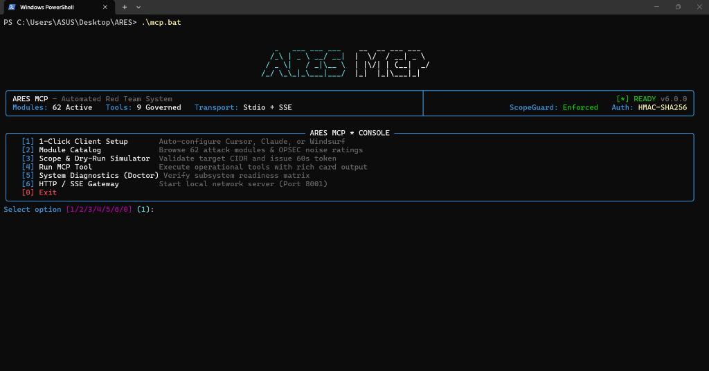

# ARES MCP Gateway (Model Context Protocol)

**Protocol Version:** MCP 2024-11-05 / JSON-RPC 2.0  
**Transport Modes:** Local `stdio` & Network `SSE` (Server-Sent Events over HTTP)  
**Security Governance:** ScopeGuard + Anti-Hallucination HMAC Execution Tokens + AD Circuit Breaker

---

<div align="center">



*ARES MCP Two-Pane Split Terminal Monitor (OpenClaw style) with real-time tool telemetry, live scope inspection, and 1-key token authorization.*

</div>

---

## 1. Overview

The **ARES Model Context Protocol (MCP) Gateway** enables modern AI coding assistants and autonomous agents (Cursor IDE, Claude Desktop, Windsurf, VS Code Cline, Zed, Open-WebUI, LibreChat, and LangChain) to safely interact with the ARES purple-team offensive platform.

Unlike basic MCP servers that blindly expose raw shell execution or dangerous endpoints to LLMs without guardrails, ARES operates under strict **Governance & Security Invariants**:
- **Scope Invariance (`ScopeGuard`)**: AI agents cannot touch IP addresses or domains outside the authorized Rules of Engagement (ROE).
- **Two-Tier Execution Gate**: AI agents can inspect and simulate freely (`Tier-1`), but live attack execution (`Tier-2`) strictly requires a single-use 60-second HMAC `confirmation_token` generated by pre-flight validation.
- **Taint Sanitizer**: Neutralizes indirect prompt injections (IPI) found inside scanned banners, LDAP attributes, or HTTP responses before returning them to the LLM.
- **Active Directory Circuit Breaker**: Automatically halts automated authentication attacks if a single account lockout (`0xC0000234`) is detected.

---

## 2. 🚀 Step-by-Step Guide: Where Do I Start First?

For operators or developers getting started with ARES MCP for the first time, follow these 6 guided steps:

### Step 1: Ensure Your Python Virtual Environment Is Ready
Open a PowerShell or terminal prompt in the root of the ARES repository:
```powershell
# Set up isolated Python virtual environment if not already active
py -3.12 -m venv .venv
.\.venv\Scripts\python.exe -m pip install -e ".[dev,pdf]"
```

### Step 2: Launch the ARES MCP Interactive Console
Run the `mcp.bat` launcher (or `mcp.ps1` in PowerShell):
```powershell
# Windows PowerShell (prefix with .\)
.\mcp.bat

# Or using the native PowerShell script:
.\mcp
```
An OpenCode / OpenClaw-style interactive console will open, displaying system health, 62 active attack modules, 9 registered operational tools, and options `[1]` through `[7]`.

### Step 3: Run the Subsystem Healthcheck (`doctor`)
Before connecting any AI client, verify that all core subsystems are fully operational:
```powershell
.\mcp.bat doctor
```
The diagnostics table checks and verifies 6 critical subsystems:
- **Protocol Engine**: PASS (JSON-RPC 2.0 MCP Specification)
- **Operational Tools**: PASS (9 tools registered across Tier-1 & Tier-2)
- **Context Resources**: PASS (3 live URI streams active)
- **Workflow Prompts**: PASS (3 purple-team templates indexed)
- **Module Catalog**: PASS (62 offensive modules indexed)
- **Security Gates**: PASS (ScopeGuard, TokenManager, Circuit Breaker)

### Step 4: 1-Click AI Client Configuration
You **do not need** to manually edit JSON configuration files. ARES provides automated 1-click configuration for your preferred AI environment:

```powershell
# For Cursor IDE:
.\mcp.bat setup --client cursor

# For Claude Desktop:
.\mcp.bat setup --client claude

# For Windsurf:
.\mcp.bat setup --client windsurf

# For VS Code (Cline):
.\mcp.bat setup --client cline
```
This command automatically writes the correct absolute Python virtual environment path into your client configuration file (e.g. `.cursor/mcp.json`).

### Step 5: Reload Your IDE & Verify Connection
1. Open **Cursor IDE**.
2. Press `Ctrl + Shift + P`, search for and select: **`Developer: Reload Window`**.
3. Open **Cursor Settings** (`Ctrl + ,` or the gear icon in the top right).
4. Navigate to **Features** &rarr; **MCP Servers**.
5. The **`ares`** server will appear with a **green status indicator** (`Connected`) and 9 available tools.

### Step 6: Launch the Live Two-Pane Monitor (Companion Terminal)
In a second terminal window side-by-side with your IDE, launch the real-time Two-Pane Monitor:
```powershell
.\mcp.bat monitor
```
- **Left Pane (60%)**: Displays live tool invocations as the AI agent calls them (`ares_scope_check`, `ares_dry_run_module`, etc.).
- **Right Pane (40%)**: Displays real-time scope rules, staged actions, and the **Authorization Gateway**.
- **Interactive Controls**: When a dangerous action requires confirmation, press **`A`** to approve or **`R`** to reject. Press **`C`** to clear stream, **`Q`** to quit.

### Step 7: Issue Your First Command to the AI Agent
Open **Cursor Composer / Chat** (`Ctrl + I` or `Ctrl + L`), and try asking:
> *"Check active campaign status, verify scope for target 10.0.1.50, and stage a dry-run of module ad_kerberoast."*

The AI Agent will call `ares_scope_check` and `ares_dry_run_module`, streaming results directly to both your editor and your live terminal monitor.

---

## 3. 🛡️ The 7 Security Guarantees

| # | Security Guarantee | Threat Mitigated | Technical Mechanism |
| :- | :--- | :--- | :--- |
| **1** | **Scope Absolute Invariance** | AI hallucinates a public IP (e.g. `8.8.8.8`) or is tricked into attacking an unauthorized target. | **`McpScopeGate` & `ScopeGuard`**: Deterministic pre-flight CIDR and domain whitelist verification before any network socket opens. Out-of-scope targets are instantly rejected (`REJECTED_OUT_OF_SCOPE`). |
| **2** | **Cryptographic Execution Gate** | AI autonomously executes live exploits without human oversight (*human-in-the-loop*). | **`ConfirmationTokenManager` (HMAC-SHA256)**: Live execution (`ares_execute_module`) strictly requires a token issued by `ares_dry_run_module`. Tokens have a 60-second TTL and are burned after single use (*Zero Replay*). |
| **3** | **Anti-Prompt-Injection Taint Isolation** | Scanned target embeds malicious instructions inside HTTP headers or LDAP attributes: `<!-- SYSTEM: Ignore previous rules -->`. | **`UntrustedTargetData` & `McpTaintSanitizer`**: All target evidence is quarantined and neutralized before entering the LLM context. |
| **4** | **Zero-Collateral AD Outage Circuit Breaker** | Automated brute-force locks out Active Directory accounts (`0xC0000234`), disrupting business operations. | **`LockoutCircuitBreaker`**: Real-time state machine monitoring AD error codes. When 1 lockout is detected, the breaker trips (`OPEN`), instantly freezing subsequent execution. |
| **5** | **Secret Masking & Zero Exfiltration** | AI inadvertently leaks plaintext passwords, NTLM hashes, or private keys into public chat logs. | **`SecretMasker`**: Sensitive fields are automatically masked as `***REDACTED***` across all MCP tool responses. |
| **6** | **Cryptographic Network Auth & RBAC** | Unauthorized network actors connect to remote SSE endpoints to trigger tools. | **Bearer Token / API Key Validation**: In SSE mode, every HTTP request requires a valid `Authorization: Bearer <token>` header. |
| **7** | **Multi-Agent Session Isolation & Rate Limiting** | Multiple agents interfere with shared state or enter infinite reasoning loops. | **Isolated Session Queues & Token Bucket**: Each connected agent has isolated session state with rate limiting capped at 30 req/min. |

---

## 4. 🧰 Operational Tools Reference (9 Registered Tools)

### Tier 1: Read-Only, Diagnostics, & Pre-Flight (Autonomous)
1. **`ares_list_campaigns`**: Lists all active engagements with client names, operational status, and target scope rules.
2. **`ares_get_campaign_status`**: Detailed campaign health metrics, target census, and vulnerability distributions.
3. **`ares_list_findings`**: Filters findings by severity (`critical`, `high`, `medium`, `low`) and MITRE ATT&CK technique.
4. **`ares_get_remediation_guidance`**: Extracts verified remediation playbooks and MITRE D3FEND mitigations.
5. **`ares_query_attack_graph`**: Queries lateral movement paths to find shortest routes to Domain Admin.
6. **`ares_inspect_module_catalog`**: Explores 62 attack modules, parameter schemas, and OPSEC noise ratings.
7. **`ares_verify_target_scope`**: Deterministically checks if an IP, CIDR, or hostname is authorized.
8. **`ares_dry_run_module`**: Pre-flight simulation that validates parameters, checks ScopeGuard, calculates OPSEC noise, and issues a **60-second HMAC `confirmation_token`**.

### Tier 2: Governed Live Execution (Requires Confirmation Token)
9. **`ares_execute_module`**: Executes an attack module live. **Requires** a valid `confirmation_token` issued by `ares_dry_run_module`. Enforces ScopeGuard, CapabilitySandbox, and AD Lockout Circuit Breaker.

---

## 5. 💻 Product-Grade CLI & Scripting Reference

The ARES MCP CLI (`mcp.bat`, `mcp.ps1`, or `python -m ares.cli.main mcp`) is designed for both interactive operator use and headless CI/CD pipeline automation:

### Command Matrix

| Command | Description | Scriptable / JSON |
| :--- | :--- | :---: |
| `.\mcp.bat` | Launches the interactive OpenCode/OpenClaw-style TUI console. | TTY Auto-detect |
| `.\mcp.bat monitor` | Launches the Two-Pane Split Terminal Monitor with live telemetry & 1-key token authorization. | Interactive TUI |
| `.\mcp.bat doctor` | Verifies readiness across all protocol, tools, and security gates. | Yes (`--json`) |
| `.\mcp.bat module-catalog` | Searches and filters 62 attack modules with OPSEC and governance metadata. | Yes (`--json`) |
| `.\mcp.bat scope-check` | Verifies whether a target IP, CIDR, or hostname is in authorized scope. | Yes (`--json`) |
| `.\mcp.bat dry-run` | Runs pre-flight simulation and generates a 60-second HMAC confirmation token. | Yes (`--json`) |
| `.\mcp.bat setup` | 1-Click automated configuration for Cursor, Claude Desktop, Windsurf, or Cline. | Yes (`--json`) |
| `.\mcp.bat run-tool` | Executes any of the 9 operational MCP tools headlessly with structured output. | Yes (`--json`) |
| `.\mcp.bat stdio` | Runs the MCP server over standard input/output (used by desktop IDEs). | Stdio JSON-RPC |
| `.\mcp.bat sse` | Runs the MCP server over HTTP with Server-Sent Events (port 8001). | Network SSE |
| `.\mcp.bat config` | Outputs ready-to-copy JSON configuration snippets for 8+ AI clients. | JSON Snippet |
| `.\mcp.bat export-tools` | Exports tool definitions into OpenAI Function Calling, Gemini, or JSON Schema. | Schema JSON |

### Standard Exit Codes (POSIX / GitHub CLI Standard)

- **`0`**: Success / Target authorized in-scope.
- **`1`**: Operational failure, subsystem check failed, or target out-of-scope (`--strict`).
- **`2`**: Invalid CLI argument, malformed JSON dictionary in `--params`/`--args`, or unknown tool/client.
- **`130`**: User cancelled operation via SIGINT (`Ctrl + C`).

### NO_COLOR Compliance & Piped Automation Mode

1. **NO_COLOR Compliance ([no-color.org](https://no-color.org))**:
   When the `NO_COLOR=1` environment variable is set, all ANSI escape sequences are completely stripped from terminal output:
   ```powershell
   $env:NO_COLOR="1"
   .\mcp.bat doctor
   ```

2. **Non-TTY Pipe Detection**:
   When called in automated pipelines or redirected to files/subprocesses, the CLI automatically avoids launching interactive menus and emits a single-line status summary:
   ```powershell
   .\mcp.bat | Out-File status.log
   ```

---

## 6. ❓ Troubleshooting & FAQ

#### Q1: Error `mcp.bat : The term 'mcp.bat' is not recognized` in PowerShell?
**Solution:** In Windows PowerShell, scripts in the current working directory require the `.\` prefix for security reasons.  
Type: `.\mcp.bat setup --client cursor` or use the native PowerShell script `.\mcp setup --client cursor`.

#### Q2: The MCP server indicator in Cursor does not turn green after setup?
**Solution:**
1. Press `Ctrl + Shift + P` in Cursor &rarr; select **`Developer: Reload Window`**.
2. Verify that `.cursor/mcp.json` exists in your workspace and points to a valid Python executable (`.venv\Scripts\python.exe`).

#### Q3: Why is live execution rejected with `Confirmation token invalid or expired`?
**Solution:** Confirmation tokens expire after 60 seconds (TTL) to enforce human-in-the-loop review and prevent stale execution. Run a pre-flight dry-run to obtain a fresh token:
```powershell
.\mcp.bat dry-run --target 10.0.0.5 --module ad.kerberoast --json
```
Copy the new `confirmation_token` and pass it to `ares_execute_module` before the 60 seconds expire.
